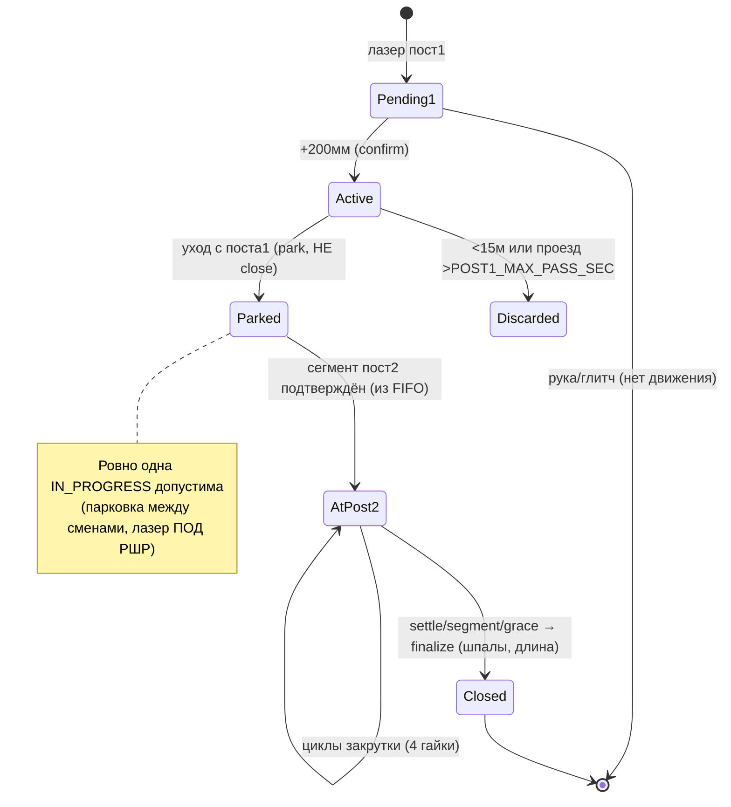

# SPEC — RZD APPS (мониторинг сборки РШР)

> **Статус:** источник правды по поведению системы. Версия 1.0 (актуальность: код `tochnost/` + `rzd/`, июнь 2026).
> **Кому:** ИИ-агентам и разработчикам перед любой нетривиальной задачей по FSM, закрутке, деплою.
> **Как читать:** это _что_ и _почему_ (контракты, инварианты, критерии приёмки). _Как именно_ в коде — по ссылкам на файлы. Глубокий нарратив — [docs/AI_ONBOARDING.md](docs/AI_ONBOARDING.md). Обоснования решений — [docs/adr/](docs/adr/).
>
> **Правило агента:** инварианты (раздел 6) менять нельзя без чтения соответствующего ADR. Каждый инвариант — это шрам от реального инцидента на заводе, не «over-engineering».

---

## 1. Назначение и границы

**Что делает система.** Принимает поток с двух контуров датчиков рельсосборочной линии завода РЖД, в реальном времени ведёт жизненный цикл каждой РШР (рельсошпальной решётки), считает эпюру (шпалы), гайки, геометрию и замечания, показывает это на веб-дашбордах и сохраняет историю в TimescaleDB.

**Акторы и интерфейсы**

| Источник | Что даёт | Вход |
|----------|----------|------|
| Sensor1 (РШР-сканер, `sensor_id` 1 и 2) | Геометрия, лазеры, `mmAlongRail`, износ, ширина колеи | `POST /api/v1/sensor/first` |
| Sensor2 (ПЛК / Modbus) | Моменты M1–M4, частоты f1–f4, R, T, H | `POST /api/v1/sensor/second` |
| Оператор / инженер | Просмотр, ручная отбраковка/финализация, редактирование номера | Web UI `rzd:3003` |
| Внешний OCR | Номер РШР → `scanned_name` | `PATCH /api/v1/rail/{id}` |

### 1.1. Не-цели (Non-goals) — НЕ реализуем в runtime backend

- **OCR номера РШР** — обучение живёт в `collect_Data/` и `PaddleOCR_train/` (отдельный форк). В runtime `tochnost` распознавание не встроено; результат приходит извне через `PATCH /rail/{id}`. **Не чинить баги FSM правкой `PaddleOCR_train/`.**
- **Корректировка «органики».** Система фиксирует аномалии (0/много гаек, короткая РШР) как `Error`, но не «дорисовывает» недостающие гайки и не подгоняет эпюру.
- **Источник правды по бизнес-нормам** (что считать браком) — за инженером; система только измеряет и сигналит.

---

## 2. Термины (кратко)

Полный глоссарий — [docs/GLOSSARY.md](docs/GLOSSARY.md). Минимум для чтения SPEC:

- **РШР** — рельсошпальная решётка (~25 м рельс со шпалами и скреплением).
- **Число шпал (`sleepers`)** — количество шпал на РШР = `ceil(гайки/4)`. Норма ~50 (⇒ ~200 гаек, 4 гайки/шпалу). ⚠️ **Не путать с «эпюрой»:** эпюра — это _расстояние между шпалами_ (раскладка, шпал/км), а не их количество. Поле в БД называется `sleepers`, но UI-колонка исторически подписана «Эпюра» — фактически там число шпал.
- **Пост 1** — геометрический контроль (Sensor1 `sensor_id=1`).
- **Пост 2** — закрутка гаек (Sensor1 `sensor_id=2` + Sensor2/Modbus).
- **`active`** — РШР сейчас на посту 1. **`rail_at_post2`** — РШР сейчас закручивается на посту 2.
- **Парковка** — снятие РШР с `active` в `waiting_at_post2` без финализации (уехала с поста 1, ждёт/идёт закрутку).
- **Цикл закрутки** — одна шпала = 4 гайки за один проход инструмента.

---

## 3. Функциональные требования (FR)

Нумерованные, тестируемые. Трассировка «FR → код → тест → ADR» — в разделе 11.

**Приём и упорядочивание**
- **FR-1.** `POST /sensor/first` принимает пакет Sensor1; отсутствие обязательного поля → `422`, пакет не попадает в FSM (наблюдаемость отказа — **FR-22**). **Исключение:** четыре позиции торцов (`mmRailStartLeft/Right`, `mmRailEndLeft/Right`) опциональны — прошивка сборщика до 08.2026 их не шлёт. → **INV-9**
- **FR-2.** `POST /sensor/second` принимает пакет Sensor2; T/H кэшируются в Redis для дашборда **независимо** от наличия РШР.
- **FR-3.** События двух контуров сливаются в единую очередь и обрабатываются в хронологическом порядке с буфером переупорядочивания `REORDER_BUFFER_MS` (500 мс).
- **FR-4.** Опоздавшие пакеты классифицируются (`NORMAL` / `LATE_APPEND` / `STALE`) по **per-stream** watermark (`s1:1`, `s1:2`, `s2`), не по общему. → **INV-4**
- **FR-22.** Любой запрос, отклонённый валидацией (`422`), пишется в Stream Monitor как событие `ingest_rejected` с **сырым телом запроса** (обрезка `STREAM_MONITOR_REJECT_BODY_LIMIT`, дефолт 4 КБ) и списком ошибок Pydantic. Ответ клиенту не меняется. События троттлятся по сигнатуре ошибки (путь + набор `поле:тип_ошибки`): не чаще одного на сигнатуру за `STREAM_MONITOR_REJECT_WINDOW_SEC` (10 с), остальные учитываются в `payload.repeat_count`. Счётчик `rejected_count` в `sensor_health` тикает на **каждом** отклонении, до троттлинга. Отклонённый пакет **не** обновляет `last_seen_at` датчика: источник без валидных данных обязан остаться `is_stale`. → **INV-10**, **ADR-0011**

**Жизненный цикл РШР**
- **FR-5.** РШР на посту 1 открывается только после подтверждения движением `LASER_CONFIRM_ADVANCE_MM` (200 мм) от появления лазера. → **INV-6**
- **FR-6.** Новая РШР при уже активной определяется по сбросу `mmAlongRail` ≥ `NEW_RAIL_MM_RESET_DROP_MM` (3000 мм) / уходу на пост 2, **не** по одиночному `laser_off`. → **INV-6**
- **FR-7.** Уход с поста 1 — `park_active_for_post2()` (в `waiting_at_post2`), **без** финализации. → **INV-1**
- **FR-8.** Пост 2 подтверждает сегмент (лазер удержан ≥ `POST2_MIN_SEGMENT_SEC` = 3 с или продвижение +200 мм); тогда предыдущий `rail_at_post2` уходит, следующий берётся из FIFO.
- **FR-9.** Финализация `rail_at_post2` происходит по **любому** из триггеров (приоритет): (a) чистый OFF лазера после реального прохода → settle `POST2_DEPART_SETTLE_SEC` (15 с); (b) заезд следующей решётки → принудительно; (c) grace-фолбэк `POST2_DEPART_GRACE_SEC` (120 с). → **INV-1**, **ADR-0006**
- **FR-10.** Отбраковка: РШР короче `RSHR_LENGTH_DISCARD_BELOW_MM` (< 15 м) или проезд поста 1 дольше `POST1_MAX_PASS_SEC` → не в учёт. Ручная отбраковка (`POST /rail/{id}/reject`) — только для `IN_PROGRESS`.

**Закрутка (пост 2)**
- **FR-11.** Modbus-пакет привязывается к гайкам **только** через `_modbus_target_rail_id()` = `rail_at_post2`. Если `None` → событие `modbus_skipped` (штатно при пустых постах). → **INV-2**
- **FR-12.** Старт цикла: активность моментов M1–M4 (`has_moment_activity`) **и** пауза ≥ `MIN_INTER_CYCLE_SEC` (7 с) от прошлого цикла. → **INV-5**
- **FR-13.** Конец цикла: `CYCLE_END_ZERO_PACKETS` (2) нулевых пакета подряд. → **INV-5**
- **FR-14.** При финализации цикла пишутся 4 `Screw` (каналы 1–4), `serial_id` — порядковый **внутри `rail_id`**, `max_torque`/`max_frequency` — пики за цикл, `mm_along_rail` — позиция старта. Повторная закрутка той же шпалы (в пределах `MIN_SLEEPER_SPACING_MM` = 250 мм) обновляет гайки, **не** плодит дубль.
- **FR-15.** Число шпал (`sleepers`) = `ceil(число_гаек / 4)`, считается **только** при финализации на уходе с поста 2. → **INV-3**

**Отчётность и UI**
- **FR-16.** Для `IN_PROGRESS` РШР число шпал в UI = «—», не 0 (колонка UI называется «Эпюра»). Допустима **ровно одна** `IN_PROGRESS` (парковка между сменами). → **INV-3**, **INV-7**
- **FR-17.** При finalize фиксируются аномалии как `Error`: 0 гаек при длине ≥ 20 м; число гаек вне `[SCREWS_COUNT_MIN_OK, SCREWS_COUNT_MAX_OK]` = `[160, 220]`.
- **FR-18.** Live-дашборд получает по WebSocket: `dashboard:status`, `dashboard:stages` (в т.ч. гайки ЛН/ЛВ/ПН/ПВ), `dashboard:stats` (T/H), `dashboard:errors`, `dashboard:errors_distribution`.
- **FR-19.** Stream Monitor (`/monitor`, без auth) отдаёт цепочку pipeline-событий и экспорт (`mode=pipeline|full|incident`) для разбора инцидентов.
- **FR-20.** При рестарте backend `rehydrate_in_progress_rails()` восстанавливает единственную `IN_PROGRESS` из БД. → **INV-7**
- **FR-21.** Забег нитей (`mmRailStartLeft − mmRailStartRight` и `mmRailEndLeft − mmRailEndRight`, знаковый, «+» = левая впереди) считается **только** при финализации на уходе с поста 2 и пишется в `rail.overhang_start_mm` / `overhang_end_mm`. Вне допуска `mm_overhang` (таблица `threshold`, дефолт `±50 мм`) → `Error` + `dashboard:errors`. Не измерен → `NULL`, метрика в карточке не показывается. → **INV-9**, **ADR-0010**

---

## 4. Спецификация FSM

> Реализация: [`tochnost/src/api/v1/sensor/service.py`](tochnost/src/api/v1/sensor/service.py), состояние — [`state.py`](tochnost/src/api/v1/sensor/state.py). FSM **не** в `rail/fsm.py` (там только отвязка при удалении).

### 4.1. In-memory состояние (`SensorState` / `SENSOR_STATE` — истина о конвейере)

| Поле | Смысл |
|------|-------|
| `_active` | Текущая РШР на посту 1 (`RailSession`) или `None` |
| `_waiting_at_post2` | Припаркованные сессии (сняты с active, ждут/идут закрутку) |
| `_post2` (`Post2Tracker`) | `fifo_rail_ids`, `rail_at_post2`, `rail_at_post2_max_mm`, pending segment |
| `_tightening` | Текущий цикл закрутки (пики M1–M4) |
| `_closed` | deque последних закрытых (до 32) |

### 4.2. Переходы (событие → функция → эффект)

| Событие | Функция | Эффект | Pipeline-событие |
|---------|---------|--------|------------------|
| Лазер пост 1 + движение 200 мм | `bind_active_rail()` | INSERT `Rail` (IN_PROGRESS), `set_active`, enqueue FIFO | `rshr_opened` |
| Геометрия пост 1 | `_apply_sensor1_to_active()` | `Sensor1` в БД, пороги, publish stages | — |
| Уход с поста 1 | `park_active_for_post2()` | В `waiting_at_post2`, **без** finalize | `rshr_parked_post1` |
| Подтверждён сегмент пост 2 | `_confirm_post2_segment()` | `rail_at_post2` ← FIFO.pop; прошлый — finalize | `post2_recognized` |
| Старт цикла | `start_tightening_cycle()` | открыть окно пиков | `tightening_started` |
| Конец цикла | `_finalize_tightening_cycle()` | 4× `add_screw`, пороги, publish | `tightening_completed` |
| Modbus без rail_at_post2 | — | пропуск | `modbus_skipped` |
| Уход с поста 2 | `_depart_rail_from_post2()` → `finalize_rail()` | Telegram burst, `COMPLETED`, sleepers, length, errors | `rshr_departed_post2` → `rshr_closed` |
| Отбраковка | `discard_active_rail()` / `RailService.reject_rail()` | не в учёт | `rshr_discarded` |

### 4.3. Диаграмма



---

## 5. Алгоритм закрутки

> Ядро: [`tochnost/src/rshr_core/tightening.py`](tochnost/src/rshr_core/tightening.py). Онлайн: `add_sensor2_data` / `_finalize_tightening_cycle` в `service.py`. Офлайн-паритет: `detect_cycles_in_window`.

**Физика.** ПЛК раз в ~1 с отдаёт M1–M4 (моменты, Нм) и f1–f4 (частоты). Одна шпала = проход инструмента по 4 гайкам (ЛН, ЛВ, ПН, ПВ). Между шпалами пауза ~7–8 с (все M и f ≈ 0).

```
Modbus пакет → _modbus_target_rail_id() → только rail_at_post2 (иначе modbus_skipped)
  СТАРТ:      has_moment_activity(M1..M4>0)  И  пауза ≥ MIN_INTER_CYCLE_SEC (7с)
  В ПРОЦЕССЕ: bump_peaks — max момент/частота по каналам
  КОНЕЦ:      all_torque_zero() ×CYCLE_END_ZERO_PACKETS раз подряд (онлайн 2, офлайн 1)
  FINALIZE:   add_screw ×4 → пороги → record_nut_cycle → Redis → tightening_completed
```

**Онлайн vs офлайн.** Живой поток: `cycle_end_zero_packets=2`, `reorder_buffer_ms=500`. Офлайн-реплей упорядоченного JSONL (`RshrTimingConfig.capture_faithful`): `cycle_end_zero_packets=1`, `reorder_buffer_ms=0`, `max_late_packet_sec=inf`. Результаты должны сходиться (см. эталон, раздел 10).

---

## 6. Инварианты (INV) — НЕ нарушать

> Каждый инвариант защищён ADR. Правка требует чтения ADR и пересчёта эталона (раздел 10).

| ID | Инвариант | Симптом нарушения | ADR |
|----|-----------|-------------------|-----|
| **INV-1** | На посту 1 — только `park_active_for_post2()`, никогда `close_active_rail`. `finalize_rail` — только на уходе с поста 2. | Эпюра 0 или ~20 | [ADR-0001](docs/adr/0001-post1-park-not-close.md) |
| **INV-2** | Гайки пишутся только на `rail_at_post2` (`_modbus_target_rail_id`), не на `get_active_rail()`. | ~70 гаек на чужой РШР | [ADR-0002](docs/adr/0002-screws-on-rail-at-post2.md) |
| **INV-3** | Число шпал = `ceil(гайки/4)`, только при finalize. Для `IN_PROGRESS` UI показывает «—», не 0. | Ложные нули/сдвиг шпал | [ADR-0003](docs/adr/0003-sleepers-ceil-and-in-progress-dash.md) |
| **INV-4** | Per-stream watermark (`s1:1`, `s1:2`, `s2`) — не общий. | `packet_stale` глушит Sensor1 при опережении Modbus | [ADR-0004](docs/adr/0004-per-stream-watermark.md) |
| **INV-5** | Старт цикла: моменты M1–M4 + пауза `MIN_INTER_CYCLE_SEC=7`; конец: `CYCLE_END_ZERO_PACKETS=2`. | Двойные циклы на одну шпалу | [ADR-0005](docs/adr/0005-cycle-start-end-detection.md) |
| **INV-6** | Открытие РШР — только после подтверждения движением `LASER_CONFIRM_ADVANCE_MM=200`; новая РШР — по сбросу mm ≥ 3000, не по мигающему лазеру. | Фантомные короткие РШР (782 мм), «рука под лазером» | [ADR-0007](docs/adr/0007-laser-confirm-and-new-rail.md) |
| **INV-7** | Ровно одна `IN_PROGRESS` допустима (парковка между сменами, РШР ПОД лазером — не финализировать); `rehydrate` восстанавливает её при рестарте. | Потеря недокрученной РШР / лишние IN_PROGRESS | [ADR-0006](docs/adr/0006-post2-departure-triggers.md) |
| **INV-8** | In-memory FSM = истина, БД = персистентность, Redis = только live-дашборд (не источник правды). | Рассинхрон, гонки | [ADR-0008](docs/adr/0008-inmemory-fsm-source-of-truth.md) |
| **INV-9** | Забег — только разность торцов одной засечки. Длину и зазор между РШР по `mmRailStart*`/`mmRailEnd*` не считать никогда. Любой ноль в паре `End` = «не измерено», а не «забег 0». | Мусорная длина при сбросе `mmAlongRail`; ложный «забег 0» у оборванного прохода | [ADR-0010](docs/adr/0010-overhang-from-edge-difference.md) |
| **INV-10** | Отклонённый (`422`) пакет наблюдаем в мониторе, но **не** считается признаком жизни датчика: `last_seen_at` не обновляется. Дедуп событий — по сигнатуре ошибки; счётчик `rejected_count` — поштучный. | Зелёная карточка датчика при полностью мёртвом потоке; либо буфер, выжженный за секунды битым firehose | [ADR-0011](docs/adr/0011-observable-rejected-requests.md) |

---

## 7. Пороги и нормы (из `RshrTimingConfig`, ENV-backed)

| Параметр | ENV | Дефолт | Назначение |
|----------|-----|--------|------------|
| Подтверждение открытия | `LASER_CONFIRM_ADVANCE_MM` | 200 мм | Отсечь «руку под лазером» |
| Мин. OFF лазера пост1 для новой РШР | `POST1_MIN_LASER_OFF_SEC` | 1.5 с | Отсечь мигание энкодера |
| Макс. проезд поста 1 | `POST1_MAX_PASS_SEC` | 2400 с | Дольше — мусор |
| Мин. сегмент пост2 | `POST2_MIN_SEGMENT_SEC` | 3 с | Отсечь ложный depart |
| Settle после OFF пост2 | `POST2_DEPART_SETTLE_SEC` | 15 с | Досчитать «хвост» закрутки |
| Grace-фолбэк ухода пост2 | `POST2_DEPART_GRACE_SEC` | 120 с | Если чистого OFF не было |
| Пауза между циклами | `MIN_INTER_CYCLE_SEC` | 7 с | Один пакет пиков ≠ 2 цикла |
| Нулевых пакетов = конец | `CYCLE_END_ZERO_PACKETS` | 2 | Не рвать на кратком провале |
| Шаг «та же шпала» | `MIN_SLEEPER_SPACING_MM` | 250 мм | Повтор ≠ дубль |
| Буфер переупорядочивания | `REORDER_BUFFER_MS` | 500 мс | Слияние S1+S2 по времени |
| Дроп по возрасту пакета | `DROP_STALE_BY_RECEIVED_AT` | false | Дрейф часов ПЛК не должен глушить поток |
| Норма гаек (OK-диапазон) | `SCREWS_COUNT_MIN_OK` / `MAX_OK` | 160 / 220 | Вне — `Error` |
| Отброс короткой РШР | `RSHR_LENGTH_DISCARD_BELOW_MM` | ~15000 мм | Артефакт |
| Допуск забега нитей | **не ENV** — строка `mm_overhang` в таблице `threshold` | ±50 мм, `is_critical=false` | Вне — `Error`. Правится `UPDATE` без деплоя |
| Отсечка неправдоподобного забега | `OVERHANG_SANITY_MM` (`rshr_core/rshr_overhang.py`) | 500 мм | Сбой засечки → «не измерено» |

Полный список ENV и деплой — [docs/RUNBOOK.md](docs/RUNBOOK.md) и `tochnost/.env.example`.

---

## 8. Контракты API / WebSocket

```
POST   /api/v1/sensor/first            приём Sensor1 (поля обязательны → иначе 422, кроме
                                       mmRailStart*/mmRailEnd* — опциональны, см. FR-1/INV-9)
POST   /api/v1/sensor/second           приём Sensor2 (Modbus)
GET    /api/v1/sensor/debug/state      снимок FSM
POST   /api/v1/sensor/state/reset      сброс FSM (confirm: true)
GET    /api/v1/rail | /rail/{id}       список / карточка РШР
PATCH  /api/v1/rail/{id}               обновление (scanned_name)
DELETE /api/v1/rail/{id}               soft delete
POST   /api/v1/rail/{id}/reject        ручная отбраковка (только IN_PROGRESS)
WS     /api/v1/ws/dashboard            live-дашборд
WS     /api/v1/stream-monitor/ws       диагностика
GET    /api/v1/stream-monitor/export?mode=pipeline|full|incident
GET    /api/v1/camera/rail-label/snapshot   JPEG для дашборда
```

Модели БД (TimescaleDB): `Rail`, `Screw`, `Sensor1`, `Sensor2`, `Error`. Схема — [docs/ARCHITECTURE.md](docs/ARCHITECTURE.md) §БД.

---

## 9. Карта pipeline-событий

`rshr_opened → rshr_parked_post1 → post2_recognized → tightening_started → tightening_completed → rshr_departed_post2 → rshr_closed`
Служебные: `modbus_skipped`, `packet_stale`, `rshr_discarded`, `worker_error`, `ingest_rejected`.

`ingest_rejected` не относится к жизненному циклу РШР, но лежит в durable-буфере и попадает в
`problems_only`, `mode=pipeline` и incident-bundle: разъехавшийся контракт датчика видно там же,
где разбирают инцидент.

---

## 10. Критерии приёмки

### 10.1. Эталон офлайн-реплея (данные 19.05.2026)

```bash
cd "test toch" && python simulate_capture.py \
  --rshr "../test data/rshr_data.jsonl" --modbus "../test data/modbus_data.jsonl"
```
Ожидается: **`rails_opened = 13`** (не 17 — 4 коротких артефакта от mm=0), **`screws_created ≈ 1164`**. Сенсоры считать **раздельно** (S1 и S2). Отклонение — регресс FSM.

### 10.2. Чек-лист после изменения FSM / деплоя

1. Офлайн-реплей даёт эталонные числа (10.1) — нет новых `IN_PROGRESS`, не теряются всплески («ПОТЕРЯНО всплесков» = 0).
2. `curl .../stream-monitor/stats` — счётчики растут.
3. Прогон 1 РШР: `rshr_opened` → `post2_recognized` → `tightening_*` → `rshr_closed`, число шпал ~50, длина ~25 м.
4. Дашборд: T/H, стадии, гайки ЛН/ЛВ/ПН/ПВ обновляются.
5. `IN_PROGRESS` в UI показывает число шпал «—», не 0 (колонка «Эпюра»).

Детали — [docs/TESTING.md](docs/TESTING.md).

---

## 11. Трассируемость (FR/INV → код → тест)

| Требование | Код | Тест/проверка |
|------------|-----|---------------|
| FR-5,6 / INV-6 | `service.py: _confirm_pending_post1`, `_should_start_new_rail_on_post1` | реплей: нет фантомных <15м |
| FR-7 / INV-1 | `service.py: park_active_for_post2`, `finalize_rail` | реплей: число шпал ~50, не 0/20 |
| FR-9 / INV-1,7 | `service.py: _maybe_close_departed_post2_rail`, `_finalize_departed_post2_rail`, `_confirm_post2_segment` | реплей: нет зависших IN_PROGRESS |
| FR-11 / INV-2 | `service.py: _modbus_target_rail_id`, `add_screw` | реплей: гайки на верной РШР |
| FR-12,13 / INV-5 | `rshr_core/tightening.py`, `config.py` | эталон screws≈1164 |
| FR-4 / INV-4 | `rshr_core/late_packets.py`, per-stream watermark | нет `packet_stale` на S1 |
| FR-15,16 / INV-3 | `finalize_rail`; `rzd/src/shared/lib/rail-utils.ts` | UI «—» для IN_PROGRESS (число шпал) |

---

*Изменил поведение — обнови этот SPEC (разделы FR/INV/пороги) и соответствующий ADR, прогони эталон 10.1.*
