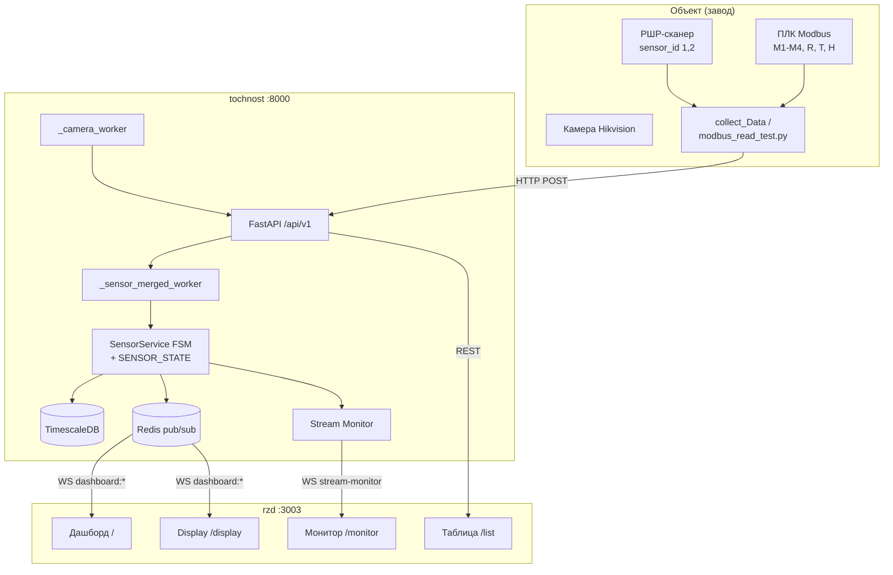
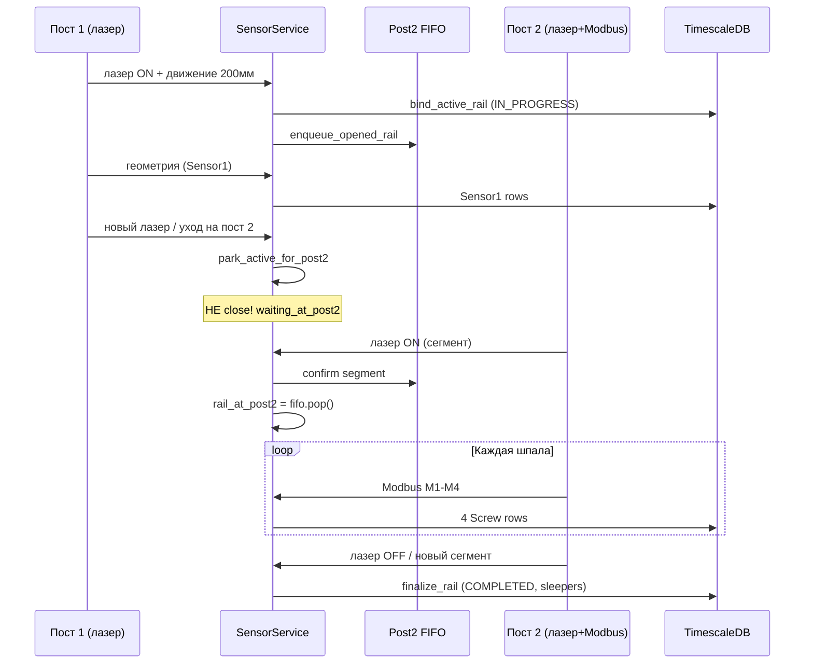

# RZD APPS — полный онбординг для ИИ-разработки

> **Назначение документа:** передать новому ИИ-ассистенту (или новому разработчику) весь накопленный контекст проекта: что это, зачем, как устроено, как работает закрутка, типовые сценарии и FAQ по реальным инцидентам.  
> **Актуальность:** июнь 2026. Основано на коде в `tochnost/` и `rzd/`, планах в `.cursor/plans/`, ~35 чатах разработки.

---

## Содержание

1. [Что это за проект и зачем он нужен](#1-что-это-за-проект-и-зачем-он-нужен)
2. [Предметная область: термины и физический процесс](#2-предметная-область-термины-и-физический-процесс)
3. [Архитектура системы](#3-архитектура-системы)
4. [Структура репозитория](#4-структура-репозитория)
5. [Конвейер данных: от датчиков до экрана](#5-конвейер-данных-от-датчиков-до-экрана)
6. [Жизненный цикл РШР (FSM)](#6-жизненный-цикл-ршр-fsm)
7. [Закрутка: как ищется, считается и изучается](#7-закрутка-как-ищется-считается-и-изучается)
8. [Лазерные датчики: пост 1 и пост 2](#8-лазерные-датчики-пост-1-и-пост-2)
9. [Frontend: дашборд, display, монитор](#9-frontend-дашборд-display-монитор)
10. [База данных и API](#10-база-данных-и-api)
11. [Камера, OCR, Telegram](#11-камера-ocr-telegram)
12. [Конфигурация и деплой](#12-конфигурация-и-деплой)
13. [Тестирование, replay и отладка](#13-тестирование-replay-и-отладка)
14. [Базовые сценарии (кейсы)](#14-базовые-сценарии-кейсы)
15. [FAQ: популярные проблемы и решения](#15-faq-популярные-проблемы-и-решения)
16. [Открытые задачи](#16-открытые-задачи)
17. [Инструкция для нового ИИ-ассистента](#17-инструкция-для-нового-ии-ассистента)

---

## 1. Что это за проект и зачем он нужен

### Суть

**RZD APPS** — программный комплекс для **мониторинга и учёта сборки рельсовых скреплений (РШР)** на производственной линии (завод РЖД). Система в реальном времени:

- принимает данные с **двух контуров датчиков** (геометрия рельсы + закрутка гаек);
- ведёт **жизненный цикл каждой РШР** от появления на посту 1 до ухода с поста 2;
- считает **число шпал** (в UI колонка называется «Эпюра» — см. терминологическую заметку ниже), гайки, геометрию, ошибки;
- показывает всё на **веб-дашборде** (в т.ч. на большом 50" мониторе на заводе);
- сохраняет историю в **TimescaleDB** для отчётов и разбора инцидентов.

### Бизнес-цель

Оператор и инженер на линии должны видеть:
- как идёт сборка **текущей** РШР (стадии, 4 гайки на шпалу, сопротивление, ширина колеи);
- **замечания** (отклонения от порогов) в момент возникновения;
- **статистику** смены (производительность, температура, влажность);
- историю по каждой РШР в таблице производства.

### Два контура оборудования

| Контур | Что измеряет | Как попадает в систему |
|--------|--------------|------------------------|
| **Sensor1 (РШР-сканер)** | Геометрия рельсы, лазеры, `mmAlongRail`, износ, ширина колеи | `POST /api/v1/sensor/first` |
| **Sensor2 (Modbus / ПЛК)** | Моменты M1–M4, частоты f1–f4, сопротивление R, температура T, влажность H | `POST /api/v1/sensor/second` |

На объекте данные собирает внешний скрипт (`test toch/modbus_read_test.py` на Windows/Linux, `collect_Data/` — отдельный контур сбора) и шлёт HTTP-запросами на backend **tochnost**.

### Что НЕ входит в runtime backend

- **OCR номера РШР** — обучение в `collect_Data/` и `PaddleOCR_train/`, результат пишется в поле `scanned_name` через API, но распознавание в runtime tochnost не встроено.
- **Первый контур датчиков** (first sensor) — упоминался в ранних чатах как отдельная папка вне monorepo; основная логика — Sensor1/Sensor2 в tochnost.

---

## 2. Предметная область: термины и физический процесс

### Глоссарий

> ⚠️ **Терминологическая заметка (важно).** «**Эпюра**» в терминологии РЖД — это _раскладка шпал_, т.е. **расстояние между шпалами** (нормативно — число шпал на км пути), а **не** их количество. То, что реально считает система — это **число шпал** на РШР (`sleepers = ceil(гайки/4)`). Исторически UI-колонка и часть текста ниже называют это «эпюрой» — это неточность именования. Далее по документу, где написано «эпюра ~50», подразумевается **число шпал ~50**.

| Термин | Значение |
|--------|----------|
| **РШР** | Рельсошпальная решётка (~25 м рельсовый отрезок со шпалами и креплением) |
| **Число шпал (`sleepers`)** | Количество шпал на РШР = `ceil(гайки/4)`. Норма ~**50** шпал ≈ **~200 гаек** (4 гайки на шпалу). **То, что считает система.** В UI подписано «Эпюра». |
| **Эпюра** | Раскладка шпал = **расстояние между шпалами** (шпал/км). ⚠️ **Не** количество шпал — частая путаница. |
| **Пост 1** | Участок, где рельса проходит геометрический контроль (Sensor1, `sensor_id=1`) |
| **Пост 2** | Участок закрутки гаек (лазер Sensor1 `sensor_id=2` + Modbus Sensor2) |
| **mmAlongRail** | Позиция вдоль рельсы по энкодеру (мм). Сбрасывается на границе рельсов |
| **Гайки ЛН/ЛВ/ПН/ПВ** | Левая наружная, левая внутренняя, правая наружная, правая внутренняя (каналы M1–M4) |
| **Цикл закрутки** | Одна шпала: 4 гайки за один проход инструмента (~7–8 с между шпалами) |
| **Парковка** | РШР остаётся «В процессе» на посту 2, пока на посту 1 уже едет следующая |
| **FIFO поста 2** | Очередь `rail_id` РШР, ожидающих закрутки на посту 2 |
| **rail_at_post2** | Какая РШР **сейчас** закручивается на посту 2 |
| **Статус «В процессе»** | `RailStatus.IN_PROGRESS` — РШР ещё не финализирована |
| **Отбраковка** | РШР < 15 м или слишком долгий проезд поста 1 → не попадает в учёт |

### Физический процесс (упрощённо)

```
[Пост 1: геометрия]  →  [Переезд]  →  [Пост 2: закрутка]  →  [Уход]
     лазер ON              FIFO           M1–M4, R/T/H         лазер OFF
     mm растёт          парковка         ~50 циклов           finalize
```

**Параллельный режим (штатный):** пока на посту 2 ещё закручивается РШР A, на посту 1 уже может ехать РШР B. Modbus пишет гайки **только** в A (`rail_at_post2`), а B открывается как новая `active` и встаёт в FIFO.

### Нормы и пороги

| Параметр | Норма / порог |
|----------|---------------|
| Длина РШР | ~25 м (мин. OK ≥ 20 м, отброс < 15 м) |
| Число шпал (в UI «эпюра») | ~50 |
| Гайки | ~200 (аномалия: < 160 или > 220 при длине ≥ 20 м) |
| Пауза между циклами | ~7–8 с (`MIN_INTER_CYCLE_SEC=7`) |
| Подтверждение лазера движением | 200 мм (`LASER_CONFIRM_ADVANCE_MM`) |

---

## 3. Архитектура системы



### Ключевые принципы архитектуры

1. **In-memory FSM** (`SENSOR_STATE`) — «истина» о текущем конвейере; БД — персистентность.
2. **Единая очередь событий** (`merged_queue`) — Sensor1 и Sensor2 сливаются и обрабатываются в хронологическом порядке (буфер 500 мс).
3. **Redis** — только для live-дашборда (не источник правды).
4. **Stream Monitor** — диагностический буфер событий (pipeline + сырые пакеты), не влияет на FSM.
5. **rshr_core** — общая логика закрутки и таймингов, используется и в backend, и в offline-симуляторе.

---

## 4. Структура репозитория

Корень: `/Users/kusaq/Desktop/RZD APPS/`

```
RZD APPS/
├── docs/
│   └── AI_ONBOARDING.md          ← этот файл
├── tochnost/                     ← BACKEND (ветка dev)
│   ├── src/
│   │   ├── server/server.py      ← FastAPI app, lifespan
│   │   ├── api/v1/
│   │   │   ├── sensor/           ← ★ главная бизнес-логика FSM
│   │   │   ├── rail/             ← CRUD рельс, метрики, Excel
│   │   │   ├── screw/            ← гайки
│   │   │   ├── error/            ← замечания
│   │   │   ├── camera/           ← Hikvision snapshot worker
│   │   │   ├── ws/               ← WebSocket дашборда
│   │   │   ├── stream_monitor/   ← диагностика потока
│   │   │   └── auth/
│   │   ├── rshr_core/            ← ★ логика закрутки, тайминги, длина
│   │   └── infra/
│   │       ├── timescale_db/     ← модели, storage, миграции
│   │       ├── redis/
│   │       └── telegram/         ← burst фото при уходе с поста 2
│   ├── migrations/
│   ├── scripts/                  ← verify_rshr_replay, test_camera, mock
│   ├── docker-compose.yml
│   └── .env.example
│
├── rzd/                          ← FRONTEND (ветка main)
│   ├── src/
│   │   ├── app/                  ← App.tsx, роутинг, стили
│   │   ├── pages/                ← dashboard, display, list, item, monitor
│   │   ├── widgets/              ← 3D-модель, камера, панели
│   │   ├── features/             ← auth, таблица, модалки
│   │   ├── entities/             ← Zustand stores, WS-хуки
│   │   └── shared/api/           ← Axios, WebSocketService
│   ├── docker-compose.yml        ← порт 3003
│   └── nginx.conf
│
├── test toch/                    ← симуляция и live-сбор Modbus
│   ├── simulate_capture.py       ← ★ offline replay FSM
│   ├── modbus_read_test.py       ← live → POST /sensor/*
│   ├── run_validation.py
│   └── README.txt
│
├── test data/                    ← JSONL-логи с объекта за конкретные даты
│   ├── rshr_data.jsonl           ← Sensor1
│   └── modbus_data.jsonl         ← Sensor2
│
├── collect_Data/                 ← OCR pipeline, обучение номера РШР
├── PaddleOCR_train/              ← форк PaddleOCR (обучение, не runtime)
└── libs/                         ← общие пакеты для test toch
```

### Git-репозитории

| Папка | Ветка деплоя | Remote |
|-------|--------------|--------|
| `tochnost/` | `dev` | отдельный git-репо |
| `rzd/` | `main` | отдельный git-репо |

Monorepo `RZD APPS` — рабочая папка; коммиты делаются **внутри** `tochnost/` и `rzd/` отдельно.

---

## 5. Конвейер данных: от датчиков до экрана

### Шаг 1: Приём пакетов

```
POST /api/v1/sensor/first   → Sensor1Create (геометрия, лазеры, mmAlongRail)
POST /api/v1/sensor/second  → Sensor2Create (M1-M4, f1-f4, R, T, H)
```

Оба endpoint'а:
1. Кладут событие в `merged_queue` (`MergedSensorEvent`)
2. Параллельно пишут в Stream Monitor (async task)
3. Для Sensor2 — кэшируют T/H в Redis (`cache_dashboard_env_stats`)

**Важно:** все ~20 полей Sensor1 **обязательны** — иначе 422 и данные не попадают в FSM.

### Шаг 2: Worker

`_sensor_merged_worker()` (запускается в `lifespan`):
1. При старте: `rehydrate_in_progress_rails()` — восстанавливает единственную `IN_PROGRESS` из БД
2. Сортирует события по `event_ts` (буфер `REORDER_BUFFER_MS=500`)
3. Классифицирует опоздавшие пакеты: `STALE` / `LATE_APPEND` / `NORMAL`
4. Вызывает `add_sensor1_data` или `add_sensor2_data` под `fsm_lock()`

### Шаг 3: FSM → БД

- `Rail`, `Sensor1`, `Screw`, `Error` — пишутся в TimescaleDB
- Pipeline-события: `rshr_opened`, `rshr_parked_post1`, `post2_recognized`, `tightening_started`, `tightening_completed`, `rshr_departed_post2`, `rshr_closed`, `modbus_skipped`

### Шаг 4: Live-дашборд

```
SensorService._publish_stages()  → Redis dashboard:stages
SensorService._publish_error()   → Redis dashboard:errors
WS /api/v1/ws/dashboard          → фронт (каждые 2 с stats/status)
```

### Шаг 5: UI

`useDashboardWebSocket` → Zustand store → 3D-модель, плитки гаек, прогресс сборки.

---

## 6. Жизненный цикл РШР (FSM)

> **Главные файлы:** `tochnost/src/api/v1/sensor/service.py`, `state.py`  
> FSM **не** в `rail/fsm.py` (там только `detach_rail_from_sensor_state` при удалении).

### Состояния in-memory (`SensorState`)

| Поле | Назначение |
|------|------------|
| `_active` | Текущая РШР на посту 1 (`RailSession`) |
| `_waiting_at_post2` | «Припаркованные» сессии (сняты с active, ждут закрутки) |
| `_post2` (`Post2Tracker`) | `fifo_rail_ids`, `rail_at_post2`, pending segment |
| `_tightening` | Текущий цикл закрутки (пики M1–M4) |
| `_closed` | deque последних закрытых (до 32) |

### Диаграмма жизненного цикла



### Ключевые функции FSM

| Событие | Функция | Что происходит |
|---------|---------|----------------|
| Открытие РШР | `bind_active_rail()` | INSERT Rail, `set_active()`, FIFO |
| Геометрия пост 1 | `_apply_sensor1_to_active()` | Sensor1 в БД, пороги, publish stages |
| Уход с поста 1 | `park_active_for_post2()` | В `waiting_at_post2`, **без** finalize |
| Сегмент пост 2 | `_confirm_post2_segment()` | `rail_at_post2` из FIFO |
| Уход с поста 2 | `_depart_rail_from_post2()` | Telegram burst, `finalize_rail()` |
| Закрытие | `finalize_rail()` | `COMPLETED`, sleepers, length_mm, errors |
| Отбраковка | `discard_active_rail()` | < 15 м или post1 > 40 мин |
| Ручная отбраковка | `RailService.reject_rail()` | Только `IN_PROGRESS` |

### Парковка между сменами

**Договорённость:** допустима **ровно одна** запись «В процессе» — недокрученная РШР на посту 2 между сменами.

- В БД: статус `IN_PROGRESS`, `sleepers` не заполнен
- В UI: колонка «Эпюра» = **«—»**, не 0
- При рестарте backend: `rehydrate_in_progress_rails()` восстанавливает состояние
- `MAX_RAIL_OPEN_SEC` / tail_grace **не** применяются к `waiting_at_post2`

### Число шпал (sleepers) — в UI колонка «Эпюра»

> Термин «эпюра» здесь = число шпал (историческая неточность; строго эпюра — это расстояние между шпалами).

```
sleepers = ceil(количество_гаек / 4)
```

Считается **только при finalize** на уходе с поста 2, не на посту 1.

**Историческая ошибка (исправлена):** раннее `close_active_rail` на посту 1 давало эпюру 0 или ~20; запись гаек на `active.rail_id` вместо `rail_at_post2` давало ~70 на чужой РШР.

---

## 7. Закрутка: как ищется, считается и изучается

### 7.1. Физика и сигнал

На посту 2 ПЛК по Modbus отдаёт (раз в ~1 с):

| Поле | Смысл |
|------|-------|
| `M1`–`M4` / `frequency_torque_1..4` | Момент закрутки (Нм) по 4 каналам |
| `f1`–`f4` / `converter_frequency_1..4` | Частота привода (Гц) |
| `R` | Сопротивление рельсовой цепи |
| `T`, `H` | Температура, влажность |

**Одна шпала** = один цикл: инструмент проходит 4 гайки (ЛН, ЛВ, ПН, ПВ). Между шпалами пауза ~7–8 с (все M и f ≈ 0).

### 7.2. Онлайн-алгоритм (production)

**Файлы:** `sensor/service.py` → `add_sensor2_data()`, `_finalize_tightening_cycle()`  
**Ядро:** `rshr_core/tightening.py`

```
┌─────────────────────────────────────────────────────────┐
│  Modbus пакет приходит на POST /sensor/second           │
│  ↓                                                      │
│  _modbus_target_rail_id() → только rail_at_post2        │
│  (если None → modbus_skipped, это норма без рельсы)   │
│  ↓                                                      │
│  СТАРТ цикла: has_moment_activity (M1-M4 > 0)           │
│               + пауза min_inter_cycle_sec (7с)          │
│  ↓                                                      │
│  В ПРОЦЕССЕ: bump_peaks — max момент/частота по M1-M4   │
│  ↓                                                      │
│  КОНЕЦ: all_torque_zero() N раз подряд (N=2)            │
│  ↓                                                      │
│  _finalize_tightening_cycle():                          │
│    → add_screw() × 4 (каналы 1-4)                       │
│    → проверка порога frequency_torque → Error           │
│    → record_nut_cycle() → Redis dashboard:stages        │
│    → emit tightening_completed                          │
└─────────────────────────────────────────────────────────┘
```

#### Правила старта цикла

```python
# rshr_core/tightening.py
def has_moment_activity(values) -> bool:
    """Старт только по моментам M1-M4, не по частоте alone."""
    return any(M1..M4 > 0)
```

**Почему `min_inter_cycle_sec=7`:** PLC шлёт пики одним пакетом с точностью до секунды; без паузы FSM видел «2 цикла» за одну шпалу.

#### Правила конца цикла

```python
def all_torque_zero(values) -> bool:
    """M1-M4 и f1-f4 все нули."""
```

Нужно **2 нулевых пакета подряд** (`CYCLE_END_ZERO_PACKETS=2`), чтобы не закрыть цикл на кратковременном провале сигнала.

#### Запись гайки (`add_screw`)

Для каждого канала 1–4 при финализации цикла:
- `serial_id` = порядковый номер гайки **внутри этой rail_id**
- `max_torque`, `max_frequency` = пики за цикл
- `mm_along_rail` = позиция на момент старта цикла
- `rail_id` = **rail_at_post2**, никогда active с поста 1

### 7.3. Офлайн-алгоритм (изучение и валидация)

**Файл:** `rshr_core/tightening.py` → `detect_cycles_in_window()`

Используется в:
- `test toch/simulate_capture.py` — полный replay FSM без API/БД
- `test toch/run_validation.py` — валидация JSONL
- `tochnost/scripts/verify_rshr_replay.py` — упрощённый replay по логам

```python
detect_cycles_in_window(
    modbus_events, t0, t1, mm_at,
    cycle_end_zero_packets=1,      # offline: 1 (vs 2 online)
    min_inter_cycle_sec=7.0,
    min_peak_moment_nm=15.0,       # отсечь шум
)
→ list[CompletedCycle]  # каждый = 4 гайки
```

### 7.4. Как изучать закрутку на тестовых данных

#### Подготовка данных

В `test data/` лежат пары файлов за конкретную дату:
- `rshr_data.jsonl` — пакеты Sensor1 (лазеры, mm, геометрия)
- `modbus_data.jsonl` — пакеты Sensor2 (M, f, R, T, H)

#### Запуск симуляции

```bash
cd "/Users/kusaq/Desktop/RZD APPS/test toch"
python simulate_capture.py \
  --rshr "../test data/rshr_data.jsonl" \
  --modbus "../test data/modbus_data.jsonl"
```

Симулятор воспроизводит:
- открытие/парковку/закрытие РШР;
- FIFO поста 2;
- циклы закрутки с теми же правилами, что `rshr_core`;
- счётчики: `rails_opened`, `screws_created`, `post2_unmatched_segments`.

#### Эталон для данных 19.05.2026

После плана `rshr_offline_parity`:
- **13** валидных РШР (не 17 — 4 коротких артефакта от mm=0)
- **1164** гайки
- Сенсоры считать **раздельно** (S1 и S2), не смешивать

#### Live-сбор с объекта

```bash
# Windows, папка test toch
pip install -r requirements.txt
python modbus_read_test.py
# Читает Modbus TCP 10.10.1.2:502, шлёт на API
```

На проде — systemd unit `modbus-read.service` (symlink без пробела: `/home/to4nost/modbus` → `test toch`).

### 7.5. Аномалии при закрытии

`_record_tightening_count_anomaly()` при `finalize_rail`:
- 0 гаек при длине ≥ 20 м → Error
- < 160 или > 220 гаек → Error (не правим «органику», только фиксируем)

### 7.6. Дашборд: отображение гаек

WebSocket `dashboard:stages` → `nuts: { ЛН, ЛВ, ПН, ПВ }`:
```json
{ "count": 12, "torque": 145.3, "ok": true }
```

3D-модель (`DashboardRailModel.tsx`): меш `Locks` красится по худшему статусу 4 гаек.

---

## 8. Лазерные датчики: пост 1 и пост 2

Оба поста шлют **Sensor1**, различаются `sensor_id`:
- `sensor_id == 1` → `process_first_sensor1_data()`
- `sensor_id == 2` → `process_second_sensor1_data()`

### Пост 1: открытие РШР

**Проблема «руки под лазером»** решена так:

```
лазер ON → pending_post1 (кандидат)
         → ждём mm_along_rail +200 мм
         → _confirm_pending_post1() → bind_active_rail()
```

ENV: `LASER_CONFIRM_ADVANCE_MM=200`

**Новая РШР при уже активной:**
- `_should_start_new_rail_on_post1()` — сброс mm ≥ 3000 мм (`NEW_RAIL_MM_RESET_DROP_MM`)
- Или рельса уже на посту 2 → park + bind новой
- **Не** по одному `laser_off` (лазер может мигать)

**Закрытие на посту 1 (устаревшее поведение заменено):**
- Раньше: `close_active_rail` → эпюра 0/20
- Сейчас: `park_active_for_post2()` → waiting, finalize только на посту 2

### Пост 2: FIFO и сегменты

```
лазер ON  → pending_segment = True (не выпускает сразу!)
         → подтверждение: mm +200 мм ИЛИ удержание ≥ 3 с
         → _confirm_post2_segment():
              - предыдущий rail_at_post2 УХОДИТ (finalize)
              - следующий из FIFO становится rail_at_post2
лазер OFF до подтверждения → ложный сегмент, FIFO не трогаем
```

ENV: `POST2_MIN_SEGMENT_SEC=3`

### mmAlongRail reset

Энкодер сбрасывается в 0 на границе рельсов (~каждые 25 м).

| Ситуация | Поведение |
|----------|-----------|
| Падение mm ≥ 3000 при лазере ON | Новая РШР (park + bind) |
| Падение mm, длина сегмента < 15 м | **Не** делить — продолжать ту же запись |
| Джиттер энкодера | `max(mm)` для длины — не откатывается |

---

## 9. Frontend: дашборд, display, монитор

**Стек:** React 19, TypeScript, Vite 7, Tailwind 4, Zustand, Three.js, FSD-архитектура.

### Страницы

| URL | Файл | Auth | Назначение |
|-----|------|------|------------|
| `/` | `pages/dashboard-page/` | да | Главный дашборд |
| `/display` | `pages/dashboard-display-page/` | да | Большой монитор (50", низкое разрешение) |
| `/list` | `pages/table-page/` | да | Таблица производства |
| `/item/:id` | `pages/item-page/` | да | Карточка РШР |
| `/monitor` | `pages/stream-monitor-page/` | **нет** | Диагностика потока |

### Дашборд `/`

- Слева: 3D-модель рельсы (`DashboardRailModel`, lazy)
- Сверху слева: превью камеры (polling 5 с)
- Справа: панели «Статус» + «Сборка» (`DashboardRightPanels`)
- Снизу справа: статистика + график замечаний
- Live: `useDashboardWebSocket()` — только при `authStatus === 'authenticated'`

### Display `/display`

Упрощённый layout для заводского монитора:
- Только 3D-модель + крупная панель «Сборка и статус»
- Без камеры, статистики, графика замечаний
- CSS: `.dashboard-display*` с `clamp()` для адаптивных шрифтов
- **Автоскейл через ENV пробовали и откатили** — лучше F11 браузера

### Stream Monitor `/monitor`

- WS: `/api/v1/stream-monitor/ws`
- События: `rshr_opened`, `tightening_started`, `modbus_skipped`, `packet_stale`, ...
- Экспорт: `GET /stream-monitor/export?mode=pipeline|full|incident`
- Публичный — для отладки без логина

### WebSocket-каналы дашборда

| Канал | Данные |
|-------|--------|
| `dashboard:status` | тип РШР, крепление, scanned_name, прогресс |
| `dashboard:stages` | геометрия + **гайки ЛН/ЛВ/ПН/ПВ** |
| `dashboard:stats` | T, H, производительность |
| `dashboard:errors` | последнее замечание |
| `dashboard:errors_distribution` | почасовое распределение (при connect) |

### API-интеграция

- Dev: Vite proxy `/api` → `localhost:8000`
- Prod: nginx proxy + `VITE_API_BASE_URL` (часто **пусто** — относительные пути)
- Auth: cookie-сессия, `POST /login`, `GET /auth/me`

---

## 10. База данных и API

### Модели (TimescaleDB)

**`Rail`** (`infra/timescale_db/models/rail.py`):
- `rail_id`, `name`, `scanned_name`, `status` (IN_PROGRESS / COMPLETED)
- `side`, `sleepers`, `length_mm`, `start_time`, `end_time`
- `resistance_avg/min/max`, `temperature_avg`
- `deleted_at` (soft delete)

**`Screw`**: `screw_id`, `serial_id`, `rail_id`, `channel` (1–4), `max_torque`, `max_frequency`, `mm_along_rail`

**`Sensor1`**: геометрия, лазеры, mmAlongRail, привязка к `rail_id`

**`Sensor2`**: сырые Modbus-поля, привязка к `screw_id`

**`Error`**: замечания с порогами, `is_critical`, `is_fixed`

### Основные API

```
POST   /api/v1/sensor/first|second     приём датчиков
GET    /api/v1/sensor/debug/state      снимок FSM (debug)
POST   /api/v1/sensor/state/reset      сброс FSM (confirm: true)

GET    /api/v1/rail                    список РШР
GET    /api/v1/rail/{id}               карточка
PATCH  /api/v1/rail/{id}               обновление (scanned_name)
DELETE /api/v1/rail/{id}               soft delete
POST   /api/v1/rail/{id}/reject        ручная отбраковка

WS     /api/v1/ws/dashboard
WS     /api/v1/stream-monitor/ws
GET    /api/v1/stream-monitor/export

GET    /api/v1/camera/rail-label/snapshot
```

---

## 11. Камера, OCR, Telegram

### Камера (runtime)

**Файл:** `tochnost/src/api/v1/camera/service.py`

- Фоновый worker `_camera_worker()` — снимок каждые `CAMERA_CAPTURE_INTERVAL_SEC` (2 с)
- Режим по умолчанию: **HTTP snapshot** (ISAPI Hikvision), не RTSP
- `detect_motion()` — пропуск кадра без изменений
- API: `GET /camera/rail-label/snapshot` → JPEG для дашборда
- Mock: `CAMERA_MOCK=true` → `static/camera-mock.jpg`

### OCR (вне runtime)

- Обучение: `collect_Data/`, `PaddleOCR_train/`
- Результат → `Rail.scanned_name` через `PATCH /rail/{id}`
- На фронте: колонка «Номер РШР», редактирование в карточке

### Telegram burst

При `_depart_rail_from_post2()`:
- `schedule_rail_departure_burst()` — 20 фото/сек с той же камеры
- ENV: `TELEGRAM_ENABLED`, `TELEGRAM_BOT_TOKEN`, `TELEGRAM_CHAT_ID`

---

## 12. Конфигурация и деплой

### Backend `tochnost/.env`

```env
# База
POSTGRES_HOST=postgres
POSTGRES_PORT=5432
POSTGRES_USER=...
POSTGRES_PASSWORD=...
POSTGRES_DB=...

# Redis
REDIS_HOST=redis
REDIS_PORT=6379
REDIS_PASSWORD=...

# Приложение
DEBUG=false
APP_PORT=8000
PUBLIC_URL=https://your-api-host.example.com
SECRET_KEY=...
JWT_SECRET_KEY=...

# FSM тайминги (критично для корректной работы)
TAIL_GRACE_SEC=120
POST2_MATCH_GRACE_SEC=30
MAX_RAIL_OPEN_SEC=3600
CYCLE_END_ZERO_PACKETS=2
REORDER_BUFFER_MS=500
MAX_LATE_PACKET_SEC=300
LATE_APPEND_GRACE_SEC=180
POST2_MIN_SEGMENT_SEC=3
POST2_DEPART_SETTLE_SEC=15   # окно после чистого OFF лазера пост2: досчитать «хвост» закрутки, затем закрыть
POST2_DEPART_GRACE_SEC=120  # фолбэк, если чистого OFF не было (разреженные данные / последний РШР смены)
POST1_MAX_PASS_SEC=2400
LASER_CONFIRM_ADVANCE_MM=200
MIN_INTER_CYCLE_SEC=7
SCREWS_COUNT_MIN_OK=160
SCREWS_COUNT_MAX_OK=220

# Камера (см. .env.example)
CAMERA_ENABLED=true
HIKVISION_FRONT_IP=...
TELEGRAM_ENABLED=true
```

### Frontend `rzd`

```env
# На проде часто ПУСТО — браузер ходит на /api через nginx :3003
VITE_API_BASE_URL=
```

**Не использовать** `host.docker.internal` в `VITE_API_BASE_URL` на проде — это адрес для Docker-сборки, не для браузера оператора.

### Docker

**Backend:**
```bash
cd tochnost
docker compose up -d --build
# app :8000, postgres :5432, redis :6379
```

**Frontend:**
```bash
cd rzd
docker compose up -d --build
# nginx :3003
```

**Автозапуск после перезагрузки:**
```bash
docker update --restart unless-stopped tochnost_postgres tochnost_redis tochnost_app
```

### Типовой деплой на прод

```bash
cd tochnost && git pull origin dev && docker compose up -d --build
cd rzd && git pull origin main && docker compose build --no-cache && docker compose up -d
```

### NTP

На РШР-сканере и ПЛК Modbus **обязателен NTP** — иначе watermark/stale-пакеты и рассинхрон Sensor1 vs Modbus (~11 с наблюдалось на объекте).

---

## 13. Тестирование, replay и отладка

### Инструменты

| Инструмент | Путь | Когда использовать |
|------------|------|-------------------|
| `simulate_capture.py` | `test toch/` | Offline replay JSONL, проверка FSM |
| `verify_rshr_replay.py` | `tochnost/scripts/` | Replay по pipeline-логам |
| `run_validation.py` | `test toch/` | Валидация формата JSONL |
| `modbus_read_test.py` | `test toch/` | Live Modbus → API |
| `send_mock_data.py` | `tochnost/scripts/` | Синтетические данные |
| `collect_incident.sh` | `tochnost/scripts/` | Сбор bundle при инциденте |
| `test_camera.py` | `tochnost/scripts/` | Проверка Hikvision |

### Debug API

```bash
# Снимок FSM
curl http://localhost:8000/api/v1/sensor/debug/state

# Stream monitor stats
curl http://localhost:8000/api/v1/stream-monitor/stats

# Экспорт инцидента
curl "http://localhost:8000/api/v1/stream-monitor/export?mode=incident" -o incident.jsonl
```

### Stream Monitor на фронте

`http://localhost:3003/monitor` — смотреть цепочку:
```
rshr_opened → post2_recognized → tightening_started → tightening_completed → rshr_departed_post2 → rshr_closed
```

### Чеклист после деплоя

1. `curl .../stream-monitor/stats` — счётчики растут
2. Прогон 1 РШР → в мониторе есть `rshr_opened`
3. На посту 2 → `tightening_started` / `tightening_completed`
4. Уход → `rshr_closed`, в таблице эпюра ~50
5. Дашборд: T/H, стадии, гайки обновляются

---

## 14. Базовые сценарии (кейсы)

### Кейс 1: Штатный прогон одной РШР

1. РШР подъезжает на пост 1, лазер ON, mm растёт на 200+ мм
2. `rshr_opened` → в таблице новая запись «В процессе»
3. Sensor1 пишет геометрию → дашборд показывает ширину колеи, износ
4. РШР уезжает с поста 1 → `park_active_for_post2`, в FIFO
5. На посту 2 лазер ON → сегмент подтверждён → `post2_recognized`
6. Modbus: ~50 циклов × 4 гайки → `tightening_completed` × 50
7. РШР уезжает с поста 2 → `rshr_departed_post2` → Telegram 20 фото
8. `rshr_closed` → статус «Завершено», эпюра ~50, длина ~25 м

### Кейс 2: Параллельные РШР (A на посту 2, B на посту 1)

1. A закручивается: `rail_at_post2 = A`
2. B приезжает на пост 1: `bind_active_rail(B)`, A остаётся в `waiting_at_post2`
3. Modbus пишет гайки в **A** (не в B!)
4. B паркуется в FIFO за A
5. A уезжает → finalize A с эпюрой
6. B выходит на пост 2 → закрутка B

### Кейс 3: Парковка между сменами

1. Конец смены: на посту 2 недокрученная A (30 из 50 шпал)
2. Статус A = «В процессе», эпюра в UI = «—»
3. Ночь, backend перезапущен → `rehydrate_in_progress_rails()` восстанавливает A
4. Утро: закрутка продолжается, finalize при уходе

### Кейс 4: Ложный лазер (рука)

1. Лазер ON, mm не меняется (< 200 мм)
2. РШР **не открывается** — pending кандидат сбрасывается
3. В мониторе нет `rshr_opened`

### Кейс 5: Короткий артефакт (< 15 м)

1. Лазер мигнул, mm прошёл 2 м
2. `should_discard_rshr()` → `rshr_discarded`
3. В таблице нет записи (или soft discard)

### Кейс 6: Replay тестовых данных

```bash
cd "test toch"
python simulate_capture.py \
  --rshr "../test data/NEW/rshr_data.jsonl" \
  --modbus "../test data/NEW/modbus_data.jsonl"
# Сверить: rails_opened=13, screws_created≈1164
```

### Кейс 7: Разбор инцидента на проде

1. Оператор видит эпюру 0 или лишние записи
2. `collect_incident.sh` или export `mode=incident` из stream monitor
3. `verify_rshr_replay.py` на скачанном jsonl
4. Смотреть: был ли `park` vs `close`, `modbus_skipped`, `packet_stale`, пустой FIFO

### Кейс 8: Обновление scanned_name (OCR)

1. Камера снимает маркировку
2. Внешний OCR (collect_Data) распознаёт номер
3. `PATCH /api/v1/rail/{id}` `{ "scanned_name": "РШР-12345" }`
4. Дашборд: `dashboard:status` → номер в панели «Статус»

---

## 15. FAQ: популярные проблемы и решения

### FAQ-1: Эпюра 0, 20 или 70 вместо ~50

**Симптом:** в таблице производства неверное количество шпал.

**Причины:**
| Эпюра | Причина |
|-------|---------|
| 0 | РШР закрыли на посту 1 до окончания закрутки |
| ~20 | Закрыли после ~20 шпал (частичная закрутка) |
| ~70 | Гайки писались на `active.rail_id` (пост 1), а не на `rail_at_post2` |

**Решение:**
- `park_active_for_post2()` вместо `close_active_rail` на посту 1
- `add_screw(rail_id=)` → только `rail_at_post2`
- UI: «В процессе» → эпюра «—»

**Файлы:** `sensor/service.py`, `sensor/state.py`, `rzd/src/shared/lib/rail-utils.ts`  
**План:** `.cursor/plans/fix_rshr_sleeper_counting_d2cb8f75.plan.md`

---

### FAQ-2: РШР не закрывается / лишние короткие записи

**Симптом:** проехало 3 РШР, в БД 5+ записей с длиной 782 мм, 1294 мм.

**Причины:**
1. Сброс mm → мгновенное открытие новой РШР без подтверждения движением
2. Мигание лазера при mm=0 → артефактные `rshr_opened`
3. Пост 2 не дал полного сегмента → нет finalize
4. Active-сессия залипла на посту 1 при РШР уже на посту 2

**Решение:**
- `LASER_CONFIRM_ADVANCE_MM=200`
- Детекция новой РШР по mm reset ≥ 3000
- Не делить при длине < 15 м
- Снятие active при РШР на посту 2

**Файлы:** `sensor/service.py`, `rshr_core/config.py`  
**Коммит:** `7f96c95`, `af7586c`, `6358036`

---

### FAQ-2b: Финализация на постах — «проехал, но не закрылся» / два РШР на одном посту

**Инвариант:** на посту 1 и на посту 2 физически не может быть двух РШР. Заезд новой
решётки = предыдущая обязана уйти. Финализация устроена по нескольким триггерам
(данные разреженные: нулевые пакеты не приходят, когда РШР стоит — сенсоры пишут
только при изменении `mmAlongRail`; Modbus тоже может пропускать).

**Пост 2 — уход `rail_at_post2` закрывается по ЛЮБОМУ из (в порядке приоритета):**
1. **Чистый OFF лазера** после реального прохода (`rail_at_post2_max_mm` дотянул до
   `RSHR_LENGTH_DISCARD_BELOW_MM`) → закрытие через короткий **settle**
   `POST2_DEPART_SETTLE_SEC` (15 с) — успеть досчитать «хвост» закрутки (моменты
   приходят ещё ~5–10 с после гашения лазера). Основной путь
   (`_maybe_close_departed_post2_rail` в `_post_event_tick`).
2. **Заезд следующей решётки** (`_confirm_post2_segment`) → старый `rail_at_post2`
   финализируется ПРИНУДИТЕЛЬНО (`_finalize_departed_post2_rail`), даже если FIFO пуст.
3. **Grace-фолбэк** `POST2_DEPART_GRACE_SEC` (120 с) — если чистого OFF не было
   (рельс встал за лазером, пакеты прекратились; сирота без длины).

Безопасно для «парковки между сменами»: припаркованный недокрученный рельс лежит
ПОД лазером (`post2_laser_was_on == True`) → не трогаем; срабатывает только по
реальному уходу (лазер был и погас).

**Пост 1 — парковка `active` по своему OFF, не дожидаясь пост 2:** если рельс реально
прошёл (`traversed_mm ≥ RSHR_LENGTH_DISCARD_BELOW_MM`) и лазер погас со сбросом
`mmAlongRail` к ~0 (`MM_RESET_NEAR_ZERO`, граница рельса) → `park_active_for_post2()`
сразу (раньше парковка ждала распознавания на посту 2). Заезд нового рельса на пост 1
паркует предыдущий через `_should_start_new_rail_on_post1` (сброс mm ≥ 3000).

**Не путать** с парковкой между сменами (раздел 6): там рельс ПОД лазером —
финализировать нельзя. Здесь лазер ПОГАС, рельс уехал.

**Файлы:** `sensor/service.py` (`_finalize_departed_post2_rail`,
`_maybe_close_departed_post2_rail`, `_confirm_post2_segment`, `_post_event_tick`,
`process_first_sensor1_data`), `sensor/state.py` (`rail_at_post2_max_mm`),
`rshr_core/config.py` (`post2_depart_settle_sec`, `post2_depart_grace_sec`)  
**Валидация (настоящий FSM):** `uv run --python 3.12 --with pydantic python
scripts/replay_logs.py --rshr … --modbus …` — проверять, что нет `IN_PROGRESS` и
не теряются циклы закрутки (`ПОТЕРЯНО всплесков`).  
**ENV:** `POST2_DEPART_SETTLE_SEC` (15), `POST2_DEPART_GRACE_SEC` (120)

---

### FAQ-3: Данные идут, но дашборд пустой

**Симптом:** T/H или сырые пакеты есть, длина и стадии — нет.

**Причины:**
1. **422 на `/sensor/first`** — не все обязательные поля (смотреть логи uvicorn)
2. Пакеты sensor_id=1 не шлются с объекта
3. `_publish_stages` не вызывается при парковке на посту 2
4. Моковые данные на фронте (устарело)

**Решение:**
- Проверить счётчик поста 1 в stream monitor > 0
- `get_dashboard_rail_id()`: active → post2 → waiting
- `_publish_post2_stages` во время закрутки

**Проверка:** `curl .../sensor/debug/state`, логи 422

---

### FAQ-4: modbus_skipped при закрутке

**Симптом:** в мониторе много `modbus_skipped`, гайки не пишутся.

**Причина:** `rail_at_post2 is None` — Modbus не к чему привязать.

| Ситуация | Норма? |
|----------|--------|
| Посты пустые, нет рельсы | Да, штатно |
| Идёт закрутка, лазер post2 ON | **Нет, баг** — проверить FIFO, post2_recognized |

**Решение:** убедиться, что post1 шлёт пакеты и FIFO наполняется; смотреть цепочку `rshr_opened` → `post2_recognized`.

---

### FAQ-5: Двойные циклы закрутки в pipeline

**Симптом:** одна шпала → 2× `tightening_started`.

**Причина:** PLC шлёт пики одним пакетом; FSM завершал цикл после 2 нулевых пакетов и сразу открывал новый.

**Решение:** `MIN_INTER_CYCLE_SEC=7`

**Файл:** `rshr_core/config.py`, `sensor/service.py`

---

### FAQ-6: packet_stale убивает Sensor1

**Симптом:** все пакеты поста 1 помечаются stale, геометрия не пишется.

**Причина:** Modbus опережал РШР-сканер на ~11 с; **общий** watermark помечал старые пакеты S1.

**Решение:** per-stream watermark (`s1:1`, `s1:2`, `s2`)

**Коммит:** `8862625`

---

### FAQ-7: Температура/влажность не на дашборде

**Симптом:** Modbus шлёт T/H, на дашборде пусто без потока Sensor1.

**Решение:** `cache_dashboard_env_stats()` вызывается независимо от FSM рельсы.

**Коммит:** `e982489` (backend)

---

### FAQ-8: Stream monitor зависает

**Симптом:** дашборд живой, `/monitor` — «Подключено», событий нет.

**Причина:** при переполнении очереди (500) WS-подписчик удалялся навсегда; GC убивал async tasks.

**Решение:** сбрасывать старые события вместо удаления подписчика; держать strong refs на monitor tasks.

**Коммит:** `2565875`  
**Workaround:** F5 или redeploy

---

### FAQ-9: РШР «уехала в молоко»

**Симптом:** новая РШР на посту 1, но `rshr_opened` нет — данные в старой сессии.

**Причина:** предыдущая РШР на посту 2, но `active` на посту 1 не снята (лазер не гас).

**Решение:** детекция по mm reset; снятие active при РШР на посту 2.

**Коммиты:** `af7586c`, `7f96c95`

---

### FAQ-10: Worker падает (TypeError timezone)

**Симптом:** после рестарта ничего не обрабатывается.

**Причина:** `classify_late_packet` — aware `received_at` − naive `event_ts`.

**Решение:** нормализация через `_naive_utc()` в `late_packets.py`

**Коммит:** `d0c0713`

---

### FAQ-11: Замечания показывают всё время, а не сегодня

**Решение:** `count_since(today)` вместо `count_all()`.

**Коммиты:** `b930db7`, `4707e2c`

---

### FAQ-12: Фронт 500 секунд собирается

**Решение:** `@vitejs/plugin-react-swc`, code splitting (three, recharts), lazy routes.

**Коммит:** `172e592`

---

### FAQ-13: Docker build timeout (uv sync)

**Решение:**
```dockerfile
ENV UV_HTTP_CONNECT_TIMEOUT=120
ENV UV_HTTP_TIMEOUT=300
ENV UV_HTTP_RETRIES=10
```
+ BuildKit cache mount

---

### FAQ-14: VITE_API_BASE_URL на проде

**Правило:** на проде для браузера оператора — **пустое** значение. API идёт через nginx на `:3003/api/...`.

`host.docker.internal` — только для Docker-сборки, не для runtime браузера.

---

### FAQ-15: Как понять, сколько РШР в тестовых данных

**Правило:** считать сенсоры **раздельно**; полный проезд = размах mm ≥ 8 м, > 500 точек.

17 лазерных сегментов ≠ 17 РШР (4 — мусор при mm=0).

**Скрипты:** `test toch/match_rshr_report.py`, `run_validation.py`

---

## 16. Открытые задачи

По планам в `.cursor/plans/` (статус pending на момент июня 2026):

| Задача | План | Суть |
|--------|------|------|
| `add_screw` + modbus target | `fix_rshr_sleeper_counting` | Довести per-rail serial и target |
| Отбраковка операций | `отбраковка_операций` | UI + backend для брака гаек |
| Per-rail R/T stats | `per-rail_r_t_stats` | Статистика сопротивления/температуры по рельсе |
| Post2 length corruption | `fix_post2_length_corruption` | Коррупция длины на посту 2 |
| Deploy watermark fix | `deploy_watermark_fix` | Деплой фикса watermark на прод |
| RSHR offline parity | `rshr_offline_parity` | Оставшиеся пункты паритета |
| OCR train and deploy | `ocr_train_and_deploy` | Внедрение OCR в pipeline |

Перед работой — проверить актуальный статус в git, план мог быть частично выполнен.

---

## 17. Инструкция для нового ИИ-ассистента

### Первое сообщение (скопировать)

```
Проект RZD APPS — мониторинг сборки РШР на заводе РЖД.

Прочитай docs/AI_ONBOARDING.md — там полный контекст.

Ключевое:
- Backend: tochnost/ (FastAPI, ветка dev)
- Frontend: rzd/ (React, ветка main)
- FSM в sensor/service.py + sensor/state.py
- Закрутка: rshr_core/tightening.py, 4 гайки/цикл, rail_at_post2
- НЕ закрывать РШР на посту 1 — только park; finalize на посту 2
- Эпюра «—» для IN_PROGRESS
- Тесты: test toch/simulate_capture.py + test data/*.jsonl
- Диагностика: /monitor (stream monitor)

Не меняй FSM без понимания FIFO и парковки.
```

### Что читать для типовых задач

| Задача | Файлы |
|--------|-------|
| Баг эпюры / FSM | `sensor/service.py`, `sensor/state.py`, `rshr_core/` |
| Закрутка / Modbus | `rshr_core/tightening.py`, `add_sensor2_data` |
| Дашборд UI | `rzd/src/entities/dashboard/`, `pages/dashboard-*` |
| Таблица РШР | `rzd/src/features/production-table/`, `rail-utils.ts` |
| Stream monitor | `stream_monitor/`, `pages/stream-monitor-page/` |
| Деплой / ENV | `docker-compose.yml`, `.env.example`, раздел 12 этого документа |
| Replay / тест | `test toch/simulate_capture.py` |

### Чего избегать

1. **Не** вызывать `close_active_rail` при новом лазере на посту 1 — только `park_active_for_post2`
2. **Не** писать гайки на `get_active_rail()` — только `rail_at_post2`
3. **Не** использовать общий watermark для S1 и S2
4. **Не** ставить `host.docker.internal` в prod `VITE_API_BASE_URL`
5. **Не** править `PaddleOCR_train/` при багах FSM — это отдельный форк
6. **Не** коммитить `.env` с секретами

### Диагностика за 5 минут

```bash
# 1. FSM жив?
curl -s localhost:8000/api/v1/sensor/debug/state | python3 -m json.tool | head -50

# 2. Пакеты приходят?
curl -s localhost:8000/api/v1/stream-monitor/stats | python3 -m json.tool

# 3. Replay на тестовых данных
cd "test toch" && python simulate_capture.py --rshr "../test data/rshr_data.jsonl" --modbus "../test data/modbus_data.jsonl"
```

---

## Приложение A: Карта pipeline-событий

| Событие | Когда |
|---------|-------|
| `rshr_opened` | `bind_active_rail` |
| `rshr_parked_post1` | `park_active_for_post2` |
| `post2_recognized` | `_confirm_post2_segment` |
| `tightening_started` | `start_tightening_cycle` |
| `tightening_completed` | `_finalize_tightening_cycle` |
| `modbus_skipped` | нет `rail_at_post2` |
| `packet_stale` | опоздавший пакет |
| `rshr_departed_post2` | `_depart_rail_from_post2` |
| `rshr_closed` | `finalize_rail` |
| `rshr_discarded` | `discard_active_rail` |
| `worker_error` | исключение в worker |

## Приложение B: Индекс чатов разработки

История в `~/.cursor/projects/Users-kusaq-Desktop-RZD-APPS/agent-transcripts/` (35 чатов).

| Тема | ID чата |
|------|---------|
| Эпюра 0/20/70 | `ae40a0a6` |
| РШР не закрылся 25.06 | `84385cbc` |
| РШР в молоко | `0dd367f5` |
| Ложный лазер | `0341cb6c` |
| Modbus/watermark | `8f6c891c` |
| Дашборд пустой | `c360b4f2` |
| Sensor2 T/H | `acf1b55e` |
| Stream monitor | `54337ae6` |
| ENV прод | `e05243a6` |
| Display UI | `0e7fc9a6` |
| Масштаб 50" (откат) | `094b0cf3` |
| Docker timeout | `cb82cec3` |
| Архитектура / валидация | `1cca5537`, `bae08ef8` |

## Приложение C: Связанные планы

Все в `~/.cursor/plans/` (рекомендуется скопировать в `docs/plans/`):

- `fix_rshr_sleeper_counting_d2cb8f75.plan.md` — эпюра, парковка
- `rshr_offline_parity_1e366207.plan.md` — паритет offline/live
- `rshr_screw_cycle_logic_93559ba6.plan.md` — логика циклов
- `laser-false-trigger-guard_bcd08b06.plan.md` — антиложный лазер
- `live_post2_dashboard_nuts_ab7884ff.plan.md` — live гайки на дашборде
- `отбраковка_операций_a33145a3.plan.md` — отбраковка (будущее)

---

*Документ создан для переноса контекста в другое ИИ-приложение. При изменении FSM или деплоя — обновляйте разделы 6, 7, 12 и FAQ.*
