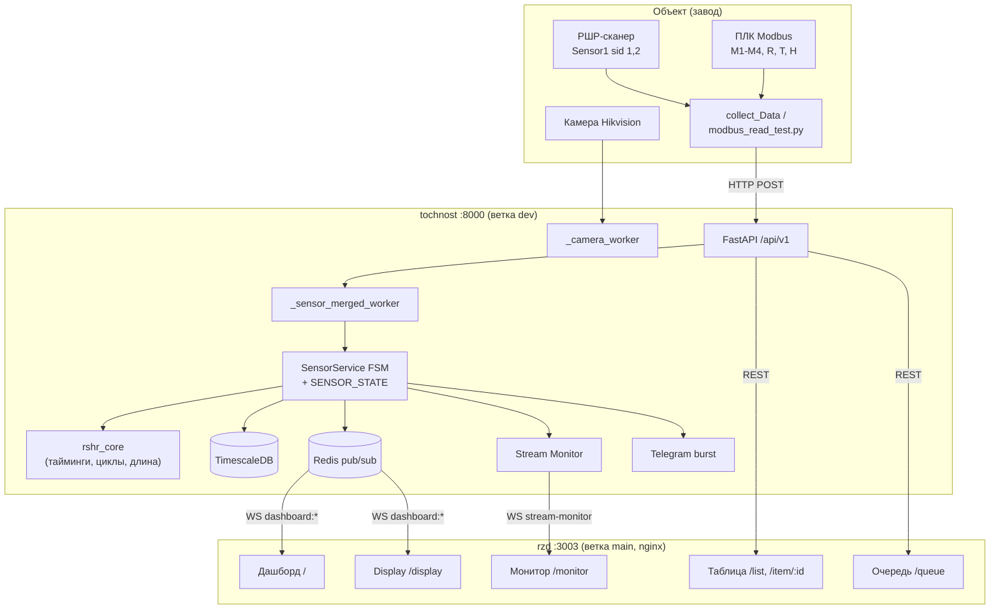

# Архитектура — RZD APPS

> Компоненты, поток данных, модель БД, границы ответственности. Поведенческие контракты — [SPEC.md](../SPEC.md). Глубокий нарратив — [AI_ONBOARDING.md](AI_ONBOARDING.md).

## 1. Компоненты

## 2. Ключевые принципы

1. **In-memory FSM (`SENSOR_STATE`) = истина** о текущем конвейере; БД — персистентность, Redis — только live-дашборд. → [ADR-0008](adr/0008-inmemory-fsm-source-of-truth.md)
2. **Единая очередь `merged_queue`** — Sensor1 и Sensor2 сливаются и обрабатываются в хронологическом порядке (буфер `REORDER_BUFFER_MS=500`).
3. **`rshr_core`** — общая логика закрутки/таймингов/длины; один и тот же код в backend и в офлайн-симуляторе → воспроизводимость (эталон 19.05).
4. **Stream Monitor** — диагностический буфер, не влияет на FSM.
5. **Два независимых git-репо** (`tochnost` dev, `rzd` main); корень `RZD APPS/` — рабочая папка, не репо.

## 3. Поток данных (5 шагов)

1. **Приём.** `POST /sensor/first|second` → `merged_queue` (+ Stream Monitor async; для S2 — кэш T/H в Redis).
2. **Worker.** `_sensor_merged_worker` (в `lifespan`): при старте `rehydrate_in_progress_rails()`; сортировка по `event_ts` (буфер 500 мс); классификация опоздавших (`STALE`/`LATE_APPEND`/`NORMAL`) по **per-stream** watermark; вызов `add_sensor1_data` / `add_sensor2_data` под `fsm_lock()`.
3. **FSM → БД.** Запись `Rail`, `Sensor1`, `Screw`, `Error`; эмиссия pipeline-событий.
4. **Live.** `_publish_stages` / `_publish_error` → Redis → WS `/ws/dashboard` (каждые ~2 с).
5. **UI.** `useDashboardWebSocket` → Zustand store → 3D-модель, плитки гаек, прогресс.

## 4. Backend `tochnost/src/`

| Модуль | Ответственность |
|--------|-----------------|
| `server/server.py` | FastAPI app, `lifespan` (запуск worker'ов) |
| `api/v1/sensor/service.py` | ★ поведение FSM (1370+ строк) |
| `api/v1/sensor/state.py` | `SensorState` / `SENSOR_STATE` (in-memory) |
| `api/v1/sensor/router.py`, `schemas.py` | endpoints и pydantic-схемы приёма |
| `api/v1/rail/` | CRUD рельс, метрики, Excel, `reject_rail`, отвязка от FSM при удалении |
| `api/v1/screw/`, `error/` | гайки, замечания |
| `api/v1/camera/` | Hikvision snapshot worker, `/camera/rail-label/snapshot` |
| `api/v1/ws/` | WebSocket дашборда |
| `api/v1/stream_monitor/` | диагностика потока, export |
| `rshr_core/` | ★ `tightening.py`, `config.py` (`RshrTimingConfig`), `late_packets.py`, `modbus_window.py`, `rshr_length.py`, `rshr_segments.py` |
| `infra/timescale_db/` | модели, storage, миграции |
| `infra/redis/`, `infra/telegram/` | pub/sub, burst фото |
| `scripts/` | `verify_rshr_replay.py`, `replay_logs.py`, `send_mock_data.py`, `test_camera.py`, `collect_incident.sh` |

## 5. Frontend `rzd/src/` (FSD)

Слои (сверху вниз, импорт только вниз): `app → pages → widgets → features → entities → shared`.

| Слой | Содержимое |
|------|-----------|
| `app/` | `App.tsx`, роутинг, стили, `store/` |
| `pages/` | `dashboard-page`, `dashboard-display-page` (монитор 50"), `table-page`, `item-page`, `queue-page`, `stream-monitor-page` |
| `widgets/` | `dashboard-rail-model` (3D, lazy), `dashboard-camera-preview`, `dashboard-right-panels`, `dashboard-display-panel`, `sidebar-nav`, `dashboard-bottom-cards`, `dashboard-info-modals` |
| `features/` | `auth-modal`, `production-table`, `table-filters`, `errors-chart`, `stages/stats/status-panel`, `reject-confirm-modal`, `item-*` |
| `entities/` | Zustand stores + WS-хуки: `dashboard` (`useDashboardWebSocket`), `auth`, `camera`, `item`, `production`, `stream-monitor` |
| `shared/` | `api/` (Axios, `WebSocketService`), `lib/rail-utils.ts` (число шпал «—» для IN_PROGRESS), `ui/`, `types/`, `config/` |

### Страницы

| URL | Auth | Назначение |
|-----|------|------------|
| `/` | да | Главный дашборд (3D + камера + панели + статистика) |
| `/display` | да | Заводской монитор 50" (только 3D + «Сборка и статус») |
| `/list`, `/item/:id` | да | Таблица производства / карточка РШР |
| `/queue` | да | Живая очередь конвейера (пост 1/2, FIFO, ручная финализация поста 2) |
| `/monitor` | **нет** | Диагностика потока |

### WebSocket-каналы дашборда

| Канал | Данные |
|-------|--------|
| `dashboard:status` | тип РШР, крепление, `scanned_name`, прогресс |
| `dashboard:stages` | геометрия + гайки ЛН/ЛВ/ПН/ПВ (`{count, torque, ok}`) |
| `dashboard:stats` | T, H, производительность |
| `dashboard:errors` | последнее замечание |
| `dashboard:errors_distribution` | почасовое распределение (при connect) |

## 6. Модель БД (TimescaleDB)

| Модель | Ключевые поля |
|--------|---------------|
| `Rail` | `rail_id`, `name`, `scanned_name`, `status` (IN_PROGRESS/COMPLETED), `side`, `sleepers`, `length_mm`, `start_time`, `end_time`, `resistance_avg/min/max`, `temperature_avg`, `deleted_at` |
| `Screw` | `screw_id`, `serial_id` (внутри rail), `rail_id`, `channel` (1–4), `max_torque`, `max_frequency`, `mm_along_rail` |
| `Sensor1` | геометрия, лазеры, `mmAlongRail`, привязка к `rail_id` |
| `Sensor2` | сырые Modbus-поля, привязка к `screw_id` |
| `Error` | замечание с порогами, `is_critical`, `is_fixed` |

## 7. Границы ответственности (что где решается)

| Вопрос | Где |
|--------|-----|
| Когда открыть/закрыть РШР, куда писать гайки | `sensor/service.py` + `state.py` (FSM) |
| Как детектировать цикл закрутки, тайминги | `rshr_core/` |
| Персистентность, миграции | `infra/timescale_db/` |
| Live-обновления дашборда | Redis + `api/v1/ws/` |
| Отображение числа шпал, «—» для IN_PROGRESS | `rzd` (`rail-utils.ts`, панели) |
| Диагностика инцидентов | Stream Monitor + `scripts/replay_logs.py` |
| OCR номера | **вне runtime** (`collect_Data/`, `PaddleOCR_train/`) → `PATCH /rail/{id}` |
