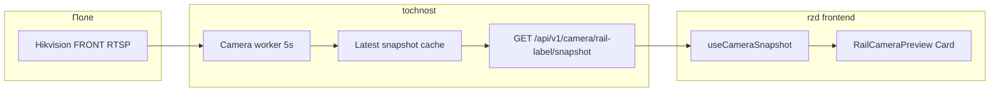

# Превью камеры рельс на главном дашборде

## Контекст

Сейчас на [главном дашборде](rzd/src/pages/dashboard-page/index.tsx) в левом верхнем углу заняты 3D-модель рельс (`DashboardRailModel`, z-2) и модалка ошибок (`NotificationModal`). **Живого видео/снимков с камеры нет** — захват реализован только в [collect_Data/collect_data.py](collect_Data/collect_data.py) (Hikvision RTSP + OpenCV), без связи с бэкендом.

Выбран вариант: **полная интеграция в tochnost** с камерой FRONT (смотрит на маркировку/название рельс).



---

## 1. Backend: модуль камеры в tochnost

### Новые файлы

| Файл | Назначение |
|------|------------|
| [tochnost/src/core/config/components/camera.py](tochnost/src/core/config/components/camera.py) | Настройки из env |
| [tochnost/src/api/v1/camera/service.py](tochnost/src/api/v1/camera/service.py) | Захват RTSP, motion detection, кэш |
| [tochnost/src/api/v1/camera/schemas.py](tochnost/src/api/v1/camera/schemas.py) | `CameraSnapshotRead` |
| [tochnost/src/api/v1/camera/router.py](tochnost/src/api/v1/camera/router.py) | REST endpoint |
| [tochnost/src/api/v1/camera/dependencies.py](tochnost/src/api/v1/camera/dependencies.py) | DI |

Подключить роутер в [tochnost/src/api/__init__.py](tochnost/src/api/__init__.py) и `CameraConfig` в [tochnost/src/core/config/components/__init__.py](tochnost/src/core/config/components/__init__.py).

### Зависимости

Добавить в [tochnost/pyproject.toml](tochnost/pyproject.toml):
- `opencv-python-headless`
- `numpy` (явно, для motion diff)

### Env-переменные (совместимы с collect_Data)

```env
CAMERA_ENABLED=true
CAMERA_MOCK=false          # true — отдавать статический JPEG для dev
CAMERA_CAPTURE_INTERVAL_SEC=5
CAMERA_MOTION_THRESHOLD=8.0
HIKVISION_USER=...
HIKVISION_PASS=...
HIKVISION_FRONT_IP=...
HIKVISION_RTSP_PORT=554
HIKVISION_FRONT_CHANNEL=101
HIKVISION_RTSP_TRANSPORT=tcp
HIKVISION_CROP_TOP/BOTTOM/LEFT/RIGHT=0
HIKVISION_JPEG_QUALITY=75
```

### Логика захвата (переиспользовать паттерн из collect_Data)

Из [collect_data.py](collect_Data/collect_data.py) перенести минимум:
- `build_rtsp_url()` — RTSP URL с tcp
- `configure_camera()` — buffer=1, FPS=15
- `flush_camera_buffer()` — сброс буфера перед чтением
- `process_frame()` — crop

**Фоновый worker** (по аналогии с `start_sensor_workers` в [server.py](tochnost/src/server/server.py)):
- `asyncio.create_task` + `asyncio.to_thread()` для блокирующего OpenCV
- Каждые `CAMERA_CAPTURE_INTERVAL_SEC` (5 с): открыть/переиспользовать `VideoCapture`, прочитать кадр, JPEG-encode
- **Детекция движения**: grayscale + `np.mean(cv2.absdiff(prev, curr))` > `CAMERA_MOTION_THRESHOLD` → `motion_detected: true` («едет»)
- Хранить последний снимок в in-memory singleton (`CameraState`), endpoint отдаёт кэш мгновенно (без ожидания RTSP на каждый запрос фронта)

### API

```
GET /api/v1/camera/rail-label/snapshot
Authorization: session (CurrentUserDep, как у rail endpoints)
```

**Response** (`CameraSnapshotRead`):
```json
{
  "captured_at": "2026-06-08T14:32:18.456+03:00",
  "image_base64": "<jpeg>",
  "motion_detected": true,
  "motion_score": 12.4,
  "status": "ok"
}
```

При ошибке камеры: `status: "error"`, `error_message`, без падения worker (retry на следующем цикле). При `CAMERA_MOCK=true`: `status: "mock"`.

### Lifespan

В [tochnost/src/server/server.py](tochnost/src/server/server.py):
```python
await start_camera_worker()  # если CAMERA_ENABLED
...
await stop_camera_worker()
```

---

## 2. Frontend: виджет на дашборде

### Новые файлы (FSD)

| Слой | Файл |
|------|------|
| API | [rzd/src/shared/api/services/CameraService.ts](rzd/src/shared/api/services/CameraService.ts) + types |
| Entity | [rzd/src/entities/camera/model/useCameraSnapshot.ts](rzd/src/entities/camera/model/useCameraSnapshot.ts) |
| Widget | [rzd/src/widgets/dashboard-camera-preview/ui/RailCameraPreview.tsx](rzd/src/widgets/dashboard-camera-preview/ui/RailCameraPreview.tsx) |

### Hook `useCameraSnapshot`

- `setInterval` 5000 мс → `GET /api/v1/camera/rail-label/snapshot`
- Состояния: `loading` (первый кадр), `error`, `data`
- `image_src = data:image/jpeg;base64,${image_base64}`

### UI (наш UI-кит)

Компонент `RailCameraPreview` на базе существующих паттернов из [Status.tsx](rzd/src/features/status-panel/ui/Status.tsx):

- **`Card`** — контейнер ~300×~240 px
- **`CardHeader`** — заголовок «Камера рельс», иконка `MonitorIcon` из `@/shared/assets/icons`
- **Превью** — `bg-(--bg-card-gray) rounded-xl overflow-hidden aspect-video`:
  - `` с последним кадром
  - при `motion_detected` — тонкая рамка `border-(--status-warning)` или лёгкий pulse
- **`Badge`**:
  - `motion_detected === true` → WARNING, текст **«В движении»**
  - `false` → SUCCESS, текст **«Стоит»**
- Подпись: `Обновлено: HH:MM:SS` (из `captured_at`)
- Placeholder при ошибке: «Нет сигнала с камеры»

### Размещение на дашборде

В [rzd/src/pages/dashboard-page/index.tsx](rzd/src/pages/dashboard-page/index.tsx) добавить fixed-слот **поверх 3D-модели, z-10**:

```tsx
<div
  className="fixed z-10"
  style={{
    top: 'var(--layout-content-padding-v)',
    left: 'calc(var(--layout-sidebar-width) + var(--layout-content-padding-h))',
  }}
>
  <RailCameraPreview />
</div>
```

`NotificationModal` остаётся `fixed top-0 left-0` — при ошибке карточки не пересекаются (камера правее сайдбара ~82px, ошибка — у левого края).

---

## 3. Деплой и dev-режим

- **Docker**: контейнер `tochnost_app` должен иметь сетевой доступ к `HIKVISION_FRONT_IP` (часто нужен `network_mode: host` или маршрутизация в LAN — задокументировать в `.env.example`).
- **Локальная разработка без камеры**: `CAMERA_MOCK=true` в tochnost `.env` — worker отдаёт статический JPEG (можно положить в `tochnost/static/camera-mock.jpg` или переиспользовать [rzd/public/monitor-preview-v2.png](rzd/public/monitor-preview-v2.png) сконвертированный).

---

## 4. Проверка

1. `CAMERA_MOCK=true` — на `/` видна карточка с превью, обновление каждые 5 с, бейдж переключается при искусственном изменении mock-кадров
2. С реальной камерой — кадр с маркировкой рельс, при ручном сдвиге рельс бейдж «В движении»
3. При отключённой камере — карточка показывает ошибку, дашборд не падает
4. Endpoint защищён сессией (401 без авторизации)
