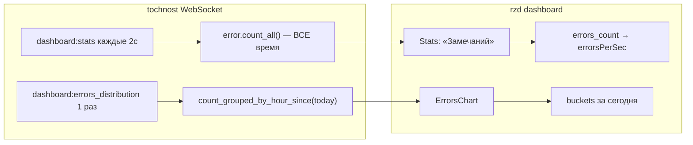

# План: дашборд — замечания, плейсхолдеры, камера

## Диагностика



**Почему цифра не меняется день ото дня:** в [`tochnost/src/api/v1/ws/service.py`](tochnost/src/api/v1/ws/service.py) поле `errors_count` для `dashboard:stats` считается через `count_all()` (все замечания за всё время), хотя UI подписан как «за сегодня» ([`rzd/src/shared/lib/stats-utils.ts`](rzd/src/shared/lib/stats-utils.ts), карточка «Замечаний» в [`rzd/src/entities/dashboard/model/data.ts`](rzd/src/entities/dashboard/model/data.ts)).

График «Замечаний» уже получает данные за сегодня через `send_errors_today_distribution`, но при `total === 0` фронт показывает пустые оси Recharts вместо понятной заглушки.

---

## 1. Бэкенд: счётчик замечаний только за сегодня

**Файлы:**
- [`tochnost/src/infra/timescale_db/storage/error.py`](tochnost/src/infra/timescale_db/storage/error.py) — добавить `count_since(since: datetime) -> int` по аналогии с `count_grouped_by_hour_since` (фильтр `Error.created_at >= since_param`).
- [`tochnost/src/api/v1/ws/service.py`](tochnost/src/api/v1/ws/service.py) — в `run_push_stats` заменить:
  ```python
  errors_count = await uow.error.count_all()
  ```
  на:
  ```python
  errors_count = await uow.error.count_since(today_start)
  ```
- [`tochnost/src/api/v1/ws/schemas.py`](tochnost/src/api/v1/ws/schemas.py) — обновить описание поля: «Количество ошибок с начала текущих суток».

`today_start` уже вычисляется в том же цикле — дополнительных параметров не нужно.

---

## 2. Фронт: заглушка «Замечаний нет» на графике

**Файлы:**
- [`rzd/src/entities/dashboard/model/store.ts`](rzd/src/entities/dashboard/model/store.ts) — расширить `getChartFromData`:
  - возвращать `{ points, hasRealData, isEmptyToday }`;
  - `isEmptyToday = true`, когда пользователь авторизован, данные пришли (`errorsDistributionData !== null`), и `total === 0` (или сумма `buckets` равна 0);
  - в этом случае **не** подставлять mock-точки из `data.ts`.
- [`rzd/src/features/errors-chart/ui/ErrorsChart.tsx`](rzd/src/features/errors-chart/ui/ErrorsChart.tsx):
  - при `isEmptyToday` скрыть `ComposedChart` и показать центрированный текст «Замечаний нет» (`text-(--text-secondary)`, тот же серый контейнер `bg-(--bg-card-gray)` что сейчас);
  - для неавторизованных — оставить текущий mock-график без изменений.

---

## 3. Фронт: единый плейсхолдер «—» на дашборде

**Паттерн-образец:** виджет статуса — [`rzd/src/features/status-panel/ui/Status.tsx`](rzd/src/features/status-panel/ui/Status.tsx) + `getStatusFromData` в store, где пустые поля = `'—'`.

**Новый хелпер:** [`rzd/src/shared/lib/dashboard-placeholder.ts`](rzd/src/shared/lib/dashboard-placeholder.ts)
```ts
export const DASHBOARD_EMPTY = '—' as const
export const formatDashboardCount = (n: number) => n === 0 ? DASHBOARD_EMPTY : `${n} шт.`
```

**Изменения:**

| Место | Было | Станет |
|-------|------|--------|
| [`store.ts`](rzd/src/entities/dashboard/model/store.ts) `getStatsFromData` — неавторизован / нет данных | `0`, `00:00`, `0°`, `0%` | `—` для всех полей |
| `formatTimePerUnit(0)` | `00:00` | `—` |
| `getStagesFromData` — нет активной рельсы | `...`, `0`, `0°` | `—` для всех этапов |
| [`stats-utils.ts`](rzd/src/shared/lib/stats-utils.ts) `getStatValue` | `0 шт.` при нуле | `formatDashboardCount(value)` |
| `errorsPerSec` (число) | `String(0)` → `"0"` | `—` при `0` |

По вашему выбору: **даже реальный ноль** (0 РШР, 0 замечаний) отображается как `—`, не как `0 шт.`.

Затронутые виджеты (автоматически через store/utils):
- [`Stats.tsx`](rzd/src/features/stats-panel/ui/Stats.tsx) — карточки статистики, включая «Замечаний»
- [`Stages.tsx`](rzd/src/features/stages-panel/ui/Stages.tsx) — этапы сборки при отсутствии активной рельсы

---

## 4. Фронт: убрать подложку у изображения камеры

**Файл:** [`rzd/src/widgets/dashboard-camera-preview/ui/RailCameraPreview.tsx`](rzd/src/widgets/dashboard-camera-preview/ui/RailCameraPreview.tsx)

Сейчас контейнер изображения всегда имеет `bg-(--bg-card-gray)` (#F2F4F6), что даёт светлую «подложку» вокруг/под кадром.

**Изменение:**
- `bg-(--bg-card-gray)` оставить только для состояния без изображения (placeholder «Камера временно недоступна»);
- при `hasImage` — `bg-transparent` (или без фона);
- на `` добавить `block` (убирает типичный зазор inline-элемента ~3px снизу, который выглядит как белая полоска).

```tsx
className={cn(
  'rounded-xl overflow-hidden aspect-video relative border-2 border-transparent',
  !hasImage && 'bg-(--bg-card-gray)',
  motionDetected && hasImage && 'border-(--status-warning) animate-pulse',
)}
// img: className="block w-full h-full object-cover"
```

---

## Проверка после внедрения

1. **Замечаний (стат):** после деплоя бэкенда счётчик сбрасывается в полночь и растёт только при новых замечаниях за текущий день.
2. **График:** при `total: 0` за сегодня — текст «Замечаний нет», без пустых осей; при наличии данных — обычный график.
3. **Плейсхолдеры:** нигде на дашборде нет `...`, `0`, `00:00`, `0 шт.` в пустых/нулевых состояниях — только `—`.
4. **Камера:** при наличии снимка нет светлой подложки под/вокруг изображения; при отсутствии сигнала — серый фон placeholder сохраняется.
