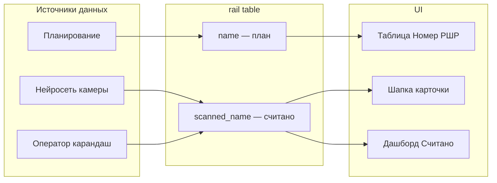

# Редактируемый считанный номер РШР (отдельный атрибут)

## Контекст

В шапке карточки ([`ItemHeader.tsx`](rzd/src/features/item-header/ui/ItemHeader.tsx)) после бейджа статуса сейчас показывается `item.object` (название объекта) — при пустом значении тире `—`.

Нужно два разных атрибута:

| Атрибут | Поле БД | Кто пишет | Где показывается |
|---------|---------|-----------|------------------|
| **Плановый номер РШР** | `rail.name` | оператор / планирование | таблица «Номер РШР», дашборд «Номер РШР (План)» |
| **Считанный номер РШР** | `rail.scanned_name` *(новое)* | нейросеть камеры + ручная правка оператором | шапка карточки, дашборд «Номер РШР (Считано)» |

Сейчас оба значения на дашборде ошибочно маппятся на `name` ([`store.ts`](rzd/src/entities/dashboard/model/store.ts): `railNumberScanned: status.name`). После изменений `railNumberScanned` берётся из `scanned_name`.



## Бэкенд (tochnost)

### 1. Миграция БД

Новый файл `tochnost/migrations/versions/2026-06-08_add_rail_scanned_name.py`:

```python
op.add_column(
    "rail",
    sa.Column("scanned_name", sa.String(255), nullable=True,
             comment="Считанный номер РШР (OCR/нейросеть)"),
)
```

`down_revision` — последняя миграция `b7e4a1c92d10`.

### 2. Модель

[`tochnost/src/infra/timescale_db/models/rail.py`](tochnost/src/infra/timescale_db/models/rail.py):

```python
scanned_name: Mapped[str | None] = mapped_column(
    String(255), nullable=True, comment="Считанный номер РШР (OCR/нейросеть)"
)
```

### 3. Схемы и API

[`tochnost/src/api/v1/rail/schemas.py`](tochnost/src/api/v1/rail/schemas.py):

- `RailRead.scanned_name: str | None` — description «Считанный номер РШР»
- `RailUpdate.scanned_name: str | None` — `Field(max_length=255)`

Существующий `PATCH /api/v1/rail/{rail_id}` автоматически подхватит новое поле через `update_fields` — **новый роут не нужен**.

В [`service.py`](tochnost/src/api/v1/rail/service.py) `update_rail` — нормализация `scanned_name` (и при желании `name`):

- `strip()` пробелов
- пустая строка → `null`

### 4. WebSocket дашборда

[`tochnost/src/api/v1/ws/schemas.py`](tochnost/src/api/v1/ws/schemas.py) — добавить `scanned_name` в `DashboardStatusData`.

[`tochnost/src/api/v1/ws/service.py`](tochnost/src/api/v1/ws/service.py) — включить `"scanned_name": rail.scanned_name` в payload `dashboard:status`.

### 5. Excel-экспорт

[`tochnost/src/api/v1/rail/service.py`](tochnost/src/api/v1/rail/service.py) `export_metrics_excel` — строка `("Считанный номер", rail.scanned_name or "")` рядом с `("Название", rail.name or "")`.

### 6. Точка для нейросети (без полной интеграции сейчас)

Интеграция OCR пока не реализована ([`camera/service.py`](tochnost/src/api/v1/camera/service.py) только снимает кадры). Когда нейросеть будет готова, она пишет результат через:

```python
await uow.rail.update_fields(active_rail_id, scanned_name=recognized_text)
```

Тот же путь, что и ручное исправление оператором через `PATCH { "scanned_name": "..." }`. Отдельный эндпоинт для ML не нужен на первом этапе.

## Фронтенд (rzd)

### 1. Типы и маппинг

- [`types/rail.ts`](rzd/src/shared/api/services/types/rail.ts) — `scanned_name` в `RailRead` и `RailUpdate`
- [`types/websocket.ts`](rzd/src/shared/api/services/types/websocket.ts) — `scanned_name` в `DashboardStatusData`
- [`entities/item/model/types.ts`](rzd/src/entities/item/model/types.ts) — `scannedName: string` в `ItemData`
- [`item-utils.ts`](rzd/src/shared/lib/item-utils.ts) — `scannedName: rail.scanned_name || '—'`
- [`store.ts`](rzd/src/entities/dashboard/model/store.ts) — `railNumberScanned: status.scanned_name || '—'` (план остаётся `railData?.name`)

### 2. Иконка карандаша

[`rzd/src/shared/assets/icons/ItemIcons/PencilIcon.tsx`](rzd/src/shared/assets/icons/ItemIcons/PencilIcon.tsx) + экспорт в [`icons/index.ts`](rzd/src/shared/assets/icons/index.ts).

### 3. Компонент `EditableScannedName`

[`rzd/src/features/item-header/ui/EditableScannedName.tsx`](rzd/src/features/item-header/ui/EditableScannedName.tsx):

- **Просмотр:** `scannedName` или `—` + кнопка-карандаш
- **Редактирование:** input, Enter/blur → сохранить, Escape → отмена
- `isSaving`, откат при ошибке API

### 4. `ItemHeader` и `ItemPage`

[`ItemHeader.tsx`](rzd/src/features/item-header/ui/ItemHeader.tsx) — убрать `item.object`, вставить:

```tsx
<EditableScannedName
  value={item.scannedName}
  onSave={onScannedNameChange}
/>
```

[`item-page/index.tsx`](rzd/src/pages/item-page/index.tsx):

```tsx
const handleScannedNameChange = async (value: string) => {
  const updated = await railService.updateRail(item.id, {
    scanned_name: value || null,
  })
  if (updated) {
    setItem(prev => prev
      ? { ...prev, scannedName: updated.scanned_name || '—' }
      : prev)
  }
}
```

## Разделение полей в UI

- **Таблица** ([`rail-utils.ts`](rzd/src/shared/lib/rail-utils.ts)) — колонка «Номер РШР» по-прежнему `rail.name` (план)
- **Шапка карточки** — `scanned_name` с карандашом
- **Дашборд** — «План» = `name`, «Считано» = `scanned_name`

## Что НЕ входит в scope

- Обучение/запуск нейросети OCR — только подготовка поля и точки записи
- `object_name` в шапке карточки больше не показывается

## Проверка

1. Миграция применяется, `scanned_name` виден в `GET /api/v1/rail`
2. Карточка `/item/{id}` — тире `—` + карандаш при пустом `scanned_name`
3. Ручной ввод «УК.80 1812-50» → `PATCH scanned_name` → значение сохраняется после перезагрузки
4. `name` (план) и `scanned_name` (считано) независимы — правка одного не трогает другое
5. Дашборд «Номер РШР (Считано)» показывает `scanned_name` из WebSocket
6. Escape отменяет редактирование без запроса
