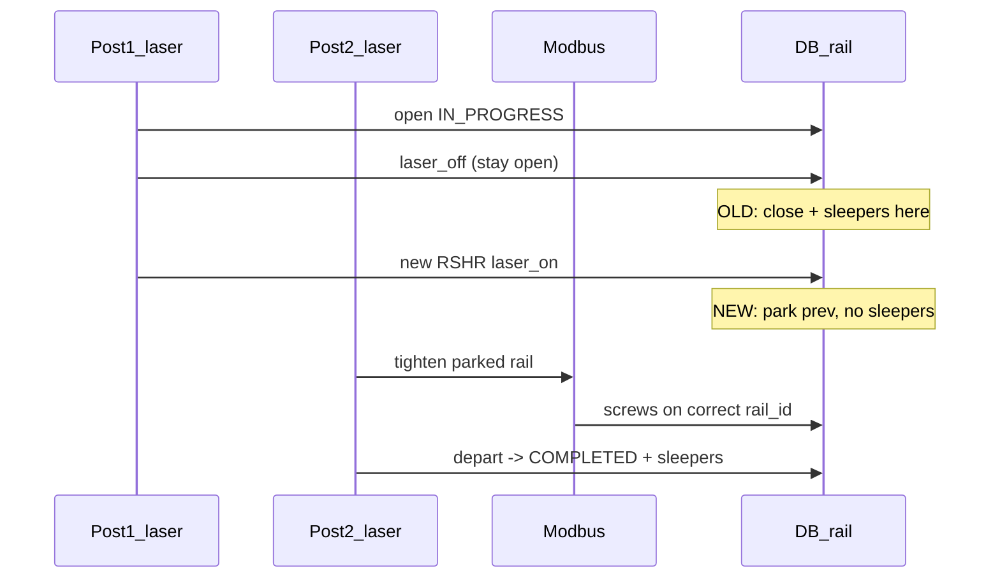

# План: эпюра 50/200 и парковка РШР на посту 2

## Контекст (согласовано)

- **Норма:** ~50 шпал, ~200 гаек на РШР (~25 м).
- **Ошибки:** 0, ~20, ~70 — из-за раннего `close_active_rail` на посту 1 и записи гаек на `active.rail_id` вместо рельсы на посту 2.
- **Между сменами:** допустима **ровно одна** запись «В процессе» (недокрученная РШР на посту 2); в колонке **Эпюра** — **«—»**, не 0/1/20.



---

## 1. Жизненный цикл РШР (backend)

**Файл:** [`tochnost/src/api/v1/sensor/service.py`](tochnost/src/api/v1/sensor/service.py)

### 1.1 «Парковка» вместо финализации на посту 1

При повторном лазере на посту 1 (блок ~430–434) **не вызывать** полный `close_active_rail` для предыдущей РШР:

- Вынести логику как в [`test toch/simulate_capture.py`](test toch/simulate_capture.py) (`open_rails` / `process_rshr_post1`): снять с `active`, сохранить сессию в **`waiting_at_post2: dict[int, RailSession]`** (новое поле в [`tochnost/src/api/v1/sensor/state.py`](tochnost/src/api/v1/sensor/state.py)), оставить в FIFO поста 2.
- В БД **не** ставить `Завершено` и **не** писать `sleepers` — статус остаётся `В процессе`.

### 1.2 Финализация только на уходе с поста 2

В [`_depart_rail_from_post2`](tochnost/src/api/v1/sensor/service.py):

- Для `rail_id` из `waiting_at_post2` или ещё `active` (если не успели «припарковать») вызывать **полное** закрытие: `sleepers`, `end_time`, `COMPLETED`, сопутствующие поля.
- Убрать дублирующее закрытие только для `active` без учёта parked-сессий.

### 1.3 Счётчики и `add_screw`

**Файлы:** [`state.py`](tochnost/src/api/v1/sensor/state.py), [`service.py`](tochnost/src/api/v1/sensor/service.py)

| Изменение | Деталь |
|-----------|--------|
| Per-rail счётчик циклов | `_rail_completed_cycles: dict[int, int]` (+4 гайки за цикл) вместо глобального `_total_screws` для эпюры |
| `add_screw(..., rail_id: int)` | `rail_id` = `_modbus_target_rail_id()` / сессия из `_rail_session_for_modbus`, **не** `get_active_rail()` |
| `serial_id` | `next_serial_for_rail(rail_id)` — порядковый номер гайки **внутри рельсы** |
| `sleepers` при закрытии | `completed_cycles[rail_id]` или `ceil(count_screws/4)` из БД для этой `rail_id` |

`_modbus_target_rail_id` — уточнить приоритет:

1. `post2.rail_at_post2`
2. иначе голова `fifo_rail_ids` (рельса ждёт пост 2, Modbus уже идёт)
3. иначе `active` (только измерение на посту 1)

Это закрывает «нули» и «70» без ужесточения 20 с между циклами (норма ~50 сохраняется).

### 1.4 Защита парковки от таймаутов

- `_maybe_close_active_rail` / `MAX_RAIL_OPEN_SEC` — применять **только** к `active` на посту 1, **не** к сессиям в `waiting_at_post2`.
- `tail_grace` close — как сейчас: не закрывать, если `rail_id in fifo` или `rail_at_post2`.

---

## 2. Восстановление после рестарта (несколько дней простоя)

**Новый хук** при старте воркера (рядом с `_ensure_workers_started` в [`service.py`](tochnost/src/api/v1/sensor/service.py)):

1. `SELECT` из `rail` WHERE `status = 'В процессе'` ORDER BY `start_time`.
2. **0 записей** — ничего.
3. **1 запись** — штатная парковка:
   - восстановить `RailSession` в `waiting_at_post2`;
   - `post2.rail_at_post2 = rail_id` (если одна на посту 2);
   - подтянуть счётчик циклов: `COUNT(*)/4` из `screw` WHERE `rail_id = ?`.
4. **>1 записей** — артефакт старого бага: залогировать; оставить самую новую как parked, остальные — политика на выбор (рекомендация: принудительно `Завершено` с `sleepers` из `COUNT(screw)` или пометка «Брак» — **зафиксировать в коде + лог**).

Опционально (фаза 2, если без этого FIFO после рестарта путается): миграция поля `laser_off_at` / `phase` в [`rail.py`](tochnost/src/infra/timescale_db/models/rail.py) — **не обязательно** для MVP, если достаточно единственной IN_PROGRESS + счётчик из `screw`.

---

## 3. UI: эпюра «—» для «В процессе»

**Файл:** [`rzd/src/shared/lib/rail-utils.ts`](rzd/src/shared/lib/rail-utils.ts)

```ts
// сейчас: shpal: rail.sleepers || 0
// нужно: для status === IN_PROGRESS → null/«—»; для COMPLETED → sleepers ?? 0
```

**Файл:** [`rzd/src/features/production-table/ui/Table.tsx`](rzd/src/features/production-table/ui/Table.tsx) (и тип `ProductionRow`) — отображать `—`, если `shpal == null`.

Статус остаётся **«В процессе»** (выбор пользователя); парковка между сменами визуально: одна строка, эпюра пустая.

---

## 4. Симулятор и тесты

**Файл:** [`test toch/simulate_capture.py`](test toch/simulate_capture.py)

- Привести `process_modbus` / счётчики к per-rail + `add_screw` target (паритет с продом).
- Прогон на [`test data/new`](test data/new) (merged modbus + `rshr_2026-05-28`):
  - большинство завершённых: **45–55** шпал;
  - нет массовых **0** при наличии Modbus в окне поста 2;
  - нет **70+** на соседних строках.

**Файл:** [`test toch/test_rshr_parity.py`](test toch/test_rshr_parity.py) — тест: после «новый лазер пост1» предыдущая РШР не получает `sleepers` до post2 depart.

---

## 5. Что сознательно не делаем

- Не вводим `min_inter_cycle_sec = 20` в онлайн-FSM (занижало бы нормальные ~50).
- Не убираем единственную IN_PROGRESS между сменами — только убираем **ложную частичную эпюру** (1, 20) в UI и **перенос финализации** на пост 2.

---

## Порядок внедрения

1. `SensorState`: `waiting_at_post2`, per-rail counters  
2. `service.py`: park / depart / `add_screw` / `_modbus_target_rail_id`  
3. Startup rehydrate  
4. `rail-utils.ts` + таблица  
5. `simulate_capture` + прогон `test data/new`
