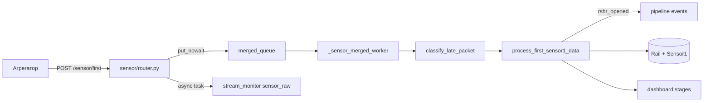

# FSM worker fix + экспорт монитора

## Диагноз по симптомам

Ты выбрал: **есть `sensor_raw` (Д1·П1), но нет `rshr_opened` и нет `packet_stale`**.

Это значит цепочка обрывается **после HTTP 202**, но **до pipeline-событий FSM**:



Монитор видит левую ветку (`sensor_raw`), дашборд/БД — правую. Симптом **raw без pipeline** = worker мёртв, падает на каждом пакете, или FSM молча не доходит до `bind_active_rail`.

### Главный подозреваемый: падение worker на timezone

В [`tochnost/src/api/v1/sensor/router.py`](tochnost/src/api/v1/sensor/router.py) `received_at=datetime.now(timezone.utc)` (**aware**).

В [`tochnost/src/api/v1/sensor/schemas.py`](tochnost/src/api/v1/sensor/schemas.py) `event_ts` нормализуется в **naive UTC**.

В [`tochnost/src/rshr_core/late_packets.py`](tochnost/src/rshr_core/late_packets.py):
```python
age_sec = (now - event_ts).total_seconds()  # now=received_at
```
Вычитание aware − naive в Python → **TypeError**, worker-поток умирает. `sensor_raw` продолжает писаться (отдельная задача в router), `rshr_opened` — нет. `packet_stale` тоже не появится (до classify не доходит или worker уже мёртв).

### Второй фактор: незадеплоенные правки FSM

В git сейчас только `af7586c` (mm_reset). **Последние правки** (handoff stale active, dashboard на первом пакете) — **локальные, не закоммичены** (~94 строки в [`tochnost/src/api/v1/sensor/service.py`](tochnost/src/api/v1/sensor/service.py)). На объекте их нет, даже если «всё обновлено» до последнего push.

---

## Часть 1: Починить обработку пакетов (критично)

### 1.1 Нормализация времени в `classify_late_packet`

Файл: [`tochnost/src/rshr_core/late_packets.py`](tochnost/src/rshr_core/late_packets.py)

- Добавить `_naive_utc(dt)` (как в stream_monitor/state.py).
- Приводить `now` и `event_ts` к naive UTC перед любыми сравнениями/вычитаниями.
- Для проверки «устаревший пакет» использовать `(received_at_naive - event_ts_naive)` — это задержка доставки, а не расхождение часов агрегатора с сервером (снижает ложные `packet_stale` при кривых часах на ПЛК).

### 1.2 Защита merged worker от смерти

Файл: [`tochnost/src/api/v1/sensor/service.py`](tochnost/src/api/v1/sensor/service.py), `_sensor_merged_worker`

- Обернуть тело обработки одного события (classify + `_process_merged_event`) в `try/except`.
- При ошибке: `logger.exception`, `emit_pipeline_event("worker_error", ...)`, **не ронять** бесконечный цикл.
- Опционально: счётчик `worker_errors` в `SENSOR_STATE.packet_counters()` для debug/export.

### 1.3 Закоммитить и задеплоить оставшиеся правки FSM

Файл: [`tochnost/src/api/v1/sensor/service.py`](tochnost/src/api/v1/sensor/service.py)

Уже реализовано локально, нужно включить в деплой:
- `_active_rail_transferred_to_post2` + `_handoff_active_from_post1`
- repair stale `active` в начале `process_first_sensor1_data`
- `_publish_post1_stages_for_packet` при `bind_active_rail` (дашборд с 1-го пакета)
- handoff при `post2_recognized`

Скрипт проверки: [`tochnost/scripts/verify_rshr_replay.py`](tochnost/scripts/verify_rshr_replay.py) — прогон `rshr_data.jsonl` (уже даёт OK во всех 3 seed-сценариях).

### 1.4 Debug-снимок FSM (для AnyDesk)

Новый endpoint: `GET /api/v1/sensor/debug/state` (без auth, как stream-monitor)

Файлы: [`tochnost/src/api/v1/sensor/router.py`](tochnost/src/api/v1/sensor/router.py), [`tochnost/src/api/v1/sensor/state.py`](tochnost/src/api/v1/sensor/state.py)

Возвращает JSON:
- `active_rail`, `waiting_at_post2`, `fifo`, `rail_at_post2`, `post2_laser_was_on`
- `watermark`, `packet_counters` (stale/reordered/modbus_skipped)
- `workers_started` / alive flag merged worker task

---

## Часть 2: Экспорт из stream monitor

### 2.1 Backend export API

Файлы:
- [`tochnost/src/api/v1/stream_monitor/router.py`](tochnost/src/api/v1/stream_monitor/router.py)
- [`tochnost/src/api/v1/stream_monitor/service.py`](tochnost/src/api/v1/stream_monitor/service.py)
- [`tochnost/src/api/v1/stream_monitor/state.py`](tochnost/src/api/v1/stream_monitor/state.py)

`GET /api/v1/stream-monitor/export`

| Параметр | Значения |
|----------|----------|
| `mode` | `pipeline` — только FSM/проблемы (без `sensor_raw`); `full` — весь буфер; `incident` — bundle |
| `format` | `jsonl` (события построчно) или `json` |

**`mode=pipeline`** — события где `event_type != 'sensor_raw'` (компактно, ~десятки КБ).

**`mode=incident`** — один JSON-файл:
```json
{
  "exported_at": "...",
  "stats": {...},
  "groups": [...],
  "events": [...],          // pipeline + problems
  "sensor_state": {...}     // из /sensor/debug/state
}
```

`Content-Disposition: attachment; filename="incident_YYYYMMDD_HHMMSS.json"`

Расширить `get_recent` или добавить `export_events(mode, limit)` в state — limit до `stored_count` (max 5000).

### 2.2 UI: кнопки скачивания

Файлы:
- [`rzd/src/entities/stream-monitor/model/useStreamMonitor.ts`](rzd/src/entities/stream-monitor/model/useStreamMonitor.ts) — `downloadExport(mode)`
- [`rzd/src/pages/stream-monitor-page/index.tsx`](rzd/src/pages/stream-monitor-page/index.tsx) — в header рядом с «Очистить»:
  - **«Скачать pipeline»** → `?mode=pipeline&format=jsonl`
  - **«Скачать инцидент»** → `?mode=incident&format=json`

Скачивание через `fetch` + `Blob` + programmatic `<a download>`.

### 2.3 Скрипт для объекта (опционально)

[`tochnost/scripts/collect_incident.sh`](tochnost/scripts/collect_incident.sh) — curl на export + stats, zip. Для AnyDesk без UI.

---

## Проверка после деплоя

1. Прогнать рельс на пост 1.
2. В мониторе должны появиться подряд: `sensor_raw` (Д1·П1) → **`rshr_opened`** → обновление дашборда.
3. Если снова сломается: **«Скачать инцидент»** → прислать файл; смотреть `sensor_state.active_rail`, `packet_counters`, наличие `worker_error`.

---

## Scope / не делаем сейчас

- Дисковый ring-buffer (только in-memory 5000) — отдельная задача.
- Auth на export/debug — оставляем как у остального stream-monitor (без auth) для удобства отладки на объекте.
