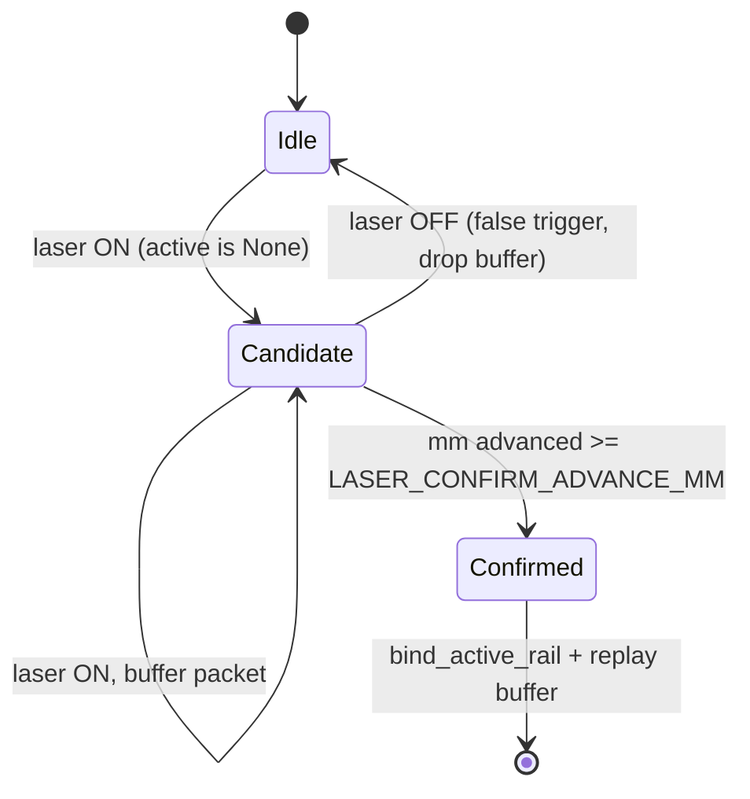

# Защита от ложных срабатываний лазера (рука под лазером)

## Проблема

Лазерные флаги `laser_on_rail_left/right` приходят очень часто (каждые ~2-15 мс) и обрабатываются в [tochnost/src/api/v1/sensor/service.py](tochnost/src/api/v1/sensor/service.py). Кратковременная смена флага (рука под лазером) сейчас вызывает мгновенную реакцию на трёх фронтах:

1. Пост 1, простой: `active is None` + laser ON -> мгновенный `bind_active_rail` (строка 567) -> фантомный РШР в БД + попадание в FIFO.
2. Пост 1, проход: кратковременное OFF->ON через ветку `if active.laser_off_at is not None: return True` в `_should_start_new_rail_on_post1` (строки 482-483) расколет один рельс на два.
3. Пост 2: на фронте ON сразу `on_post2_segment_start` (строка 649) -> преждевременный выпуск рельса из FIFO.

## Ключевая идея (фильтр по движению)

Реальный РШР двигает `mm_along_rail` (энкодеры), рука — нет. Реагируем на фронт лазера только после того, как `mm_along_rail` продвинулся на >= `LASER_CONFIRM_ADVANCE_MM` мм при удержании лазера ON. Если лазер погас раньше — это ложное срабатывание, отбрасываем.

## Изменения

### 1. Конфиг — порог подтверждения
В [tochnost/src/rshr_core/config.py](tochnost/src/rshr_core/config.py) в `RshrTimingConfig` добавить поле и env-чтение:

```python
# Мин. продвижение mm_along_rail для подтверждения реального РШР (отсекает руку под лазером)
laser_confirm_advance_mm: int = 200
```
и в `from_env`: `laser_confirm_advance_mm=_env_int("LASER_CONFIRM_ADVANCE_MM", 200)`.

### 2. Состояние кандидата — пост 1
В [tochnost/src/api/v1/sensor/state.py](tochnost/src/api/v1/sensor/state.py) добавить «кандидат на старт РШР» (буфер пакетов до подтверждения движением), чтобы не терять головные замеры:

- поле `self._pending_post1: PendingStart | None = None` (dataclass: `start_mm`, `start_ts`, `last_mm`, `buffer: list[Sensor1Create]`);
- методы `begin_pending_post1`, `append_pending_post1`, `pending_post1_advance_mm`, `take_pending_post1`, `clear_pending_post1`;
- сброс `_pending_post1` в `reset()`.

### 3. Пост 1 — отложенный старт + защита от раскола
В `process_first_sensor1_data` ([service.py](tochnost/src/api/v1/sensor/service.py) строки 551-619):

- Сценарий 1 (фантомный старт): когда `active is None` и laser ON — вместо немедленного `bind_active_rail` копить пакеты в `_pending_post1`. Как только `mm_along_rail` продвинулся на >= `laser_confirm_advance_mm` при удержании ON — подтвердить: `bind_active_rail` по первому пакету буфера (сохраняя `start_mm`/`start_time`), затем «проиграть» остальные буферизованные пакеты через активный рельс. Если лазер погас до подтверждения — `clear_pending_post1` (ложное срабатывание, РШР не создаётся).
- Рефактор: вынести «хвост» обработки активного рельса (строки 591-618: запись флагов, диапазоны, прогресс, вставка Sensor1, публикация stages) в хелпер `_apply_sensor1_to_active(data, active)` для переиспользования при проигрывании буфера.
- Сценарий 2 (раскол при мигании): в `_should_start_new_rail_on_post1` (строки 477-484) убрать безусловную ветку `if active.laser_off_at is not None: return True` — новый РШР начинать только при `_active_rail_transferred_to_post2` или `_is_mm_reset_for_new_rail` (т.е. при реальном сбросе mm к ~0). При восстановлении ON без сброса mm — сбрасывать устаревший `active.laser_off_at` (отмена ложного закрытия; `tail_grace_sec=120s` уже не даёт закрыться от короткого мигания).

### 4. Пост 2 — подтверждение выпуска движением
В `process_second_sensor1_data` ([service.py](tochnost/src/api/v1/sensor/service.py) строки 621-680) ввести состояние «кандидат сегмента»:

- на фронте ON (`on_rail and not was_on`) не выпускать рельс сразу, а зафиксировать кандидат (`candidate_start_mm`, ts);
- подтверждать `on_post2_segment_start` / depart только когда `mm_along_rail` продвинулся на >= `laser_confirm_advance_mm`, при этом сохранить существующую проверку `post2_min_segment_sec` как дополнительный страховочный контур (на случай если энкодер поста 2 не движется);
- если лазер погас до подтверждения — отбросить кандидат, не трогая FIFO.

## Поток подтверждения (пост 1, простой)



## Параметры по умолчанию

- `LASER_CONFIRM_ADVANCE_MM = 200` мм — заметно меньше нормальной длины РШР (~25 м) и допуска (20 м), но достаточно, чтобы отсечь неподвижную руку. Настраивается через env.

## Проверка

- Прогон реплея на `rshr_data.jsonl` через тесты в `test toch/` (например `test_rshr_parity.py`, `replay_data.py`) — убедиться, что обычные РШР по-прежнему открываются/закрываются и число гаек/длина не изменились.
- Синтетический тест: вставить короткий импульс laser ON без роста `mm_along_rail` в простое и в середине прохода — убедиться, что РШР не создаётся и не раскалывается, а на посту 2 нет преждевременного выпуска из FIFO.