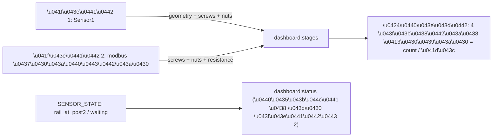

# Живая статистика на посту 2 + реальные гайки на дашборде

## Причины (подтверждены)

- Проблема 1: `dashboard:stages` публикуется только из пути поста 1 ([service.py](tochnost/src/api/v1/sensor/service.py):514). При парковке на пост 2 вызывается `_publish_stages_empty()` ([service.py](tochnost/src/api/v1/sensor/service.py):765), а во время закрутки (`add_sensor2_data`) ничего не публикуется. `run_push_status` ([ws/service.py](tochnost/src/api/v1/ws/service.py):89) берёт `get_active_rail()` = None при парковке -> статус пустой.
- Проблема 2: 4 плитки гаек зашиты моком `'85'` ([data.ts](rzd/src/entities/dashboard/model/data.ts):34-37) и всегда подставляются через `...mockDashboard.stages.slice(5)` ([store.ts](rzd/src/entities/dashboard/model/store.ts):288). В payload `dashboard:stages` нет данных по позициям гаек.

## Поток после фикса

## Бэкенд

### 1. Per-rail учёт гаек по каналам — [state.py](tochnost/src/api/v1/sensor/state.py)
- Добавить `self._dashboard_nuts: dict[int, dict[int, dict]]` (rail_id -> channel 1..4 -> {count, torque, ok}); init в `__init__` и очистка в `reset()`.
- Методы: `record_nut_cycle(rail_id, per_channel_torque: dict[int,float], per_channel_ok: dict[int,bool])` (count+=1, torque=value, ok=flag по каналам), `get_dashboard_nuts(rail_id)`, `clear_dashboard_nuts(rail_id)`.
- Хелперы для дашборда: `get_dashboard_rail_id()` (active -> rail_at_post2 -> первый waiting_at_post2 -> None) и кэш геометрии `_last_stage_geometry: dict | None` (+ сеттер/геттер), чтобы переиспользовать последние значения износа/колеи на посту 2.

### 2. Запись гаек при завершении цикла — `_finalize_tightening_cycle` ([service.py](tochnost/src/api/v1/sensor/service.py):347-414)
- Там уже считается `max_m` по каналам и проверка по `ft_threshold`. Дополнительно вызвать `state.record_nut_cycle(rail_id, {ch:max_m}, {ch: ok})` и после — опубликовать стадии поста 2.

### 3. Публикация стадий на посту 2 — [service.py](tochnost/src/api/v1/sensor/service.py)
- Новый `_publish_post2_stages(session)`: берёт `screws_completed=get_dashboard_screws()`, `nuts=get_dashboard_nuts(rail_id)`, `resistance`/`resistance_avg` из state, геометрию — из `_last_stage_geometry` (последнее с поста 1), `errors_count` через `uow.error.count_by_rail`.
- Вызывать его в `add_sensor2_data` после обработки modbus-пакета (по `rail_at_post2`) и из `_finalize_tightening_cycle`, чтобы счётчики/моменты обновлялись живо.
- `_publish_post1_stages_for_packet`: сохранять снимок геометрии в `_last_stage_geometry` и добавлять `nuts` в payload (на посту 1 обычно нули).

### 4. Схема payload — [ws/schemas.py](tochnost/src/api/v1/ws/schemas.py):24-40
- В `DashboardStagesData` добавить `nuts: list[NutStage]`, где `NutStage = {position: Literal['ЛН','ЛВ','ПН','ПВ'], count: int, torque: float, ok: bool}` (каналы M1->ЛН, M2->ЛВ, M3->ПН, M4->ПВ — маппинг подтвердить при реализации по логике сторон `ch in (1,2)=левая`).

### 5. Статус рельса на посту 2 — `run_push_status` ([ws/service.py](tochnost/src/api/v1/ws/service.py):82-120)
- Вместо `get_active_rail()` использовать `get_dashboard_rail_id()`: пока РШР на посту 2 (parked/recognized) — продолжать слать её в `dashboard:status`, а не пустой объект.

## Фронтенд

### 6. Тип — [types/websocket.ts](rzd/src/shared/api/services/types/websocket.ts):14-31
- Добавить в `DashboardStagesData` поле `nuts: { position: 'ЛН'|'ЛВ'|'ПН'|'ПВ'; count: number; torque: number; ok: boolean }[]`.

### 7. Реальные плитки гаек — [store.ts](rzd/src/entities/dashboard/model/store.ts):287-289
- Убрать `...mockDashboard.stages.slice(5)`. Построить 4 плитки из `stages.nuts`, сохранив id `nutLN/nutLV/nutPN/nutPV` (нужны для 3D-модели [DashboardRailModel.tsx](rzd/src/widgets/dashboard-rail-model/ui/DashboardRailModel.tsx):114-169):
  - `value = `${count} / ${torque.toFixed(0)} Нм``
  - `status = ok ? OK : WARNING`, `iconKey` соответственно.
- Если `nuts` нет (нет активной закрутки) — показывать прочерк/PENDING, не мок.

## Проверка
- На посту 2 во время закрутки: на дашборде РШР не пропадает, `screws_completed` и 4 плитки гаек растут (count) и показывают момент (Нм).
- Плитки больше не показывают «85» из мока; при разной затяжке статус плитки становится WARNING и 3D-модель «Locks» краснеет.
- `GET /api/v1/sensor/debug/state` и подписка на `dashboard:stages`/`dashboard:status` подтверждают живые обновления на посту 2.

## Заметки
- Маппинг каналов M1..M4 -> ЛН/ЛВ/ПН/ПВ уточнить при реализации (левая = каналы 1,2).
- Геометрия (износ/колея/длина) на посту 2 берётся из последнего снимка поста 1 — новых геометрических данных там нет.