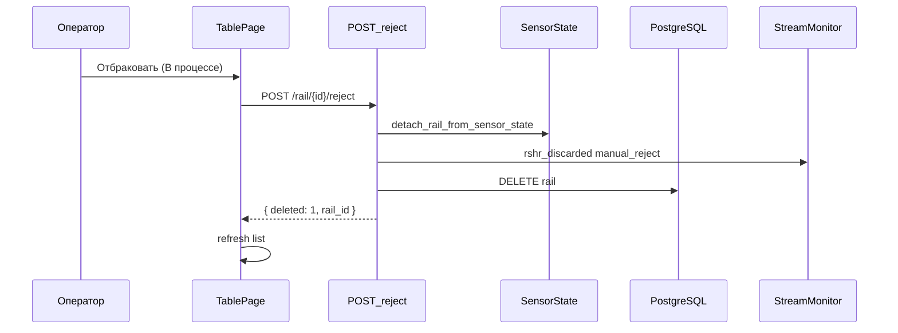

# Ручная отбраковка = discard (без «Брак» в БД)

## Проблема

Сейчас [`reject_rail`](tochnost/src/api/v1/rail/service.py) делает `update_fields(status=RailStatus.ERROR)` — значение **«Брак»** может не пройти CHECK/enum в PostgreSQL без миграции.

Автоматическая отбраковка в конвейере уже работает иначе: [`finalize_rail`](tochnost/src/api/v1/sensor/service.py) / [`discard_active_rail`](tochnost/src/api/v1/sensor/service.py) **удаляют** запись из `rail` и пишут событие `rshr_discarded` в stream monitor.

## Решение (согласовано)

**Ручная отбраковка** = тот же исход, что у автоматического discard:

1. Снять рельсу с FSM (`detach_rail_from_sensor_state`)
2. Записать аудит-событие `rshr_discarded` с `reason: manual_reject`
3. **Удалить** запись из БД (`delete_by_id`)
4. Строка **исчезает** из `/list`; в `/monitor` видно событие отбраковки

**«Удалить»** остаётся отдельным действием: для любого статуса, без pipeline-события, для административной очистки истории.



---

## 1. Бэкенд

### 1.1 Переписать `reject_rail`

Файл: [`tochnost/src/api/v1/rail/service.py`](tochnost/src/api/v1/rail/service.py)

```python
async def reject_rail(self, rail_id: int) -> RejectRailResponse:
    rail = await self.uow.rail.get_by_id(rail_id)
    if rail is None: raise 404
    if rail.status != RailStatus.IN_PROGRESS: raise 409

    await detach_rail_from_sensor_state(rail_id, self.redis)
    await emit_pipeline_event(
        "rshr_discarded",
        rshr_id=rail_id,
        event_ts=datetime.now(timezone.utc),
        summary=f"РШР #{rail_id} отбракована вручную",
        payload={"reason": "manual_reject", "discarded": True},
    )
    await self.uow.rail.delete_by_id(rail_id)
    return RejectRailResponse(deleted=1, rail_id=rail_id)
```

Импорт `emit_pipeline_event` из [`pipeline_hooks.py`](tochnost/src/api/v1/stream_monitor/pipeline_hooks.py).

### 1.2 Схема и роутер

- [`tochnost/src/api/v1/rail/schemas.py`](tochnost/src/api/v1/rail/schemas.py): `RejectRailResponse { deleted: int, rail_id: int }`
- [`tochnost/src/api/v1/rail/router.py`](tochnost/src/api/v1/rail/router.py): `response_model=RejectRailResponse`, описание «Снимает с линии и удаляет из журнала»

### 1.3 Убрать `RailStatus.ERROR` из бэкенда

Файл: [`tochnost/src/infra/timescale_db/models/rail.py`](tochnost/src/infra/timescale_db/models/rail.py) — удалить `ERROR = "Брак"`, чтобы случайно не писать в БД.

Миграция **не нужна** — статус никогда не записывался в prod без миграции.

### 1.4 (опционально) Общий хелпер discard

Вынести в [`fsm.py`](tochnost/src/api/v1/rail/fsm.py) или `service.py` метод `async def discard_rail_record(rail_id, redis, uow, *, reason, summary)` — переиспользовать в `reject_rail`. Sensor FSM не трогаем (авто-discard остаётся в `SensorService`).

---

## 2. Фронтенд

### 2.1 API-клиент

[`rzd/src/shared/api/services/RailService.ts`](rzd/src/shared/api/services/RailService.ts) + [`types/rail.ts`](rzd/src/shared/api/services/types/rail.ts):

```ts
type RejectRailResponse = { deleted: number; rail_id: number }
```

### 2.2 Модалка

[`RejectConfirmModal.tsx`](rzd/src/features/reject-confirm-modal/ui/RejectConfirmModal.tsx) — новый текст:

> «Операция будет снята с линии и удалена из журнала. Событие сохранится в мониторе потока.»

(без упоминания статуса «Брак»)

### 2.3 TablePage

[`table-page/index.tsx`](rzd/src/pages/table-page/index.tsx): после `rejectRail` — `setRefreshTrigger(+1)` (как после delete), строка пропадает.

Мок-режим: убрать локальную смену статуса на `ERROR` — вместо этого добавить id в `deletedIds` или рефетч.

### 2.4 Статус «Брак» на фронте

[`ProductionStatus.ERROR`](rzd/src/shared/types/enums.ts) и бейдж **оставить** для фильтров/моков/будущего, но API больше не возвращает «Брак» для новых операций.

---

## 3. Отличие «Отбраковать» vs «Удалить»

| | Отбраковать | Удалить |
|--|-------------|---------|
| Доступно | Только **В процессе** | Любой статус |
| FSM | detach | detach |
| БД | DELETE | DELETE |
| Аудит | `rshr_discarded` / `manual_reject` | нет |
| Смысл | Закрыть активную операцию как брак | Убрать запись из журнала |

---

## 4. Тестирование

- РШР «В процессе» (в т.ч. активная на линии) → Отбраковать → исчезает из списка, линия не зависает
- Событие в `/monitor` с типом `rshr_discarded`, `reason: manual_reject`
- «Завершено» → пункта «Отбраковать» нет
- «Удалить» на завершённой записи по-прежнему работает
- Нет ошибок PostgreSQL при отбраковке

## Затрагиваемые файлы

- [`tochnost/src/api/v1/rail/service.py`](tochnost/src/api/v1/rail/service.py)
- [`tochnost/src/api/v1/rail/schemas.py`](tochnost/src/api/v1/rail/schemas.py)
- [`tochnost/src/api/v1/rail/router.py`](tochnost/src/api/v1/rail/router.py)
- [`tochnost/src/infra/timescale_db/models/rail.py`](tochnost/src/infra/timescale_db/models/rail.py)
- [`rzd/src/shared/api/services/RailService.ts`](rzd/src/shared/api/services/RailService.ts)
- [`rzd/src/features/reject-confirm-modal/ui/RejectConfirmModal.tsx`](rzd/src/features/reject-confirm-modal/ui/RejectConfirmModal.tsx)
- [`rzd/src/pages/table-page/index.tsx`](rzd/src/pages/table-page/index.tsx)
