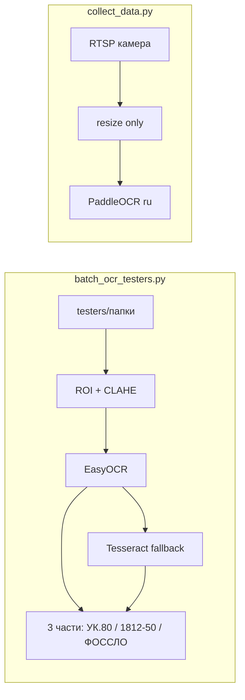
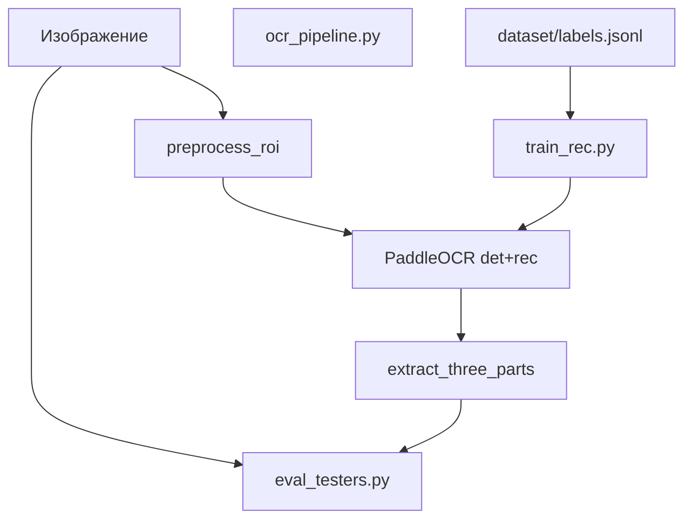

# План улучшения OCR: доразметка, обучение, внедрение

## Текущее состояние



**Проблема:** два разных движка и разная логика. В [`collect_Data/batch_ocr_testers.py`](collect_Data/batch_ocr_testers.py) есть сильная доменная постобработка (ROI, нормализация символов, сборка 3 частей), но **EasyOCR**. В [`collect_Data/collect_data.py`](collect_Data/collect_data.py) — **PaddleOCR** без ROI/постпроцесса. Папка `testers` в репозитории не закоммичена (локальные данные) — план опирается на структуру `testers/<эталонный_текст>/*.jpg`.

**Цель (фаза 1, по вашему выбору):** на `testers` — стабильный exact match по полной строке маркировки; камера — после подтверждения метрик.

---

## Целевые метрики (приёмка фазы 1)

| Метрика | Старт (baseline) | Цель |
|---------|------------------|------|
| Exact Match (полная строка) | замерить | >= 85% на hold-out test |
| CER (по символам) | замерить | <= 8% |
| Часть 2 (`1812-50`) отдельно | замерить | >= 90% exact |
| Время на кадр (CPU) | замерить | не хуже baseline > 1.5x |

---

## Архитектура после рефакторинга



Единый модуль в `collect_Data/ocr_pipeline.py` — вынести из `batch_ocr_testers.py`: `preprocess`, `normalize`, `which_part`, `format_part`, `extract_three_parts`, обёртка над PaddleOCR.

---

## Этап 0: Baseline и eval-скрипт (0.5 дня)

**Файлы:** `collect_Data/eval_testers.py`, `collect_Data/outputs/eval_baseline.json`

1. Прогнать текущий [`batch_ocr_testers.py`](collect_Data/batch_ocr_testers.py) на `collect_Data/testers/`.
2. Собрать manifest: `image_path`, `expected` (имя родительской папки), `predicted`, `parts`, `conf`, `latency_ms`.
3. Считать: Exact Match, CER, accuracy по частям (1/2/3), confusion по символам `О/0`, `.`, `-`.
4. Stratified split **по папкам** (не по файлам): 70% train / 15% val / 15% test — чтобы одинаковые маркировки не утекали между сплитами.

**Зависимости:** добавить в [`requirements.txt`](collect_Data/requirements.txt): `easyocr` (для baseline), `jiwer` или свой CER, `pandas` (опционально для отчёта).

---

## Этап 1: Быстрые улучшения без обучения (0.5–1 день)

Перед долгим CPU-обучением — выжать максимум из уже имеющегося кода.

1. **Унифицировать препроцесс:** подключить ROI+CLAHE из `batch_ocr_testers` к PaddleOCR в `ocr_pipeline.py`.
2. **Перенести постпроцесс** в общий модуль; порог confidence вынести в env (`OCR_CONF_MIN`, default `0.5` вместо жёстких `0.75`).
3. **Зональный OCR (опционально):** разрезать ROI на 3 горизонтальные полосы под части 1–3 — снизить путаницу между `УК.80`, `1812-50`, `ФОССЛО`.
4. Переписать [`batch_ocr_testers.py`](collect_Data/batch_ocr_testers.py) как thin CLI → `ocr_pipeline` + `eval_testers`.
5. Повторный прогон eval — зафиксировать прирост; если >= цели — обучение можно отложить.

---

## Этап 2: Доразметка (1–2 дня, параллельно с кодом)

**Структура данных:**

```
collect_Data/dataset/
  manifest.jsonl      # image, expected, split, source_folder
  labels.jsonl        # image, expected, status: auto|verified|corrected
  crops/              # вырезанные строки для обучения rec
  review/             # кадры с ошибками для ручной правки
```

**Workflow доразметки:**

1. `build_manifest.py` — обход `testers/`, эталон = имя папки (нормализовать пробелы, регистр).
2. `export_errors.py` — после eval: все `predicted != expected` → `review/errors.csv` + копии превью в `review/images/`.
3. `label_review.py` (простой CLI): показать изображение + expected + predicted → оператор вводит исправленный текст → пишет в `labels.jsonl` со статусом `verified`.
4. **Правила разметки:**
   - Полная строка: `"УК.80 1812-50 ФОССЛО"` (единый формат с пробелами).
   - Дополнительно — разметка **по частям** (3 поля) для обучения и диагностики.
   - Сложные/размытые кадры: пометка `skip` или `hard` — не в train.
5. **Минимальный объём для CPU fine-tune rec:** ~300–500 crop-строк (после аугментаций ×5–10 → 1500–5000); если в `testers` мало — добрать из `collect_Data/data/**/front/*.jpg` с ручной разметкой ошибочных.

---

## Этап 3: Подготовка train-set для PaddleOCR (0.5 дня)

**Файл:** `collect_Data/prepare_rec_dataset.py`

1. Для каждого изображения: `preprocess` → PaddleOCR det (или фиксированные 3 зоны) → crop каждой текстовой линии.
2. Метка crop = соответствующая часть из `labels.jsonl` (не сырой OCR).
3. Экспорт в формат PaddleOCR recognition:
   - `dataset/rec/train.txt`: `relative_path\tУК.80`
   - `dataset/rec/val.txt`, `dataset/rec/test.txt`
4. **Аугментации** (offline, при генерации или в train config): blur, JPEG quality, brightness/contrast, лёгкий поворот ±3°, шум — имитация камеры Hikvision.

**Модель для CPU:** `PP-OCRv4_mobile_rec` (или `cyrillic_PP-OCRv3_mobile_rec` если доступна в вашей версии paddleocr) — меньше параметров, быстрее обучение на CPU.

---

## Этап 4: Дообучение recognition на CPU (1–3 дня wall-clock)

**Файлы:** `collect_Data/train_rec.sh`, `collect_Data/configs/rec_finetune.yml`

Использовать официальный pipeline PaddleOCR / PaddleX fine-tune **только recognition** (детектор оставить pretrained + ROI crop).

**Параметры под CPU:**

- `batch_size: 8` (или 4 при OOM)
- `epoch: 30–50` (early stop по val CER)
- `learning_rate: 0.001` с cosine decay
- `num_workers: 2`
- Чекпоинты каждые 5 epoch → выбор лучшего по val

**Артефакты:** `collect_Data/models/rec_best/` — inference weights + `model_config.json`.

**Интеграция inference:** в `ocr_pipeline.py` — `PaddleOCR(rec_model_dir=..., det_model_dir=...)` или загрузка только rec поверх det.

---

## Этап 5: Финальная оценка и отчёт (0.5 дня)

1. `eval_testers.py --model rec_best` на **test split** (никогда не использовался при train).
2. Сравнительная таблица: baseline EasyOCR | Paddle+post | fine-tuned rec.
3. HTML/CSV отчёт: топ-20 ошибок, примеры кадров.
4. Если метрики не достигнуты — итерация: +доразметка 50–100 hard cases → повтор train 20 epoch.

---

## Этап 6 (отложено): Внедрение на камеру

После приёмки на testers:

1. Подключить `ocr_pipeline` в [`collect_data.py`](collect_Data/collect_data.py) вместо прямого `self.ocr.ocr(frame)`.
2. Env: `HIKVISION_OCR_MODEL_DIR`, `HIKVISION_OCR_CONF_MIN`.
3. Сохранять в JSONL: `final_text`, `parts`, `confidence`, `needs_review`.
4. Smoke-test на RTSP 10–20 кадров.

---

## Структура новых файлов

| Файл | Назначение |
|------|------------|
| `collect_Data/ocr_pipeline.py` | preprocess, OCR, postprocess |
| `collect_Data/eval_testers.py` | метрики, split, отчёты |
| `collect_Data/build_manifest.py` | manifest из testers |
| `collect_Data/export_errors.py` | список на доразметку |
| `collect_Data/label_review.py` | CLI доразметки |
| `collect_Data/prepare_rec_dataset.py` | crops + rec train/val/test |
| `collect_Data/configs/rec_finetune.yml` | конфиг обучения |
| `collect_Data/train_rec.sh` | запуск обучения |
| `collect_Data/models/` | gitignore весов, README как скачать baseline |

---

## Риски и митигация (CPU)

- **Долгое обучение:** только rec mobile, малый batch, early stopping; сначала этап 1 (постпроцесс) — часто даёт 50% выигрыша без train.
- **Мало данных в testers:** доразметка + кадры из `data/**/front`.
- **Переобучение на 3 шаблона:** аугментации + hold-out по папкам + не подставлять `ФОССЛО` по умолчанию в train labels (только если реально на фото).
- **Расхождение eval/live:** после testers — обязательный этап 6 с тем же `ocr_pipeline`.

---

## Порядок внедрения в код (после подтверждения плана)

1. `ocr_pipeline.py` + `eval_testers.py` + baseline отчёт  
2. Рефактор `batch_ocr_testers.py` на Paddle + постпроцесс  
3. Скрипты доразметки + manifest  
4. `prepare_rec_dataset.py` + train + eval fine-tuned  
5. Документация `collect_Data/README_OCR.md` (запуск, env, метрики)
