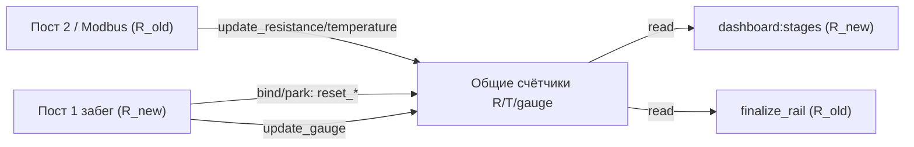

# Пер-рельсовые сопротивление и температура (фикс cross-talk)

## Проблема

`R`/`T` (с поста 2, Modbus) и `mm_gauge` (с поста 1) хранятся в общих плоских аккумуляторах `SensorState` и:
- читаются одновременно `dashboard:stages` (активная решётка поста 1) и `finalize_rail` (решётка, уходящая с поста 2);
- сбрасываются в `bind_active_rail` / `park_active_for_post2` (пост 1).

В сценарии «старая на посту 2 + новая на посту 1» это даёт перемешивание и преждевременное обнуление `resistance_avg` / `temperature_avg`.

## Решение

R/T становятся пер-рельсовыми (ключ — `rail_id` решётки на посту 2). Gauge остаётся как есть (он привязан только к активной решётке поста 1 и нигде не персистится). Живой `dashboard:stages` поста 1 больше не показывает сопротивление (пусто, пока решётка не дойдёт до поста 2).

### 1. `tochnost/src/api/v1/sensor/state.py`
- Добавить датакласс `RailMeasureStats` (res_sum/res_count/res_current/res_min/res_max/temp_sum/temp_count) и словарь `self._rail_measures: dict[int, RailMeasureStats]`.
- Переписать методы под `rail_id`:
  - `update_resistance(rail_id, value)`, `update_temperature(rail_id, value)`
  - `get_resistance_average(rail_id)`, `get_resistance_min(rail_id)`, `get_resistance_max(rail_id)`, `get_temperature_average(rail_id)`
  - `clear_rail_measures(rail_id)` вместо `reset_resistance_stats`/`reset_temperature_stats`.
- В `reset()` (строки 442-461) — очищать `_rail_measures` целиком; убрать вызовы `reset_resistance_stats`/`reset_temperature_stats`.

### 2. `tochnost/src/api/v1/sensor/service.py`
- `add_sensor2_data` (строки 304-305): писать под решётку поста 2 — `update_resistance(rail_id, ...)`, `update_temperature(rail_id, ...)`, где `rail_id` уже вычислен как Modbus-цель (пост 2).
- `finalize_rail` (строки 800-803): читать по `session.rail_id` — `resistance_avg/temperature_avg/min/max`; в конце вызвать `clear_rail_measures(session.rail_id)` (вместо текущих reset на 814-816 для R/T).
- `_publish_stages` / `process_first_sensor1_data` (строки 530-556): убрать чтение сопротивления из общих счётчиков; передавать `resistance=None`, `resistance_ok=None` (живой блок поста 1 показывает «—»). `mm_gauge`/`mm_gauge_avg` и износ — без изменений.
- Удалить ставшие ненужными reset R/T в `park_active_for_post2` (691-692), `discard_active_rail` (717-718), `bind_active_rail` (839-840); для `discard_active_rail` добавить `clear_rail_measures(active.rail_id)`.

### 3. `tochnost/src/api/v1/rail/fsm.py`
- В `detach_rail_from_sensor_state` (строки 18-20) заменить `reset_resistance_stats`/`reset_temperature_stats` на `clear_rail_measures(rail_id)`.

### 4. `tochnost/src/api/v1/ws/schemas.py`
- `DashboardStagesData` (строки 36-37): `resistance: float | None`, `resistance_ok: bool | None` (для корректной документации схемы).

### 5. Фронтенд
- `rzd/src/shared/api/services/types/websocket.ts` (строки 26-27): `resistance: number | null`, `resistance_ok: boolean | null`.
- `rzd/src/entities/dashboard/model/store.ts`, `getStagesFromData` (строки 240-250): если `resistance == null` — карточка «Сопротивление» рендерится как `value: '—'`, `status: StageStatus.PENDING`, `iconKey: 'pending'`, `progress: 0` (вместо `null.toFixed`, который сейчас бы упал).

## Что НЕ меняем
- `dashboard:stats` температура/влажность (через `cache_dashboard_env_stats`) — независимый поток, остаётся.
- `mm_gauge` аккумулятор — без изменений (привязан к активной решётке поста 1, не персистится).
- Логика FIFO/постов, открытие/закрытие решёток — без изменений.

## Проверка
- Сценарий «старая на посту 2 крутится + новая активна на посту 1»: в `dashboard:stages` сопротивление пустое, длина/колея/износ — по новой решётке; при уходе старой с поста 2 её `resistance_avg/temperature_avg/min/max` записываются корректно по её собственным накоплениям.