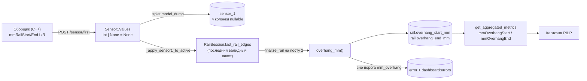

# Забег рельсовых нитей

**Цель:** считать и показывать забег (продольное несовпадение торцов левой и правой рельсовых нитей) по четырём новым полям Sensor1, с порогом и записью в «Ошибки», не сломавшись при откате прошивки сборщика.

**Подход:** новые поля опциональны на всех слоях (Pydantic `int | None = None`, колонки `nullable=True`); забег вычисляется чистой функцией в `rshr_core`; сохраняется один раз при `finalize_rail` (пост 2) и переиспользует существующий механизм `Threshold` → `Error` → `dashboard:errors`.

**Стек:** FastAPI + Pydantic 2.11 + SQLAlchemy 2 + Alembic + TimescaleDB (`tochnost`, ветка `dev`); React 19 + FSD + TS (`rzd`, ветка `main`).

---

## Контекст

Инженер добавил в `RshrInfo` (`SideWearChallenge/EncodersToLength.h`) четыре целых поля и пишет их в `values` каждого JSON-пакета Sensor1:

```
mmRailStartLeft, mmRailStartRight, mmRailEndLeft, mmRailEndRight
```

Это позиции торцов каждой нити по той же миллиметровой оси, что и `mmAlongRail`.

### Что из них считаем и что НЕ считаем

| Величина | Формула | Берём? |
|---|---|---|
| Забег в начале | `mmRailStartLeft − mmRailStartRight` | **да** |
| Забег в конце | `mmRailEndLeft − mmRailEndRight` | **да** |
| Длина нити | `End − Start` | **нет** |
| Зазор между соседними РШР | `Start(N+1) − End(N)` | **нет** |

Обоснование — ADR-0010 (создаётся в задаче 7), коротко:

- Точность энкодера **0.2% накопленной ошибки масштаба** — на 25 м это ≈ 50 мм. Забег есть разность двух засечек, снятых практически в одной точке ленты, поэтому масштабная ошибка в ней сокращается: 0.2% от 30 мм = 0.06 мм. Реальный предел забега — дискретность пакета: в капче `mmAlongRail` растёт на 1 мм за пакет (~1 мс), лента ~1 м/с → засечка ±1–2 мм.
- **Длину по `End − Start` считать нельзя:** `mmAlongRail` сбрасывается в 0 при мигании лазера (INV-6 / [ADR-0007](../adr/0007-laser-confirm-and-new-rail.md), комментарий в `RailSession`). При сбросе внутри прохода `Start` и `End` окажутся с разными нулями. Забег это переживает: торцы Л и П в пределах десятков мм — всегда в одном сегменте. Длина остаётся на `traversed_mm`.
- **Зазор между соседними РШР** по этим полям недостижим: ось пер-РШР, сквозной нумерации нет. Вне области этой задачи.

### Знак

Забег знаковый, `левая − правая`. `+12 мм` — левая нить забежала вперёд. Порог ложится на существующую форму `Threshold` (`min_value = −50`, `max_value = +50`) без нового кода.

## Поток данных



## Матрица совместимости

| Прошивка | Бэкенд | Поведение |
|---|---|---|
| старая (без полей) | новый | Поля отсутствуют → `None` → забег NULL → блок в карточке не рисуется. Всё остальное как сейчас. |
| новая (с полями) | старый | Pydantic 2.11.7 по умолчанию игнорирует лишние ключи (проверено) → уже работает, деплой бэкенда не срочный. |
| новая | новый | Забег считается. |
| новая, торец не пойман | новый | `End` = 0 → `overhang_mm` вернёт `None` по sanity-отсечке → забег в конце NULL, забег в начале посчитан. |

## Что НЕ трогаем

- **INV-1** — пост 1 остаётся `park_active_for_post2()`. Забег пишется только в `finalize_rail`, то есть только при уходе с поста 2.
- **INV-6** — логика открытия РШР и `LASER_CONFIRM_ADVANCE_MM` не меняется. Новые поля читаются, но ни на один переход FSM не влияют.
- `traversed_mm` и расчёт `length_mm` — без изменений.
- `libs/rshr_core/` — устаревшая копия живого `tochnost/src/rshr_core/`; правим только живую.

---

# Задачи

## Задача 1 — Домен: чистая функция забега

**Файлы:**
- Создать: `tochnost/src/rshr_core/rshr_overhang.py`
- Изменить: `tochnost/src/rshr_core/__init__.py`
- Создать: `tochnost/scripts/test_rshr_overhang.py`

**Отдаёт наружу:** `overhang_mm(left: int | None, right: int | None) -> int | None`, константа `OVERHANG_SANITY_MM: int = 500`.

- [ ] **Шаг 1. Написать падающий тест**

`tochnost/scripts/test_rshr_overhang.py`:

```python
"""Юнит-тест забега. Запуск: python3 scripts/test_rshr_overhang.py (из tochnost/)."""

import sys
from pathlib import Path

sys.path.insert(0, str(Path(__file__).resolve().parent.parent / "src"))

from rshr_core.rshr_overhang import OVERHANG_SANITY_MM, overhang_mm

FAILED = 0


def check(got, want, label):
    global FAILED
    if got == want:
        print(f"  ok   {label}")
    else:
        FAILED += 1
        print(f"  FAIL {label}: got {got!r}, want {want!r}")


check(overhang_mm(None, 1000), None, "старая прошивка: левый None")
check(overhang_mm(1000, None), None, "старая прошивка: правый None")
check(overhang_mm(None, None), None, "старая прошивка: оба None")
check(overhang_mm(1012, 1000), 12, "левая нить забежала на 12 мм")
check(overhang_mm(1000, 1012), -12, "правая нить забежала на 12 мм")
check(overhang_mm(1000, 1000), 0, "торцы вровень")
check(overhang_mm(0, 0), 0, "нулевая ось — валидный забег 0")
check(overhang_mm(1000 + OVERHANG_SANITY_MM, 1000), OVERHANG_SANITY_MM, "ровно на границе sanity — принимаем")
check(overhang_mm(1000 + OVERHANG_SANITY_MM + 1, 1000), None, "за границей sanity — отбрасываем")
check(overhang_mm(1000, 1000 + OVERHANG_SANITY_MM + 1), None, "за границей sanity в минус — отбрасываем")
check(overhang_mm(24000, 0), None, "торец конца не пойман (End=0) — отбрасываем")

if FAILED:
    print(f"\n{FAILED} тест(ов) упало")
    sys.exit(1)
print("\nвсе тесты прошли")
```

- [ ] **Шаг 2. Прогнать, убедиться что падает**

```bash
cd tochnost && python3 scripts/test_rshr_overhang.py
```

Ожидается: `ModuleNotFoundError: No module named 'rshr_core.rshr_overhang'`.

- [ ] **Шаг 3. Написать минимальную реализацию**

`tochnost/src/rshr_core/rshr_overhang.py`:

```python
"""Забег рельсовых нитей — продольное несовпадение торцов левой и правой нити.

Забег считается РАЗНОСТЬЮ двух засечек, снятых практически в одной точке ленты,
поэтому накопленная ошибка масштаба энкодера (0.2% ≈ 50 мм на 25 м) в ней
сокращается: 0.2% от 30 мм = 0.06 мм.

Длину по тем же полям считать НЕЛЬЗЯ: mmAlongRail сбрасывается при мигании
лазера, из-за чего Start и End могут оказаться с разными нулями (ADR-0010).
Длина считается по traversed_mm.
"""

from __future__ import annotations

# Забег физически не бывает больше полуметра. Всё, что больше, — сбой засечки:
# торец не пойман (поле осталось 0), сброс mmAlongRail между Start и End,
# мусор из прошивки.
OVERHANG_SANITY_MM = 500


def overhang_mm(left: int | None, right: int | None) -> int | None:
    """Забег = левая нить − правая. Знак «+» — левая забежала вперёд.

    Возвращает None, если данных нет (старая прошивка сборщика) или разность
    неправдоподобна. None означает «не измерено» — вызывающий код НЕ пишет
    метрику и НЕ заводит Error.
    """
    if left is None or right is None:
        return None
    delta = int(left) - int(right)
    if abs(delta) > OVERHANG_SANITY_MM:
        return None
    return delta
```

- [ ] **Шаг 4. Экспортировать из пакета**

В `tochnost/src/rshr_core/__init__.py` добавить импорт и элемент `__all__` рядом с `RSHR_LENGTH_DISCARD_BELOW_MM`:

```python
from rshr_core.rshr_overhang import OVERHANG_SANITY_MM, overhang_mm
```

```python
    "OVERHANG_SANITY_MM",
    "overhang_mm",
```

- [ ] **Шаг 5. Прогнать, убедиться что проходит**

```bash
cd tochnost && python3 scripts/test_rshr_overhang.py
```

Ожидается: 11 строк `ok`, финальное `все тесты прошли`, код возврата 0.

- [ ] **Шаг 6. Коммит** (только по явной просьбе — см. CLAUDE.md)

```bash
cd tochnost && git add src/rshr_core/rshr_overhang.py src/rshr_core/__init__.py scripts/test_rshr_overhang.py && git commit -m "feat(rshr_core): забег рельсовых нитей — overhang_mm + sanity-отсечка"
```

---

## Задача 2 — Контракт и хранение

**Файлы:**
- Изменить: `tochnost/src/api/v1/sensor/schemas.py` (`Sensor1Values`, `Sensor1Read`, `RailSession`)
- Изменить: `tochnost/src/infra/timescale_db/models/sensor1.py`
- Изменить: `tochnost/src/infra/timescale_db/models/rail.py`
- Создать: `tochnost/migrations/versions/2026-08-21_add_rail_overhang.py`

**Потребляет:** ничего из задачи 1.
**Отдаёт наружу:** атрибуты `mm_rail_start_left`, `mm_rail_start_right`, `mm_rail_end_left`, `mm_rail_end_right` на `Sensor1Values`/`Sensor1`/`Sensor1Read`; `overhang_start_mm`, `overhang_end_mm` на модели `Rail`; поле `RailSession.last_rail_edges`.

> **Всё это — один коммит.** В `service.py` пять мест делают `Sensor1(**data.values.model_dump())`. Если поля появятся в Pydantic без колонок в ORM, `TypeError` уронит **каждый** входящий пакет Sensor1.

- [ ] **Шаг 1. Добавить поля в `Sensor1Values`**

В конец класса `Sensor1Values` в `tochnost/src/api/v1/sensor/schemas.py` (после `mm_bolt_height_right_outer`):

```python
    # Позиции торцов нитей для забега. Опциональны: прошивка сборщика старее
    # 08.2026 их не присылает → None → забег не считается (ADR-0010).
    mm_rail_start_left: int | None = Field(
        default=None,
        description="позиция начала левого рельса в мм (для забега)",
        validation_alias=AliasChoices("mmRailStartLeft", "mm_rail_start_left"),
    )
    mm_rail_start_right: int | None = Field(
        default=None,
        description="позиция начала правого рельса в мм (для забега)",
        validation_alias=AliasChoices("mmRailStartRight", "mm_rail_start_right"),
    )
    mm_rail_end_left: int | None = Field(
        default=None,
        description="позиция конца левого рельса в мм (для забега)",
        validation_alias=AliasChoices("mmRailEndLeft", "mm_rail_end_left"),
    )
    mm_rail_end_right: int | None = Field(
        default=None,
        description="позиция конца правого рельса в мм (для забега)",
        validation_alias=AliasChoices("mmRailEndRight", "mm_rail_end_right"),
    )
```

- [ ] **Шаг 2. Те же четыре поля в `Sensor1Read`**

В конец класса `Sensor1Read` (после `mm_bolt_height_right_outer`):

```python
    mm_rail_start_left: int | None = Field(default=None, description="позиция начала левого рельса в мм (для забега)")
    mm_rail_start_right: int | None = Field(default=None, description="позиция начала правого рельса в мм (для забега)")
    mm_rail_end_left: int | None = Field(default=None, description="позиция конца левого рельса в мм (для забега)")
    mm_rail_end_right: int | None = Field(default=None, description="позиция конца правого рельса в мм (для забега)")
```

- [ ] **Шаг 3. Поле в `RailSession`**

В конец датакласса `RailSession` (после `from_post2: bool = False`):

```python
    # Последний пакет прохода, где все 4 позиции торцов пришли непустыми.
    # Порядок: (start_left, start_right, end_left, end_right).
    # Берём именно ПОСЛЕДНИЙ: прошивка заполняет End только после прохода
    # торца, в начале прохода там нули.
    last_rail_edges: tuple[int, int, int, int] | None = None
```

- [ ] **Шаг 4. Колонки в `sensor_1`**

В `tochnost/src/infra/timescale_db/models/sensor1.py`, после `mm_bolt_height_right_outer`:

```python
    mm_rail_start_left: Mapped[int | None] = mapped_column("mmRailStartLeft", BigInteger, nullable=True, comment="позиция начала левого рельса в мм (для забега)")
    mm_rail_start_right: Mapped[int | None] = mapped_column("mmRailStartRight", BigInteger, nullable=True, comment="позиция начала правого рельса в мм (для забега)")
    mm_rail_end_left: Mapped[int | None] = mapped_column("mmRailEndLeft", BigInteger, nullable=True, comment="позиция конца левого рельса в мм (для забега)")
    mm_rail_end_right: Mapped[int | None] = mapped_column("mmRailEndRight", BigInteger, nullable=True, comment="позиция конца правого рельса в мм (для забега)")
```

- [ ] **Шаг 5. Колонки в `rail`**

В `tochnost/src/infra/timescale_db/models/rail.py`, после `length_mm`:

```python
    overhang_start_mm: Mapped[int | None] = mapped_column(
        Integer, nullable=True, comment="Забег в начале РШР (левая нить − правая), мм"
    )
    overhang_end_mm: Mapped[int | None] = mapped_column(
        Integer, nullable=True, comment="Забег в конце РШР (левая нить − правая), мм"
    )
```

- [ ] **Шаг 6. Миграция**

`tochnost/migrations/versions/2026-08-21_add_rail_overhang.py`:

```python
"""add rail overhang (забег нитей) + позиции торцов в sensor_1

Revision ID: f1a6d09c3b27
Revises: e5b2c7a14f03
Create Date: 2026-08-21

"""

from typing import Sequence, Union

from alembic import op
import sqlalchemy as sa


revision: str = "f1a6d09c3b27"
down_revision: Union[str, Sequence[str], None] = "e5b2c7a14f03"
branch_labels: Union[str, Sequence[str], None] = None
depends_on: Union[str, Sequence[str], None] = None


SENSOR1_COLUMNS = [
    ("mmRailStartLeft", "позиция начала левого рельса в мм (для забега)"),
    ("mmRailStartRight", "позиция начала правого рельса в мм (для забега)"),
    ("mmRailEndLeft", "позиция конца левого рельса в мм (для забега)"),
    ("mmRailEndRight", "позиция конца правого рельса в мм (для забега)"),
]


def upgrade() -> None:
    for name, comment in SENSOR1_COLUMNS:
        op.add_column("sensor_1", sa.Column(name, sa.BigInteger(), nullable=True, comment=comment))

    op.add_column(
        "rail",
        sa.Column("overhang_start_mm", sa.Integer(), nullable=True, comment="Забег в начале РШР (левая нить − правая), мм"),
    )
    op.add_column(
        "rail",
        sa.Column("overhang_end_mm", sa.Integer(), nullable=True, comment="Забег в конце РШР (левая нить − правая), мм"),
    )

    # Дефолтный допуск ±50 мм. Консервативно: ловим только грубые дефекты, пока
    # не накопится статистика реального разброса. Правится UPDATE-ом без деплоя.
    # is_critical=false — метрика новая, не хотим сразу красить РШР в критику.
    op.execute(
        """
        INSERT INTO threshold (value, min_value, max_value, unit_of_measurement, is_critical)
        SELECT 'mm_overhang', -50, 50, 'мм', false
        WHERE NOT EXISTS (SELECT 1 FROM threshold WHERE value = 'mm_overhang')
        """
    )


def downgrade() -> None:
    op.execute("DELETE FROM threshold WHERE value = 'mm_overhang'")
    op.drop_column("rail", "overhang_end_mm")
    op.drop_column("rail", "overhang_start_mm")
    for name, _ in reversed(SENSOR1_COLUMNS):
        op.drop_column("sensor_1", name)
```

- [ ] **Шаг 7. Проверить, что старый пакет по-прежнему валидируется**

```bash
cd tochnost && python3 -c "
import sys; sys.path.insert(0, 'src')
import json
from api.v1.sensor.schemas import Sensor1Create
old = json.loads(open('../test data/rshr_data.jsonl').readline())
m = Sensor1Create.model_validate(old)
d = m.values.model_dump()
assert d['mm_rail_start_left'] is None, d['mm_rail_start_left']
assert d['mm_rail_end_right'] is None
print('старый пакет ок, новые поля =', {k: v for k, v in d.items() if 'rail_start' in k or 'rail_end' in k})
new = json.loads(json.dumps(old))
new['values'].update(mmRailStartLeft=100, mmRailStartRight=88, mmRailEndLeft=24100, mmRailEndRight=24085)
print('новый пакет ок, забег нач/кон =',
      Sensor1Create.model_validate(new).values.mm_rail_start_left, '/',
      Sensor1Create.model_validate(new).values.mm_rail_end_left)
"
```

Ожидается: обе строки печатаются без исключений, у старого пакета все четыре поля `None`.

- [ ] **Шаг 8. Прогнать миграцию**

```bash
cd tochnost && alembic upgrade head && alembic current
```

Ожидается: `f1a6d09c3b27 (head)`.

- [ ] **Шаг 9. Проверить seed порога**

```bash
docker compose exec -T postgres psql -U postgres -d postgres -c "SELECT value, min_value, max_value, unit_of_measurement, is_critical FROM threshold WHERE value='mm_overhang';"
```

Ожидается ровно одна строка `mm_overhang | -50 | 50 | мм | f`. Повторный `alembic downgrade -1 && alembic upgrade head` не должен создавать дубль.

---

## Задача 3 — FSM: сбор и финализация

**Файлы:**
- Изменить: `tochnost/src/api/v1/sensor/service.py` (`_apply_sensor1_to_active`, `bind_active_rail`, `finalize_rail`)

**Потребляет:** `overhang_mm`, `OVERHANG_SANITY_MM` (задача 1); `RailSession.last_rail_edges`, колонки `rail.overhang_*_mm` (задача 2).
**Отдаёт наружу:** заполненные `rail.overhang_start_mm` / `rail.overhang_end_mm` и записи `Error` с `value_name='mm_overhang'`.

- [ ] **Шаг 1. Импорт**

К существующему `from rshr_core.rshr_length import segment_length_mm` в шапке `service.py` добавить:

```python
from rshr_core.rshr_overhang import overhang_mm
```

- [ ] **Шаг 2. Приватный хелпер сбора рядом с `_apply_sensor1_to_active`**

```python
    @staticmethod
    def _capture_rail_edges(data: Sensor1Create, session: RailSession | None) -> None:
        """Запомнить позиции торцов из пакета, если прошивка их прислала.

        Берём последний валидный набор за проход: прошивка заполняет End только
        после прохода торца, в начале прохода там нули. Старая прошивка полей
        не шлёт — тогда last_rail_edges остаётся None и забег не считается.
        """
        if session is None:
            return
        v = data.values
        edges = (v.mm_rail_start_left, v.mm_rail_start_right, v.mm_rail_end_left, v.mm_rail_end_right)
        if any(e is None for e in edges):
            return
        session.last_rail_edges = (int(edges[0]), int(edges[1]), int(edges[2]), int(edges[3]))
```

- [ ] **Шаг 3. Вызвать хелпер на обоих путях поста 1**

В `_apply_sensor1_to_active` (`service.py:819`) — первой строкой тела, до отслеживания диапазонов:

```python
        self._capture_rail_edges(data, active)
```

В `bind_active_rail` — сразу после строки `active = self.state.get_active_rail()` (`service.py:1461`, под комментарием «Первичное отслеживание диапазонов для метрик Sensor1»):

```python
        self._capture_rail_edges(data, active)
```

> Переменная называется именно `active` — это тот же объект, что уже передаётся в `_track_bad_range(active=active)` ниже. Типизирован как `RailSession | None`, поэтому хелпер выше принимает `None`.
> В `process_second_sensor1_data` (пост 2) хелпер **не** вызывать: сессия там чужая, а пост 2 позиций торцов не мерит.

- [ ] **Шаг 4. Считать забег в `finalize_rail`**

В `finalize_rail`, сразу после блока `pop_all_bad_ranges` (`service.py:1188-1209`) и до `screw_count = await self.uow.screw.count_by_rail(rail_id)`:

```python
        # Забег нитей. Считается только здесь (уход с поста 2) — INV-1.
        edges = session.last_rail_edges
        overhang_start = overhang_mm(edges[0], edges[1]) if edges else None
        overhang_end = overhang_mm(edges[2], edges[3]) if edges else None

        if overhang_start is not None or overhang_end is not None:
            th_overhang = await self.get_threshold("mm_overhang")
            for label, value in (("в начале", overhang_start), ("в конце", overhang_end)):
                if value is None or th_overhang is None:
                    continue
                if th_overhang.min_value <= value <= th_overhang.max_value:
                    continue
                description = (
                    f"Забег {label} РШР {value:+d} мм — вне допуска "
                    f"{th_overhang.min_value:+.0f}…{th_overhang.max_value:+.0f} мм"
                )
                await self.uow.error.add(
                    Error(
                        rail_id=rail_id,
                        screw_id=None,
                        value_name="mm_overhang",
                        description=description,
                        unit_of_measurement=th_overhang.unit_of_measurement,
                        value=float(value),
                        min_value=th_overhang.min_value,
                        max_value=th_overhang.max_value,
                        is_critical=th_overhang.is_critical,
                    )
                )
                await self._publish_error(
                    timestamp=(session.last_timestamp if session.last_timestamp else datetime.now()),
                    description=description,
                    value_name="mm_overhang",
                    value=float(value),
                )
```

- [ ] **Шаг 5. Записать забег на рельсу**

В том же `finalize_rail`, рядом с `update_kwargs["length_mm"] = int(length_mm)` (`service.py:1254`):

```python
        if overhang_start is not None:
            update_kwargs["overhang_start_mm"] = overhang_start
        if overhang_end is not None:
            update_kwargs["overhang_end_mm"] = overhang_end
```

> Пишем только непустые: иначе повторная финализация затрёт уже посчитанный забег нулями.

- [ ] **Шаг 6. Добавить забег в pipeline-событие закрытия**

В `payload` события `rshr_closed` (`service.py:1281`), рядом с `"length_mm": length_mm`:

```python
            "overhang_start_mm": overhang_start,
            "overhang_end_mm": overhang_end,
```

Это делает забег видимым в stream-monitor (`http://localhost:3003/monitor`) без отдельного эндпоинта.

- [ ] **Шаг 7. Проверить, что старый поток не сломался**

```bash
cd "test toch" && python simulate_capture.py --rshr "../test data/rshr_data.jsonl" --modbus "../test data/modbus_data.jsonl"
```

Ожидается: `rails_opened = 13`, `screws_created ≈ 1164`. Любое отклонение — регресс, разбираться до коммита (SPEC §10.1).

---

## Задача 4 — API: метрики в карточке

**Файлы:**
- Изменить: `tochnost/src/api/v1/rail/service.py` (`get_aggregated_metrics`, `name_to_threshold_key`)

**Потребляет:** `rail.overhang_start_mm` / `overhang_end_mm` (задача 3).
**Отдаёт наружу:** элементы `RailMetricRead` с `name` = `"mmOverhangStart"` и `"mmOverhangEnd"`.

- [ ] **Шаг 1. Добавить метрики в `get_aggregated_metrics`**

В конец `get_aggregated_metrics`, перед `return items`:

```python
        # Забег нитей — пер-рельсовая константа, не временной ряд:
        # values=[] осознанно. Метрику НЕ добавляем, если забега нет
        # (старая прошивка / торец не пойман) — иначе в карточке появится
        # пустая строка у всех исторических РШР.
        for disp, attr in (("mmOverhangStart", "overhang_start_mm"), ("mmOverhangEnd", "overhang_end_mm")):
            overhang_value = getattr(rail, attr, None)
            if overhang_value is None:
                continue
            items.append(
                RailMetricRead(
                    rail_id=rail_id,
                    name=disp,
                    value=float(overhang_value),
                    required=required_for("mm_overhang"),
                    values=[],
                    note=None,
                )
            )
```

> **Сначала — однострочная правка.** В `get_aggregated_metrics` первой строкой стоит `await self._get_active_rail_or_404(rail_id)` (`rail/service.py:111`) — результат отбрасывается, объекта `rail` в области видимости нет. Заменить на:
>
> ```python
>         rail = await self._get_active_rail_or_404(rail_id)
> ```
>
> Хелпер `required_for` уже определён внутри этой же функции (`rail/service.py:244`) — импортировать ничего не нужно.

- [ ] **Шаг 2. Карта порогов для Excel**

В `name_to_threshold_key` (`rail/service.py:467`) добавить две строки рядом с `"mmGauge": "mm_gauge"`:

```python
            "mmOverhangStart": "mm_overhang",
            "mmOverhangEnd": "mm_overhang",
```

- [ ] **Шаг 3. Проверить ответ API**

```bash
curl -s localhost:8000/api/v1/rail/1/metrics | python3 -c "import json,sys; print([m['name'] for m in json.load(sys.stdin)])"
```

Ожидается: у исторической РШР без забега `mmOverhangStart`/`mmOverhangEnd` **отсутствуют**; у новой, прошедшей с новой прошивкой, — присутствуют с числовым `value` и непустым `required`.

---

## Задача 5 — Фронт: блок забега в карточке

**Файлы:**
- Изменить: `rzd/src/shared/config/references.ts`
- Изменить: `rzd/src/shared/lib/item-utils.ts`

**Потребляет:** метрики `mmOverhangStart` / `mmOverhangEnd` (задача 4).

- [ ] **Шаг 1. Референс метрики**

В `STAGE_METRICS_REFERENCES` в `rzd/src/shared/config/references.ts`, после блока высот болтов:

```typescript
  // Забег рельсовых нитей (мм, знаковый: + = левая нить впереди)
  mm_overhang: {
    min_value: -50,
    max_value: 50,
    unit: 'мм',
  },
```

- [ ] **Шаг 2. Диапазоны, slug и подписи**

В `rzd/src/shared/lib/item-utils.ts`:

в карту диапазонов (`item-utils.ts:554-557`):

```typescript
    'mmOverhangStart': { min: -50, max: 50, unit: 'мм', aggregation: 'average' },
    'mmOverhangEnd': { min: -50, max: 50, unit: 'мм', aggregation: 'average' },
```

в карту slug (`item-utils.ts:582-585`):

```typescript
    'mmOverhangStart': 'mm-overhang-start',
    'mmOverhangEnd': 'mm-overhang-end',
```

в карту подписей (`item-utils.ts:610-613`):

```typescript
    'mmOverhangStart': 'Забег в начале',
    'mmOverhangEnd': 'Забег в конце',
```

- [ ] **Шаг 3. Знак в отображении**

Забег знаковый, и знак — это смысл (какая нить впереди). Убедиться, что `formatValue` не режет минус и не округляет до целого без знака; если режет — форматировать явно:

```typescript
const formatOverhang = (v: number) => `${v > 0 ? '+' : ''}${Math.round(v)} мм`
```

- [ ] **Шаг 4. Проверить в браузере**

```bash
cd rzd && npm run dev
```

Открыть `http://localhost:3003/item/<id>`:
- у исторической РШР блок «Забег» отсутствует (не «—», а именно отсутствует);
- у новой РШР две строки со знаком и подписью допуска.

---

## Задача 6 — Приёмка

**Файлы:**
- Создать: `tochnost/scripts/inject_rail_edges.py`

- [ ] **Шаг 1. Реплей эталона — обратная совместимость**

```bash
cd "test toch" && python simulate_capture.py --rshr "../test data/rshr_data.jsonl" --modbus "../test data/modbus_data.jsonl"
```

Ожидается: `rails_opened = 13`, `screws_created ≈ 1164` — **без изменений** относительно SPEC §10.1. Капча снята старой прошивкой, новых полей в ней нет. Это и есть тест «сборщик откатился — бэкенд работает штатно».

- [ ] **Шаг 2. Скрипт инжекта полей в капчу**

`tochnost/scripts/inject_rail_edges.py`:

```python
"""Добавляет в капчу Sensor1 поля забега — для проверки нового пути без объекта.

Забег в начале = +12 мм, в конце = −8 мм. Позиции торцов привязаны к
mmAlongRail, чтобы End заполнялся только во второй половине прохода —
как это делает реальная прошивка.

Запуск: python3 scripts/inject_rail_edges.py in.jsonl out.jsonl
"""

import json
import sys

OVERHANG_START = 12
OVERHANG_END = -8
END_APPEARS_AFTER_MM = 12000

src, dst = sys.argv[1], sys.argv[2]
written = 0
with open(src, encoding="utf-8") as fin, open(dst, "w", encoding="utf-8") as fout:
    for line in fin:
        line = line.strip()
        if not line:
            continue
        packet = json.loads(line)
        values = packet.get("values", {})
        mm = int(values.get("mmAlongRail", 0) or 0)
        values["mmRailStartRight"] = 100
        values["mmRailStartLeft"] = 100 + OVERHANG_START
        if mm >= END_APPEARS_AFTER_MM:
            values["mmRailEndRight"] = 24000
            values["mmRailEndLeft"] = 24000 + OVERHANG_END
        else:
            values["mmRailEndRight"] = 0
            values["mmRailEndLeft"] = 0
        fout.write(json.dumps(packet, ensure_ascii=False) + "\n")
        written += 1
print(f"{written} пакетов записано в {dst}")
```

- [ ] **Шаг 3. Прогнать реплей с инжектом**

```bash
cd tochnost && python3 scripts/inject_rail_edges.py "../test data/rshr_data.jsonl" /tmp/rshr_with_edges.jsonl
cd "../test toch" && python simulate_capture.py --rshr /tmp/rshr_with_edges.jsonl --modbus "../test data/modbus_data.jsonl"
```

Ожидается: `rails_opened = 13`, `screws_created ≈ 1164` — новые поля не влияют ни на один переход FSM.

- [ ] **Шаг 4. Проверить забег на живом бэкенде**

Прогнать `scripts/replay_logs.py` на `/tmp/rshr_with_edges.jsonl`, затем:

```bash
docker compose exec -T postgres psql -U postgres -d postgres -c "SELECT rail_id, overhang_start_mm, overhang_end_mm FROM rail WHERE status='COMPLETED' ORDER BY rail_id DESC LIMIT 5;"
```

Ожидается: `overhang_start_mm = 12`, `overhang_end_mm = -8` у закрытых РШР.

- [ ] **Шаг 5. Проверить срабатывание порога**

Поднять `OVERHANG_START` до 80 в скрипте инжекта, перегенерировать, прогнать, затем:

```bash
docker compose exec -T postgres psql -U postgres -d postgres -c "SELECT rail_id, value_name, value, min_value, max_value, description FROM error WHERE value_name='mm_overhang' LIMIT 5;"
```

Ожидается: записи с `value = 80`, `min_value = -50`, `max_value = 50` и текстом «Забег в начале РШР +80 мм — вне допуска −50…+50 мм».

---

## Задача 7 — Документация

**Файлы:**
- Создать: `docs/adr/0010-overhang-from-edge-difference.md`
- Изменить: `SPEC.md` (§3 FR, §6 INV, §7 пороги, §8 контракт)
- Изменить: `docs/GLOSSARY.md`
- Изменить: `docs/adr/README.md`, `docs/plans/README.md`

- [ ] **Шаг 1. ADR-0010**

Содержание: решение — считать забег разностью засечек и не считать по тем же полям длину. Контекст — 0.2% накопленной ошибки масштаба сокращается в разности, а `mmAlongRail` сбрасывается при мигании лазера, из-за чего `End − Start` рвётся. Последствия — длина остаётся на `traversed_mm`; зазор между соседними РШР по этим полям недостижим (ось пер-РШР), потребует сквозной оси на сырых `encoder1..4`.

- [ ] **Шаг 2. SPEC.md**

- §3 (FR): новый FR — «забег в начале и в конце считается при finalize из позиций торцов Sensor1; вне допуска `mm_overhang` заводится `Error`».
- §6 (INV): новый **INV-9** — «забег считается разностью торцов одной засечки; длина по `mmRailEnd − mmRailStart` не считается никогда» → ADR-0010.
- §7 (пороги): строка `mm_overhang | таблица threshold | ±50 мм | допуск на забег нитей`. Отметить, что это **не** ENV, а строка БД.
- §8 (контракт): текущая формулировка «`POST /api/v1/sensor/first` — все поля обязательны → иначе 422» больше не верна. Заменить на «все поля обязательны, кроме четырёх позиций торцов (`mmRailStart*` / `mmRailEnd*`) — они опциональны для совместимости с прошивкой сборщика до 08.2026».

- [ ] **Шаг 3. GLOSSARY**

Статья «Забег» — продольное несовпадение торцов левой и правой рельсовых нитей звена, мм, знаковый (+ = левая впереди). Отдельно предупредить: **не** путать с эпюрой и не путать с длиной.

- [ ] **Шаг 4. Индексы**

Строка в `docs/adr/README.md` на ADR-0010; строка в `docs/plans/README.md` в раздел «FSM, закрутка, подсчёт»:

```markdown
- [rail_overhang](rail_overhang_0bb96d8b.plan.md) — забег рельсовых нитей из позиций торцов Sensor1 (INV-9)
```

---

## Порядок и зависимости

```
1 (домен) ─┐
           ├─► 3 (FSM) ─► 4 (API) ─► 5 (фронт) ─► 6 (приёмка) ─► 7 (доки)
2 (контракт+БД) ─┘
```

Задачи 1 и 2 независимы, можно параллельно. Задача 2 — **строго один коммит** целиком.

## Оценка

| Задача | Время |
|---|---|
| 1 — домен + тест | 20 мин |
| 2 — контракт, модели, миграция | 60 мин |
| 3 — FSM | 60 мин |
| 4 — API | 20 мин |
| 5 — фронт | 45 мин |
| 6 — приёмка | 60 мин |
| 7 — доки | 45 мин |

**Итого ≈ 5 часов.**

## Открытые вопросы

1. **Ось торцов.** План исходит из того, что `mmRailStart*`/`mmRailEnd*` лежат на той же оси, что `mmAlongRail` (сбрасываемой). Если прошивка кладёт их на сквозную ось сырых энкодеров — забег всё равно верен, но `OVERHANG_SANITY_MM = 500` может оказаться тесным. Проверяется первым же живым пакетом: `curl -s localhost:8000/api/v1/sensor/debug/state`.
2. **Допуск ±50 мм** — консервативный дефолт по решению от 21.08.2026, а не норматив ТУ. После набора статистики забега по 100+ РШР ужать до реального (ожидаемо 8–10 мм) одним `UPDATE threshold`.
3. **`is_critical = false`** для `mm_overhang`. Если забег должен браковать РШР — `UPDATE threshold SET is_critical = true WHERE value = 'mm_overhang'`.


---

# Результаты выполнения (21.08.2026)

## Найдено при проверке, чего не было в дизайне

**Дыра: `End = 0/0` записывался как «забег 0».** Прошивка инициализирует поля нулями и
заполняет `End` только после прохода торца. Sanity-отсечка по модулю разности этот
случай не ловит — `0 − 0 = 0` проходит. Воспроизведено на записи 25.06 «Хорошая»
инжектом с `--stage-after-mm 999999`: получили `overhang_end = 0` вместо `None`.

Исправлено правилом в домене: **любой ноль в паре `End` = не измерено**. К `Start`
правило не применяется — `mmAlongRail` отсчитывается ОТ начала РШР, там `0/0`
законно означает «нити вровень». Вынесено в `overhangs_from_edges()`, подробности —
[ADR-0010](../adr/0010-overhang-from-edge-difference.md).

**Общая ветка `getStatus` во фронте ломается на отрицательном `min`.** Она считает
границу «сильно вне» как `min * 0.8`, что для `min = −50` сдвигает границу К нулю
(−40). В результате −52 мм давало `error`, а симметричное +52 мм — `warning`.
Добавлен спецкейс по модулю: оба дают `warning`, оба ±80 дают `error`.

**Метрики забега не попадали бы в API.** В `get_aggregated_metrics` первой строкой
стоял `await self._get_active_rail_or_404(rail_id)` — результат отбрасывался, объекта
`rail` в области видимости не было. Заменено на `rail = await ...`.

## Проверено

| Проверка | Инструмент | Результат |
|---|---|---|
| Домен: sanity, знак, нулевые торцы | `scripts/test_rshr_overhang.py` | 19/19 |
| Контракт на реальных капчах | 6 файлов, 12 000 пакетов | 0 ошибок схемы, забег `None` везде |
| Матрица сценариев через настоящий FSM | запись 25.06 «Хорошая» | 16/16 |
| Фронт: подписи, знак, статусы, симметрия | esbuild + node | 15/15 |
| Типы фронта | `npx tsc --noEmit` | чисто |
| Эталон 19.05 не сдвинут моими правками | `simulate_capture.py` | детерминирован, `libs/` не тронута |

Матрица на записи 25.06 «Хорошая» (2 закрытые РШР, 24715 и 25137 мм):

| Сценарий | РШР #2 (прошла пост 1) | РШР #1 (пропустила пост 1) | `Error` |
|---|---|---|---|
| Старая прошивка, полей нет | `(None, None)` | `(None, None)` | 0 |
| Забег +12 / −8, `End` с 12 м | `(12, −8)` | `(None, None)` | 0 |
| Забег +80 — вне допуска | `(80, −8)` | `(None, None)` | 1 |
| Торец конца не пойман | `(12, None)` | `(None, None)` | 0 |

Длины РШР во всех четырёх прогонах не сдвинулись — новые поля не влияют ни на один
переход FSM. Забег **переживает парковку** на посту 1 (РШР #2 прошла
`пост 1 → парковка → пост 2 → finalize`).

## Осталось руками

1. **Миграция не прогонялась** — Docker/БД в этой сессии не поднимались.
   `alembic upgrade head` → ожидается `f1a6d09c3b27 (head)`, затем проверить seed:
   `SELECT * FROM threshold WHERE value='mm_overhang'` — ровно одна строка `-50 / 50 / мм / f`.
2. **Карточка в браузере не смотрелась** — фронт-логика проверена юнит-тестом, но не глазами.
3. **Коммитов нет** — по CLAUDE.md коммитим только по явной просьбе.

## Расхождения в существующих фикстурах (не мои правки)

- `test data/19-05-2026/validation_actual.json` содержал `rails_completed=11 / screws_created=340`.
  Свежий прогон даёт **12 / 360** (детерминированно, два запуска идентичны). SPEC §10.1
  при этом обещает **13 / ~1164**. Три разных набора чисел; фикстура не воспроизводится.
- `simulate_capture.py` импортирует `rshr_core` из `libs/` (копия от 8 июня), а прод
  использует `tochnost/src/rshr_core/` (25 июня). `config.py` и `late_packets.py` разошлись.
  То есть эталонный тест гоняет **не тот код**, что работает на проде.
- CLAUDE.md (строка 58) документирует `simulate_capture.py --rshr … --modbus …` — таких
  флагов у скрипта нет, есть `--dir`. В `docs/TESTING.md` исправлено; CLAUDE.md не трогал.
