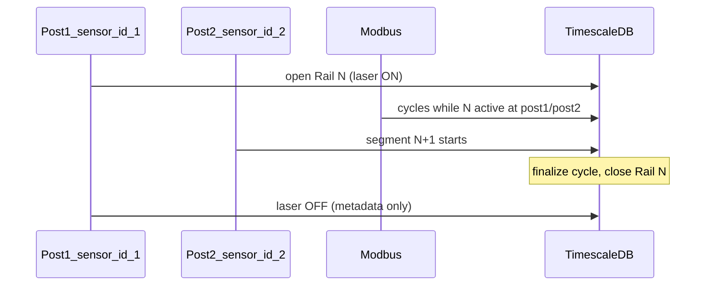
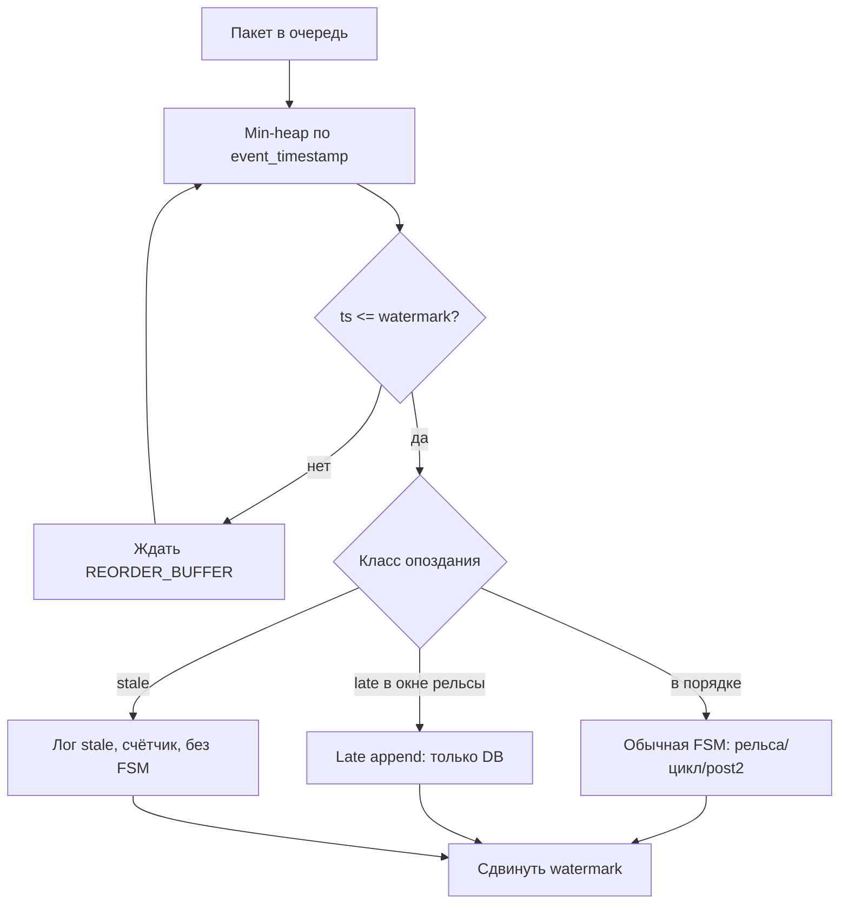

# План оптимизации: продакшен = офлайн-прогоны

## Целевое поведение (эталон)

Офлайн сейчас задаёт ожидаемую модель в [`test toch/match_rshr_report.py`](test toch/match_rshr_report.py) + [`test toch/rshr_rules.py`](test toch/rshr_rules.py) + [`test toch/modbus_tightening.py`](test toch/modbus_tightening.py):

- **РШР пост 1** (`sensor_id=1`): сегменты по лазеру, длина = `max_mm - start_mm`, отброс &lt; 15 м.
- **Modbus**: цикл = шпала = 4 гайки; на каждую гайку отдельно `max_moment` / `max_frequency`.
- **Окно закрутки**: сейчас в отчёте — лазер ON поста 1 + **2 мин** хвоста ([`match_rshr_report.py`](test toch/match_rshr_report.py) ~`t_end = t1 + timedelta(minutes=2)`).

После плана окно закрутки для рельсы **N** закрывается по правилу поста 2: **появление N+1 на `sensor_id=2` → N ушёл с поста 2**. Хвост после laser OFF — **настраиваемый fallback** (по умолчанию 120 с), если пост 2 не дал событие.

### Принцип: логика жёсткая, тайминги мягкие

**Не меняем** (ядро):

- длина сегмента = `max_mm - start_mm`, отброс &lt; 15 м;
- цикл = 4 гайки, на каждую свой `max_torque` / `max_frequency`;
- старт цикла по моментам M1–M4, завершение по нулевым моментам;
- закрытие рельсы N при N+1 на посту 2.

**Настраиваем** (обёртка под прод, не подменяет правила):

- длительности grace/debounce/reorder buffer через конфиг;
- обработка по **timestamp пакета**, не по времени прихода в API;
- допуски на рассинхрон потоков (Modbus быстрее/медленнее RSHR).

### Запись vs live (прод)

| Аспект | Сейчас (JSONL 19.05) | Прод-тест / live |
|--------|----------------------|------------------|
| Время | Фиксированная шкала файла, идеальный порядок строк | Задержки сети, burst, иногда out-of-order |
| Скорость потоков | Соотношение S1/S2/Modbus «запечатано» | Modbus может опережать или отставать от RSHR |
| Нагрузка | Офлайн читает файл целиком | Очередь 50k, воркер может отставать |

Все решения ниже строятся так, чтобы **на записи 19.05 результат совпадал с отчётом**, а на live добавлялись только **буферы и пороги**, не ослабляющие правила.



---

## Фаза 0: Общий модуль логики (один источник правды)

**Проблема:** [`tochnost/src/api/v1/sensor/tightening.py`](tochnost/src/api/v1/sensor/tightening.py) ищет `M1` после `model_dump()`, а Pydantic отдаёт `frequency_torque_1` — в API закрутка **не работает**, офлайн — работает.

**Действия:**

1. Создать пакет [`libs/rshr_core/`](libs/rshr_core/) (или `tochnost/src/rshr_core/`, импортируемый из `test toch` через `PYTHONPATH`):
   - `tightening.py` — `has_torque_activity`, `all_torque_zero`, `bump_peaks`, `CyclePeaks`, `detect_cycles_in_window` (перенос из [`test toch/modbus_tightening.py`](test toch/modbus_tightening.py) с **универсальным чтением** полей: alias `M1` / `frequency_torque_1`, `f1` / `converter_frequency_1`).
   - `rshr_length.py` — перенос [`test toch/rshr_rules.py`](test toch/rshr_rules.py).
   - `rshr_segments.py` — общая функция построения лазерных сегментов (сейчас дублируется в `validate_capture`, `match_rshr_report`, `simulate_capture`).

2. В бэкенде заменить импорты: `from rshr_core.tightening import ...` вместо локального `tightening.py`.

3. В `test toch` — тонкие обёртки / re-export, чтобы `match_rshr_report.py` и `simulate_capture.py` не дублировали код.

**Критерий:** unit-тест на `Sensor2Values` (Pydantic) и на сырой dict `{"M1": 100}` — оба дают `has_torque_activity=True`.

---

## Фаза 1: Критические исправления бэкенда

### 1.1 Длина РШР и отброс

**Файлы:** [`tochnost/src/api/v1/sensor/schemas.py`](tochnost/src/api/v1/sensor/schemas.py), [`service.py`](tochnost/src/api/v1/sensor/service.py)

- В `RailSession` добавить `start_mm_along_rail: int`.
- В `bind_active_rail` — сохранять `start_mm` из первого пакета.
- В `close_active_rail` / `discard_active_rail`:
  - `length_mm = segment_length_mm(start_mm, last_mm)` через `rshr_core`.
  - discard если `length_mm < 15_000` (не `last_mm < 15_000`).
- Опционально: флаг/статус `SHORT` при `15 м ≤ length < 20 м` (константа `RSHR_LENGTH_MIN_OK_MM` уже есть, не используется).

### 1.2 Закрутка Modbus (4 гайки × max момент/частота)

**Файл:** [`service.py`](tochnost/src/api/v1/sensor/service.py) `_finalize_tightening_cycle`, `add_sensor2_data`

- Использовать `rshr_core.tightening` (пики уже в `TighteningCycleState`).
- Старт цикла — только по **моментам** `M1–M4` (не по `f1–f4`), чтобы совпасть с физикой и уменьшить ложные циклы.
- При `close`/`post2 depart` — если `is_tightening_active()`, вызвать `_finalize_tightening_cycle` **до** `reset_tightening_cycle`.

### 1.3 Окно Modbus и закрытие рельсы

**Сейчас:** лазер OFF на посту 1 → сразу `close_active_rail` → Modbus после этого игнорируется.

**Целевое:**

- Лазер OFF поста 1 — записать `laser_off_at` (timestamp пакета), **не** закрывать рельсу сразу.
- Закрытие рельсы **N** при событии поста 2: «начался сегмент N+1» (фаза 2).
- Fallback: `close` только если с `laser_off_at` прошло ≥ `TAIL_GRACE_SEC` **по timestamp**, а пост 2 не закрыл рельсу.

**Конфиг** [`RshrTimingConfig`](libs/rshr_core/config.py) (env / settings):

| Параметр | Default | Назначение |
|----------|---------|------------|
| `TAIL_GRACE_SEC` | 120 | Хвост Modbus после laser OFF, если нет post2 |
| `POST2_MATCH_GRACE_SEC` | 30 | Допуск: post2 N+1 может прийти чуть раньше/позже ожидаемого FIFO |
| `MAX_RAIL_OPEN_SEC` | 3600 | Защита от «зависшей» активной рельсы (live) |
| `CYCLE_END_ZERO_PACKETS` | 2 | Подряд пакетов с M=0 для конца цикла (против дребезга) |
| `REORDER_BUFFER_MS` | 500 | Буфер переупорядочивания merged-очереди по timestamp |
| `MAX_LATE_PACKET_SEC` | 300 | Макс. опоздание пакета относительно watermark; старше — stale |
| `LATE_APPEND_GRACE_SEC` | 180 | После close рельсы: только дозапись в БД, без смены FSM |

На офлайн-прогоне: `REORDER_BUFFER_MS=0`, `CYCLE_END_ZERO_PACKETS=1`, `MAX_LATE_PACKET_SEC=∞` — поведение ближе к текущему отчёту.

### 1.4 Один поток + event-time (порядок по timestamp, не по приходу)

**Файл:** [`service.py`](tochnost/src/api/v1/sensor/service.py) workers

Заменить два параллельных воркера на **один** `sensor_merged_worker`:

- В очередь: `(event_timestamp, kind, payload, received_at)` — **время из пакета** + время приёма (для метрик lag).
- `asyncio.Lock` на все мутации `SENSOR_STATE`.

**Алгоритм обработки (event-time):**



- **Watermark** = `max_processed_event_ts - REORDER_BUFFER_MS` (по мере обработки).
- Пакет обрабатывается, когда `event_ts <= watermark` (все «раньше» уже прошли или выдержан буфер).
- **Застрявший пакет** (пришёл через 2–5 мин): если `event_ts` попадает в интервал закрытой рельсы `[start_time, end_time]` и `now - event_ts < MAX_LATE_PACKET_SEC` → режим **late append** (см. 1.6). Иначе → **stale drop**.

**Важно:** `cycle_start_mm` и mm для гайки — из **интерполяции S1 на `event_ts`** (кэш последних S1 по рельсе), а не из «текущего» active после опоздавшего пакета.

### 1.6 Застрявшие и не по порядку пакеты (LatePacketPolicy)

**Модуль:** `libs/rshr_core/late_packets.py` + ветвление в `SensorService`.

Три режима — **ядро FSM не откатывается назад**:

| Режим | Условие | Действие | Чего НЕ делаем |
|-------|---------|----------|----------------|
| **Normal** | `event_ts` в порядке watermark, рельса открыта | Полная FSM: сегменты, циклы, close | — |
| **Late append** | Рельса уже `COMPLETED`, `event_ts ∈ [start, end+TAIL]` и &lt; `MAX_LATE` | Записать Sensor1/Sensor2 в `rail_id`; опционально пересчитать `resistance_*` / пики **только если** цикл ещё не был финализирован с нулём | Не reopen рельсу, не менять `post2` FIFO, не создавать новые гайки после finalize |
| **Late modbus tighten** | Modbus late в окне активной закрутки **до** finalize цикла | `bump_peaks` + при необходимости отложенный `finalize` если уже пришёл «конец» | Не стартовать новый цикл на закрытой рельсе |
| **Stale** | `event_ts` слишком старый или рельса не найдена | `logger.warning`, метрика `packets_stale_total` | Не трогать active / не открывать новую рельсу |

**Правила, чтобы логика не пострадала:**

1. **Никогда** не обрабатывать late-пакет с `event_ts` **раньше** уже обработанного как «post2 depart» для той же рельсы — только append сырья в БД.
2. Late **S1 laser ON** на уже закрытой рельсе — не открывать новую active; только insert Sensor1 (аудит).
3. Late **S1 laser ON** когда уже есть active N+1 — не портить N+1; append к старой рельсе по `is_in_closed(ts)`.
4. Опоздавший Modbus с M&gt;0 **после** finalize всех циклов рельсы — запись Sensor2, **без** новых `screw` (аномалия в лог).
5. При burst после простоя: watermark скачет — обрабатывать пачку **строго по возрастанию `event_ts`**, не по `received_at`.

**Детекция «застрял» (observability):**

- `lag_ms = received_at - event_ts` на каждом пакете; алерт если p99 &gt; 30 с.
- Счётчики: `packets_reordered`, `packets_late_append`, `packets_stale`.
- В `validate_capture` / отчёт: симуляция с перестановкой 1% пакетов и задержкой 60 с — инварианты из плана сохраняются.

**Офлайн vs live:**

- JSONL-прогон: перестановки нет, `MAX_LATE=∞` — как сейчас.
- `live-stress`: сценарии `stuck_modbus_60s`, `rshr_after_modbus`, `post_close_late_s2` в `test_rshr_parity.py`.

### 1.5 Надёжность ingestion

- В воркерах: `logger.exception` при ошибках БД.
- Роутер: `put_nowait` + HTTP 503 при переполнении очереди (50k).
- Ошибки диапазонов: timestamp из `data.timestamp`, не `datetime.now()`.

---

## Фаза 2: Пост 2 — `sensor_id=2`

**Файлы:** [`state.py`](tochnost/src/api/v1/sensor/state.py), [`service.py`](tochnost/src/api/v1/sensor/service.py)

### 2.1 Состояние поста 2

Добавить `Post2Tracker`:

- FIFO очередь `rail_id` рельс, открытых на посту 1 и не discarded.
- Текущий сегмент поста 2: `segment_index`, `laser_on`, `start_ts`.
- `rail_at_post2: int | None` — какая рельса сейчас на посту 2 для Modbus.

### 2.2 `process_second_sensor1_data`

Логика (та же схема полей, что у sid=1):

1. Детектировать лазерные сегменты на посту 2 (`rshr_core.rshr_segments`).
2. При **старте нового** сегмента (лазер ON после OFF):
   - если есть предыдущая рельса в очереди → `depart_rail_from_post2(rail_id)`:
     - финализировать цикл закрутки;
     - `close_active_rail` для этой рельсы (или перевести в `COMPLETED`);
   - сопоставить новый сегмент с следующей рельсой из FIFO (по порядку открытия на посту 1).
3. Писать `Sensor1` с `sensor_id=2` — либо отдельная таблица/поле `sensor_id` в модели (если сейчас нет — добавить колонку `sensor_id` в `sensor1` миграцией), либо хранить только в state + привязка к `rail_id`.

**Сопоставление N ↔ N:** хронологический FIFO: i-й валидный `bind_active_rail` на посту 1 ↔ i-й валидный сегмент лазера на посту 2.

**Митигации без ослабления правила «N+1 на посту 2»:**

- При расхождении счётчиков (больше сегментов post2, чем рельс post1): **не** привязывать лишние сегменты к случайной рельсе — лог `post2_unmatched`, метрика, сегмент в отчёте validation.
- При отставании post2: рельса остаётся открытой до `TAIL_GRACE_SEC` / `MAX_RAIL_OPEN_SEC`, Modbus продолает писаться на `rail_at_post2` или `active` — **не** обрывать закрутку раньше правила.
- `POST2_MATCH_GRACE_SEC`: если N+1 на post2 по timestamp в пределах grace от ожидаемого — считать depart; иначе — только лог, ждать следующего явного сегмента (не угадывать).

### 2.3 Modbus привязка

`add_sensor2_data`:

- Если `rail_at_post2` задан → писать гайки/ Sensor2 на этот `rail_id`.
- Иначе если есть `active` поста 1 → как сейчас (перекрытие, пока N ещё едет к посту 2).
- Иначе `return`.

---

## Фаза 3: Офлайн-прогоны = тот же код

| Скрипт | Изменения |
|--------|-----------|
| [`simulate_capture.py`](test toch/simulate_capture.py) | Импорт `rshr_core`; `start_mm` + `segment_length_mm` для discard; циклы через общий tightening; обработка `sensor_id=2` + FIFO; merged timeline; tail/post2 close |
| [`match_rshr_report.py`](test toch/match_rshr_report.py) | Окно Modbus: `[post1_start, post2_N+1_start)` с fallback +2 мин; `screws[]` без изменений формата |
| [`validate_capture.py`](test toch/validate_capture.py) | Сегменты sid=1 и sid=2; проверка сопоставления постов; убрать ожидание «sid2 stub» |
| [`replay_data.py`](test toch/replay_data.py) | Опция `--use-capture-timestamps` (отправлять `event_ts`, не `utcnow`) |

**Критерий приёмки (19-05-2026):**

```bash
cd "test toch"
python3 validate_capture.py --dir "../test data/19-05-2026"
python3 simulate_capture.py --dir "../test data/19-05-2026"
python3 match_rshr_report.py --dir "../test data/19-05-2026"
```

- `simulate_capture`: `screws_created` ≈ сумма `screws_total` из отчёта (±10%).
- `rails_completed` = `rails_valid` в отчёте (13).
- Расхождение отчёт vs simulate &lt; 5% по гайкам на каждой валидной РШР.

Добавить [`test toch/test_rshr_parity.py`](test toch/test_rshr_parity.py) (pytest):

- tightening keys (Pydantic + dict);
- segment length;
- синтетический цикл Modbus;
- **live-сценарии:** reorder (Modbus до/после RSHR при разных timestamp), burst (+50 пакетов Modbus за 100 ms), slow S1 (+5 s пауза) — счётчики гаек и длина **не** должны ломаться.

Два режима прогона:

1. **capture-faithful** — конфиг как сейчас (buffer=0, grace=120) → сверка с `rshr_match_report.json`.
2. **live-stress** — buffer=500 ms, `CYCLE_END_ZERO_PACKETS=2`, jitter → проверка инвариантов (нет отрицательной длины, нет цикла без finalize, нет &gt;4 гаек за один цикл).

---

## Фаза 4: API / БД (уже частично сделано)

- Миграция [`2026-05-19_rshr_summary_fields.py`](tochnost/migrations/versions/2026-05-19_rshr_summary_fields.py): `channel`, `max_torque`, `max_frequency` — применить.
- [`ScrewRead`](tochnost/src/api/v1/screw/schemas.py): уже расширен — проверить отдачу в list/detail.
- Опционально: колонка `sensor1.sensor_id` для различения постов в БД.

---

## Фаза 5: Качество данных (medium)

- Игнорировать `R=0` и `R>65000` в агрегатах (как `LIMIT_VALUE` в [`modbus_read_test.py`](test toch/modbus_read_test.py)).
- В отчёте: `resistance_min` без нулей (отдельное поле `resistance_min_positive`).
- Удалить или задокументировать [`_add_sensor2_data_legacy_zero_check`](tochnost/src/api/v1/sensor/service.py).

---

## Порядок работ (рекомендуемый)

1. `rshr_core` + `RshrTimingConfig` + `late_packets.py` + тесты Pydantic/dict keys  
2. Длина сегмента + finalize on close + consecutive zero для конца цикла  
3. Merged worker (event-time watermark + late append/stale) + logging/503  
4. Post2 tracker + unmatched handling + modbus binding  
5. Обновить simulate / match_rshr_report / validate (два режима конфига)  
6. Прогон capture-faithful на `19-05-2026` + live-stress синтетика  
7. Миграции + replay `--use-capture-timestamps`  

## Риски и митигации (логика не ослабляется)

Правило: митигация **никогда** не подменяет ядро (например, не «закрывать цикл по таймауту с нулевыми гайками» вместо `all_torque_zero`). Таймауты только **закрывают окно** и **финализируют уже начатый** цикл.

| Риск | Что ломается | Митигация (логика сохранена) |
|------|----------------|------------------------------|
| **Ключи M1 vs frequency_torque_1** | Нет гаек в БД | `rshr_core` читает оба имени; тест на Pydantic |
| **Длина = last_mm вместо сегмента** | Неверный discard/length | `start_mm` + `segment_length_mm`; без изменения порога 15 м |
| **Live: пакеты не по порядку / застряли** | Неверный mm, лишние циклы, reopen рельсы | Event-time watermark + `LatePacketPolicy`; FSM только вперёд; late → append DB; stale → drop |
| **Застрявший Modbus после close** | Лишние гайки или потеря пиков | Late append: bump только если цикл не финализирован; иначе Sensor2 без screw |
| **Застрявший S1 меняет сегмент задним числом** | Неверная длина | Не пересчитывать `length_mm` после close; опциональный флаг `rail.needs_reaudit` |
| **Live: Modbus быстрее RSHR** | `cycle_start_mm=0` | mm на момент **timestamp** цикла из последнего S1 ≤ ts; если нет — `mm=null`, не выдумывать 0 |
| **Live: RSHR быстрее Modbus** | Поздняя закрутка | Окно до post2 depart + `TAIL_GRACE_SEC`; не закрывать по laser OFF |
| **Дребезг M=0 между шпалами** | Двойной цикл / рваная шпала | `CYCLE_END_ZERO_PACKETS≥2` на live; 1 на capture-тестах |
| **Дребезг f&gt;0 без M** | Ложный старт цикла | Старт **только по M1–M4** (правило не меняем) |
| **Незавершённый цикл при close** | Потеря последней шпалы | `_finalize_tightening_cycle` перед reset **всегда** |
| **FIFO пост1↔пост2 рассинхрон** | Гайки не на той рельсе | Unmatched → **не** писать в БД; лог + `post2_match_gaps`; ручной разбор |
| **Пропуск рельсы на посту 1** | Сдвиг N↔N+1 | Счётчик `rails_opened` vs `post2_segments`; gap в validate |
| **Очередь переполнена (burst)** | Тихая потеря 202 | `put_nowait` → 503; метрика `queue_dropped` |
| **Воркер отстаёт от реального времени** | Старые данные как «сейчас» | Бизнес-логика только по `data.timestamp`; `MAX_RAIL_OPEN_SEC` по timestamp |
| **Зависшая активная рельса** | Modbus вечно на одну N | `MAX_RAIL_OPEN_SEC` → принудительный close + finalize + лог CRITICAL |
| **R=0 / R&gt;65000** | Искажение min/max | Clamp/ignore в **агрегатах**; сырые Sensor2 не трогаем |
| **closed deque 10** | Поздний S1 на старую рельсу | Увеличить до 32 или lookup в БД по `rail_id`+interval |
| **Dashboard end_time сдвинут** | UX | В БД: `laser_off_at`, `post2_depart_at`, `end_time`; UI выбирает поле |
| **Запись 19.05 ≠ скорость прода** | Ложная уверенность | Два прогона: capture-faithful + live-stress (см. фаза 3) |
| **replay utcnow** | Неверный тест API | `--use-capture-timestamps` по умолчанию для parity |

### Инварианты (контроль на каждом прогоне)

После любого режима (capture или live-stress):

- на рельсу: `screws_count % 4 == 0` (или явный `incomplete_cycle` flag);
- `length_mm == last_mm - start_mm` для не-discarded;
- discarded только при `length_mm < 15000`;
- нет записи гаек без `rail_id`;
- `max_torque` / `max_frequency` не уменьшаются внутри цикла.

---

## Вне scope (после стабилизации)

- Полный replay в Docker/DB production  
- UI для `screws[]` из отчёта  
- Backfill исторических `max_torque` в БД  
