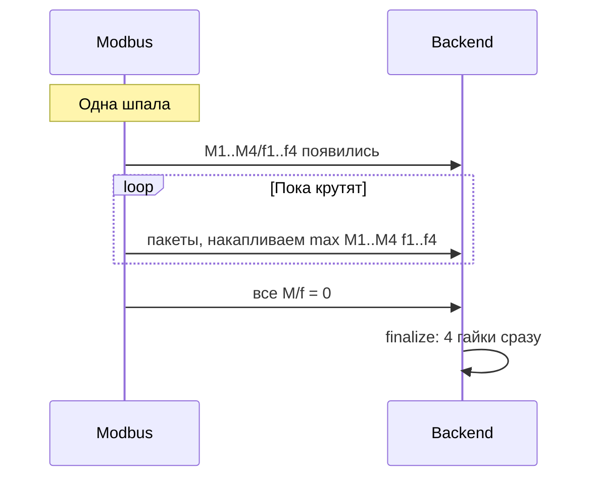
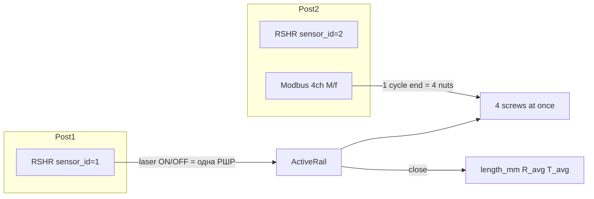

# План: циклы закрутки, метрики РШР и гаек

## Что зафиксировано из наших обсуждений

| Тема | Договорённость |
|------|----------------|
| **РШР** | Рельсошпальная **решётка** (рельсы + шпалы), не одна рельса |
| **Пост 1** | Один датчик РШР → в данных `sensor_id=1`. Решётка **катится**, закрутки **нет** |
| **Пост 2** | Тот же тип датчика РШР → `sensor_id=2` + **Modbus** (второй физический сенсор) = закрутка |
| **Привязка РШР N / N+1** | Когда **N+1** появилась на посту 2 (хотя бы с одного датчика) → **N уже уехала** с поста 2 |
| **Длина РШР** | Норма **~25 м**; допуск **≥ 20 м**; **< 15 m** → РШР **удаляем** (ошибка распознавания) |
| **Ориентир 100 гаек** | ~25 шпал × 4 гайки на 25 м — **ориентир порядка величины**, не жёсткое требование |
| **Перекрытие по времени** | Пока N+1 едет с поста 1 на пост 2, N может **ещё докручиваться**; в момент приезда N+1 на пост 2 — как правило уже нет |
| **Сопоставление с данными 19.05** | На «хороших» 25 м РШР: **~18–26 циклов** → **~72–104 гайки** (близко к ориентиру); backend сейчас даёт **сотни тысяч** — это баг |

---

## Семантика M1–M4 (важно)

**M1, M2, M3, M4 — это не четыре последовательных цикла.** Это **четыре разных гайки, которые крутятся одновременно** на одной шпале (один такт закрутки):

| Канал Modbus | Гайка | Сторона (как в коде) |
|--------------|-------|---------------------|
| M1 / f1 | гайка 1 | левая (serial_id % 4 → 1) |
| M2 / f2 | гайка 2 | левая |
| M3 / f3 | гайка 3 | правая |
| M4 / f4 | гайка 4 | правая |

**Один цикл закрутки** = интервал, когда **хотя бы один** из M/f > 0, до момента, когда **все** M1–M4 и f1–f4 снова 0 (как в [`modbus_read_test.py`](test toch/modbus_read_test.py)).

В конце цикла за один раз создаём **ровно 4 записи Screw**:
- гайка 1: `max_torque` = max(M1), `max_frequency` = max(f1)
- гайка 2: max(M2), max(f2)
- гайка 3: max(M3), max(f3)
- гайка 4: max(M4), max(f4)

Общие для всех четырёх на этот момент: `mmAlongRail` (с активной РШР), `R`, `T`, `H`, `ST1–ST4` из последнего снимка цикла.

**Неправильно:** считать каждый пакет Modbus отдельным циклом или создавать 4 гайки на каждый пакет.  
**Неправильно:** трактовать M2 как «второй цикл» после M1.



---

## Проблема сейчас

В [`tochnost/src/api/v1/sensor/service.py`](tochnost/src/api/v1/sensor/service.py) `add_sensor2_data` создаёт **4 гайки на каждый пакет Modbus** (~455k за день), игнорируя границу **одного одновременного цикла**.

Правила длины частично есть: [`test toch/rshr_rules.py`](test toch/rshr_rules.py), `discard_active_rail` при < 15 m.



---

## Целевое поведение

| Сущность | Источник | Что сохраняем |
|----------|----------|----------------|
| **РШР** | `sensor_id=1`, laser ON→OFF | `length_mm` = max `mmAlongRail`; `resistance_avg`, `temperature_avg` за всё окно РШР |
| **Шпала / цикл** | 1 завершённый цикл Modbus | **4 гайки сразу**, каждая со своим max M и max f |
| **Отброс** | length < 15 m | `discard_active_rail` — запись удаляется |

Логика цикла = [`modbus_read_test.py`](test toch/modbus_read_test.py) (607–682): старт при любом M/f > 0, конец когда **все** нули.

---

## 1. Backend: state machine закрутки

**Новый модуль** [`tochnost/src/api/v1/sensor/tightening.py`](tochnost/src/api/v1/sensor/tightening.py):
- `has_torque_activity(values)` — любой из M1–M4 или f1–f4 > 0
- `all_torque_zero(values)` — все M и f == 0
- `update_cycle_peaks(peaks, values)` — **параллельно** обновить max по каждому из 4 каналов

**Расширить** [`tochnost/src/api/v1/sensor/state.py`](tochnost/src/api/v1/sensor/state.py):
- `TighteningCycleState`: `max_torque[1..4]`, `max_freq[1..4]`, `cycle_start_mm`, `last_values`
- `update_temperature` / `get_temperature_average` (как resistance)
- `start_cycle(mm)`, `bump_peaks(values)`, `finish_cycle()` → 4 пары (max_M, max_f) + metadata

**Переписать** `add_sensor2_data`:

```text
if not active_rail: return
update resistance + temperature (каждый пакет в окне РШР)

if tightening_active:
  if all M/f zero:
    finalize_cycle()  # ровно 4 гайки, один раз
  else:
    bump_peaks only    # в БД ничего не пишем
elif has_torque_activity:
  start_cycle(active.last_mm_along_rail)
  bump_peaks
else:
  только R/T stats (idle, ST=1543 без момента)
```

**`finalize_cycle`**:
- **Один вызов** → `add_screw` × **4** (не цикл for по пакетам)
- screw 1..4: `max_torque` = peak M1..M4, `max_frequency` = peak f1..f4, общий `mm_along_rail` = `cycle_start_mm`
- по одной `Sensor2` на гайку (канал гайки i хранит свои max, остальные поля — из `last_values`)
- пороги `frequency_torque` — по max соответствующего канала
- `sleepers = total_screws // 4` при закрытии РШР

**`close_active_rail`**:
- если `length_mm < 15_000` → `discard_active_rail` (уже есть)
- иначе: `length_mm`, `resistance_avg`, `temperature_avg` в `rail`

---

## 2. Миграция БД и API

**Миграция** `2026-05-19_rail_rshr_summary.py`:
- `rail`: `length_mm`, `resistance_avg`, `temperature_avg`
- `screw`: `mm_along_rail`, `max_torque`, `max_frequency` (для канала этой гайки)

**Схемы**: `RailRead`, `ScrewRead` / `ScrewWithLastSensor` — отдавать эти поля напрямую.

Константы длины: перенести из [`rshr_rules.py`](test toch/rshr_rules.py) в `tochnost` (20 m / 15 m), test-скрипты импортируют оттуда.

---

## 3. Offline-симуляция и отчёт

**[`simulate_capture.py`](test toch/simulate_capture.py)** — та же машина состояний: **1 cycle → +4 screws**, не +4 на пакет.

**[`match_rshr_report.py`](test toch/match_rshr_report.py)** (новый), по каждой валидной РШР:
- `length_m`, `resistance_avg`, `temperature_avg`
- `tightening_cycles` (= число шпал, ориентир)
- `screws_total` (= cycles × 4)
- по 4 гайкам последнего цикла не нужно — список всех гаек с max M/f

Sanity: `screws_total == cycles * 4`, `cycles` порядка `length_m` (±50%).

**Checks** в simulate: `screws_created` ~500–2000 на 13 РШР, не 454924.

---

## 4. Прогон (offline)

```bash
cd "test toch"
python3 validate_capture.py --dir "../test data/19-05-2026"
python3 simulate_capture.py --dir "../test data/19-05-2026"
python3 match_rshr_report.py --dir "../test data/19-05-2026"
```

Ожидание: 13 РШР, 4 отброшены; ~18–26 циклов на 25 м → ~72–104 гаек; отчёт с длиной, R_avg, T_avg, max M/f на гайку.

---

## Вне scope

- `process_second_sensor1_data` (`sensor_id=2` RSHR) — заглушка
- Docker replay — не в этом прогоне
- Фронт `rzd/` — опционально, API `/rail/{id}/metrics` и `/screws` станут осмысленными после фикса backend
