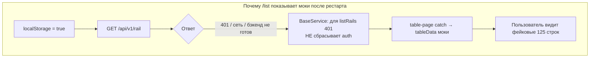
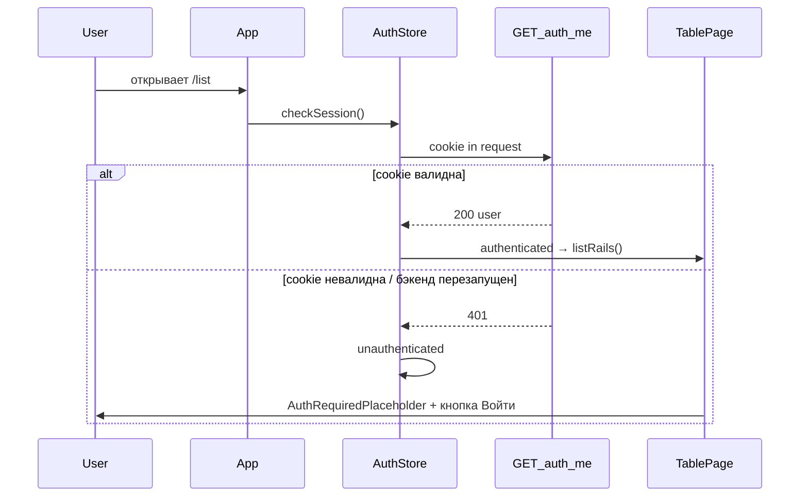

# Отбраковка, фикс удаления и стабильная авторизация

## Контекст

Четыре связанные задачи:

1. **Отбраковать** — закрыть РШР «В процессе» со статусом **Брак**.
2. **Баг удаления** — 404 на «В процессе» и массовое удаление; тихие ошибки UI.
3. **Авторизация слетает** — после перезапуска бэкенда `/list` показывает моки; иногда нужен ручной logout/login.
4. **Заглушка вместо моков** — «Чтобы увидеть контент, необходимо авторизоваться», а не фейковые данные.

---

## Часть A. Багфикс удаления (404 и «без ответа»)

### Диагностика



```mermaid
flowchart TD
    subgraph bulkBug [Массовое удаление — 404]
        A[SelectionBar Удалить] --> B["axios DELETE /api/v1/rail<br/>body: [1,2,3]"]
        B --> C["FastAPI: rail_ids без Body()<br/>→ query param, body игнорируется"]
        C --> D["rail_ids = пусто → delete_by_ids([])"]
        D --> E["404 Rails not found"]
    end

    subgraph silentBug [Тихая ошибка UI]
        F[DeleteConfirmModal] --> G["handleConfirmDelete()<br/>onDelete() без await"]
        G --> H[Модалка закрывается всегда]
        H --> I["Ошибка только в console.error"]
    end

    subgraph inProgressBug [Удаление В процессе]
        J["DELETE /api/v1/rail/{id}"] --> K[detach_rail_from_sensor_state]
        K --> L[delete_by_id]
    end
```

**Массовое удаление:** [`router.py`](tochnost/src/api/v1/rail/router.py) — `rail_ids` без `Body()`, фронт шлёт массив в теле ([`RailService.ts`](rzd/src/shared/api/services/RailService.ts)).

**Тихая ошибка:** [`Table.tsx`](rzd/src/features/production-table/ui/Table.tsx) — `onDelete` без `await`.

**В процессе:** удаление без очистки [`SENSOR_STATE`](tochnost/src/api/v1/sensor/state.py).

### A.1 Бэкенд

- Схема `DeleteRailsRequest { rail_ids }` + `Body()`
- Частичный успех: `{ deleted, not_found }`, 404 только если `deleted == 0`
- Хелпер `detach_rail_from_sensor_state(rail_id)` — для delete и reject
- `get_by_id` в [`RailStorage`](tochnost/src/infra/timescale_db/storage/rail.py)

### A.2 Фронтенд

- `deleteRails`: `data: { rail_ids: railIds }`
- `await onDelete`, ошибки в модалке, рефетч при 404

---

## Часть B. Отбраковка «В процессе»

**Бэкенд:** `RailStatus.ERROR = "Брак"`, `POST /api/v1/rail/{rail_id}/reject`, detach FSM + `update_fields(status, end_time)`.

**Фронтенд:** пункт **Отбраковать** в [`RowActionsMenu.tsx`](rzd/src/features/production-table/ui/RowActionsMenu.tsx) (только `IN_PROGRESS`), `RejectConfirmModal`, проводка через [`Table.tsx`](rzd/src/features/production-table/ui/Table.tsx) → [`table-page/index.tsx`](rzd/src/pages/table-page/index.tsx).

Работает **только в authenticated-состоянии** (см. часть D).

---

## Часть D. Авторизация и заглушка вместо моков

### Диагностика

Сейчас авторизация — **два несинхронизированных слоя**:

| Слой | Где | Проблема |
|------|-----|----------|
| `localStorage` `rzd_auth_authenticated=true` | [`table-page`](rzd/src/pages/table-page/index.tsx), [`item-page`](rzd/src/pages/item-page/index.tsx) | Флаг живёт отдельно от cookie-сессии |
| HTTP-only cookie `Authorization` | Бэкенд [`auth/router.py`](tochnost/src/api/v1/auth/router.py) | Реальная сессия; после рестарта/401 может быть невалидна, а флаг остаётся |



**Ключевые места в коде:**

1. [`BaseService.ts`](rzd/src/shared/api/services/BaseService.ts) — для `GET /api/v1/rail` при 401 **специально не** чистится `localStorage` и не открывается модалка («страница сама покажет моки»).
2. [`table-page/index.tsx`](rzd/src/pages/table-page/index.tsx) — при `!isAuthenticated` **и при любой ошибке API** подставляются моки [`tableData`](rzd/src/entities/production/model/data.ts).
3. `isAuthenticated` читается **один раз** из `localStorage` при рендере — не реагирует на `auth:changed` / `auth:required`.
4. [`dashboard/store.ts`](rzd/src/entities/dashboard/model/store.ts) — при `!isAuthenticated` всегда отдаёт моки для графиков/стадий.
5. Куки: `secure=True`, `samesite=none` — на http dev через Vite-прокси могут быть проблемы с отправкой cookie.

### D.1 Бэкенд: проверка сессии

**Новый endpoint** [`auth/router.py`](tochnost/src/api/v1/auth/router.py):

```
GET /api/v1/auth/me → { user_id, username }
```

Зависимость `CurrentUserDep` — лёгкая проверка «cookie ещё жива».

**Куки для dev/prod** — в [`auth/router.py`](tochnost/src/api/v1/auth/router.py) и [`server/middlewares/auth.py`](tochnost/src/server/middlewares/auth.py):

```python
secure=settings.is_production  # False на localhost http
samesite="lax" if not settings.is_production else "none"
```

(уточнить по `core/config.py` — добавить флаг при отсутствии)

### D.2 Фронтенд: единое состояние auth

Новый модуль `rzd/src/entities/auth/` (или расширить [`appStore`](rzd/src/app/store/appStore.ts)):

```ts
type AuthStatus = 'checking' | 'authenticated' | 'unauthenticated'

// При старте приложения:
authService.me()  // GET /auth/me
  → ok: authenticated
  → 401: unauthenticated, clear localStorage
```

- `login` в [`AuthModal`](rzd/src/features/auth-modal/ui/AuthModal.tsx): `me()` после login → `setAuthenticated`
- `logout` в [`SidebarNav`](rzd/src/widgets/sidebar-nav/ui/SidebarNav.tsx): синхронно чистит store
- Слушатели: `auth:changed`, `AUTH_REQUIRED_EVENT`
- **Убрать** прямое чтение `localStorage.getItem(AUTH_STORAGE_KEY)` из страниц

### D.3 Заглушка вместо моков

Новый компонент `rzd/src/shared/ui/AuthRequiredPlaceholder/`:

- Текст: **«Чтобы увидеть контент, необходимо авторизоваться»**
- Кнопка **«Войти»** → `setAuthModalOpen(true)` из [`appStore`](rzd/src/app/store/appStore.ts)
- Стиль — в духе существующих карточек ([`PageContainer`](rzd/src/shared/ui/PageContainer/PageContainer.tsx))

**[`table-page/index.tsx`](rzd/src/pages/table-page/index.tsx):**

| `authStatus` | Поведение |
|--------------|-----------|
| `checking` | Спиннер / skeleton |
| `unauthenticated` | `AuthRequiredPlaceholder`, **без** `tableData` |
| `authenticated` | `listRails()`; при ошибке — сообщение об ошибке, **не моки** |

**[`item-page/index.tsx`](rzd/src/pages/item-page/index.tsx):** то же — убрать fallback на `getItemData()` при 401.

**Дашборд** ([`dashboard/store.ts`](rzd/src/entities/dashboard/model/store.ts)): при `unauthenticated` — пустые данные + заглушка на панелях (или оверлей), не демо-графики. Моки оставить только если явно нужен demo-режим (не в scope).

### D.4 Исправить 401 interceptor

[`BaseService.ts`](rzd/src/shared/api/services/BaseService.ts):

- **Удалить** исключение `isListRailsRequest` — любой 401:
  1. `localStorage.removeItem(AUTH_STORAGE_KEY)`
  2. `authStore.setUnauthenticated()`
  3. `dispatchEvent(AUTH_REQUIRED_EVENT)`
- Опционально: не открывать модалку на публичном `/monitor`

### D.5 Проверка сессии при навигации

В [`App.tsx`](rzd/src/app/App.tsx) или auth-хуке:

- При mount и при переходе на `/`, `/list`, `/item/:id` — `checkSession()` если прошло N минут или `authStatus === 'checking'`
- После успешного login — `auth:changed` → страницы рефетчат данные (не моки)



---

## Часть C. Итоговое поведение

| Сценарий | Ожидание |
|----------|----------|
| Отбраковать «В процессе» | Статус **Брак**, FSM очищен |
| Удалить «В процессе» / bulk | Успех, FSM очищен |
| Не авторизован, открыт /list | Заглушка, **не моки** |
| Авторизован, бэкенд перезапущен, cookie жива | Реальные данные |
| Авторизован, сессия протухла | 401 → заглушка + модалка входа |
| Login | `me()` OK → данные с API |

---

## Тестирование

**Отбраковка и удаление:**
- Отбраковка, удаление одной/массовое, FSM после удаления активной рельсы

**Авторизация:**
- Logout → `/list` → заглушка, не таблица с id 100000–99999
- Login → `/list` → реальные данные с API
- Перезапуск бэкенда при живой cookie → `/list` без моков
- Перезапуск + протухшая сессия → заглушка + «Войти»
- 401 на любом запросе → сброс auth, не моки
- Навигация `/` → `/list` → сессия не «слетает» молча

---

## Затрагиваемые файлы

**Бэкенд:**
- [`tochnost/src/api/v1/auth/router.py`](tochnost/src/api/v1/auth/router.py) — `GET /me`, cookie flags
- [`tochnost/src/server/middlewares/auth.py`](tochnost/src/server/middlewares/auth.py) — cookie flags
- [`tochnost/src/infra/timescale_db/models/rail.py`](tochnost/src/infra/timescale_db/models/rail.py)
- [`tochnost/src/infra/timescale_db/storage/rail.py`](tochnost/src/infra/timescale_db/storage/rail.py)
- [`tochnost/src/api/v1/rail/schemas.py`](tochnost/src/api/v1/rail/schemas.py)
- [`tochnost/src/api/v1/rail/service.py`](tochnost/src/api/v1/rail/service.py)
- [`tochnost/src/api/v1/rail/router.py`](tochnost/src/api/v1/rail/router.py)

**Фронтенд:**
- новый `rzd/src/entities/auth/` — store + `useAuth`
- новый `rzd/src/shared/ui/AuthRequiredPlaceholder/`
- [`rzd/src/shared/api/services/AuthService.ts`](rzd/src/shared/api/services/AuthService.ts) — `me()`
- [`rzd/src/shared/api/services/BaseService.ts`](rzd/src/shared/api/services/BaseService.ts)
- [`rzd/src/app/App.tsx`](rzd/src/app/App.tsx)
- [`rzd/src/pages/table-page/index.tsx`](rzd/src/pages/table-page/index.tsx)
- [`rzd/src/pages/item-page/index.tsx`](rzd/src/pages/item-page/index.tsx)
- [`rzd/src/entities/dashboard/model/store.ts`](rzd/src/entities/dashboard/model/store.ts)
- [`rzd/src/features/auth-modal/ui/AuthModal.tsx`](rzd/src/features/auth-modal/ui/AuthModal.tsx)
- + файлы из частей A и B (reject, delete, Table, RowActionsMenu)
