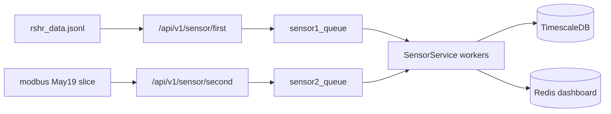

# Проверка фиксации данных 19.05.2026

## Что есть в данных

| Файл | Роль (по вашей схеме) | API endpoint | Факт по содержимому |
|------|----------------------|--------------|---------------------|
| [`test data/19-05-2026/rshr_data.jsonl`](test data/19-05-2026/rshr_data.jsonl) | Сенсор 1 (РШР) | `POST /api/v1/sensor/first` | **756 322** валидных строк, **2 482** битых JSON; время **2026-05-19 04:39–13:07 UTC**; `sensor_id`: **1 → 293 348**, **2 → 462 974**; ~**60** переключений лазера → ориентир **~30** сессий рельсы |
| [`test data/19-05-2026/modbus_data.jsonl`](test data/19-05-2026/modbus_data.jsonl) | Сенсор 2 (Modbus) | `POST /api/v1/sensor/second` | **790 753** строк всего; срез **19.05** — **239 339** строк (с **строки 551 415**); все записи 19.05 проходят фильтр записи из [`test toch/modbus_read_test.py`](test toch/modbus_read_test.py) (`ST==1543` или ненулевой статус ≠9863) |



## Критичные находки до прогона

1. **`process_second_sensor1_data` не реализован** — в [`tochnost/src/api/v1/sensor/service.py`](tochnost/src/api/v1/sensor/service.py) тело метода — заглушка `...`. Записи с `sensor_id: 2` (~**61%** RSHR-файла) **молча не обрабатываются**. Это главный риск «система не фиксирует всё».

2. **Replay подменяет timestamp** — [`test toch/replay_data.py`](test toch/replay_data.py) шлёт `datetime.utcnow()`, а не оригинальные метки. Для проверки бизнес-логики (открытие/закрытие рельсы, пороги, гайки) это допустимо; для проверки хронологии в БД — нет. В отчёте сравниваем **количества и диапазоны мм**, не wall-clock timestamps.

3. **Sensor2 создаёт 4 гайки на каждый пакет** при активной рельсе ([`add_sensor2_data`](tochnost/src/api/v1/sensor/service.py) ~247–317). Ожидания по «физическим» гайкам нужно сверять с **текущей** логикой кода, а не с интуицией по Modbus.

## План выполнения

### 1. Подготовка среды (локально)

- Поднять стек: `docker compose up -d` в [`tochnost/`](tochnost/).
- Убедиться, что API отвечает: `GET /docs` на `http://localhost:8000`.
- Сбросить in-memory state перед прогоном: `POST /api/v1/sensor/state/reset` с `{"confirm": true}` ([`router.py`](tochnost/src/api/v1/sensor/router.py)).
- Очистить или зафиксировать начальные счётчики в БД (rails, sensor1, sensor2, screw, error) — для чистого сравнения «до/после».

### 2. Подготовка входных файлов

- Сгенерировать срез Modbus только за 19.05 (временный файл, напр. `test data/19-05-2026/modbus_2026-05-19.jsonl`) — **239 339** строк, без 551k строк от 27.03.
- Для RSHR использовать полный [`rshr_data.jsonl`](test data/19-05-2026/rshr_data.jsonl); парсер из `replay_data.py` (`_iter_json_objects`) уже устойчив к разорванным JSON.

### 3. Offline-анализ (эталон «что должно быть»)

Добавить небольшой скрипт, напр. [`test toch/validate_capture.py`](test toch/validate_capture.py), который **без API** считает:

**RSHR (ожидания для `sensor_id=1`, пока нет реализации для id=2):**
- число сегментов «лазер на рельсе» / «лазер выключен»;
- для каждого сегмента: `start_mm`, `end_mm`, длительность, число уникальных `mmAlongRail`;
- записи вне порогов (если пороги есть в таблице `threshold` — подтянуть через API или env).

**Modbus (19.05):**
- распределение `ST1–ST4`, `M1–M4`, `R`, `T`, `H`;
- сколько пакетов потенциально попадёт в активную рельсу (по временному пересечению с RSHR-сегментами, грубо).

Скрипт сохраняет `validation_expected.json` — baseline для сравнения.

### 4. Прогон через replay (ускоренно)

Использовать существующий [`test toch/replay_data.py`](test toch/replay_data.py):

```bash
python replay_data.py \
  --file1 "test data/19-05-2026/modbus_2026-05-19.jsonl" \
  --file2 "test data/19-05-2026/rshr_data.jsonl" \
  --api1 http://localhost:8000/api/v1/sensor/second \
  --api2 http://localhost:8000/api/v1/sensor/first \
  --speed 500
```

- `--speed 500` (~8.5 мин на ~1M событий при среднем интервале 15–20 ms); при переполнении очередей (max 50k) — снизить speed или дождаться drain workers.
- Логировать долю ответов **202** vs ошибок HTTP.

### 5. Post-run сверка с БД

SQL/psql к TimescaleDB (после прогона):

| Проверка | Ожидание (ориентир) | Запрос/метрика |
|----------|---------------------|----------------|
| Рельсы | ~30 `COMPLETED` (± из-за краевых laser-off) | `SELECT status, COUNT(*) FROM rail GROUP BY status` |
| Sensor1 | сотни тысяч строк, привязанных к rail_id | `COUNT(*)` по `sensor1`, `MAX(mm_along_rail)` ≈ **25219** |
| Sensor1 по sensor_id | **0** строк для id=2, пока заглушка | отдельный счётчик по payload (если пишем в лог) / ручная выборка |
| Sensor2 | только при активной рельсе | `COUNT(*)` в `sensor2`, связь с `screw` |
| Гайки | очень большое число (4 × число modbus-пакетов в активной фазе) | `COUNT(*)` в `screw`, `serial_id` max |
| Ошибки | по порогам из `threshold` | `COUNT(*)` в `error` по `value_name` |

Дополнительно — REST: `GET /api/v1/sensor/rail/{rail_id}/sensor1` для 2–3 рельс, сверка `mm_gauge`, laser flags с сырым JSON на тех же `mmAlongRail`.

### 6. Итоговый отчёт

Сформировать краткий markdown-отчёт:

- **OK** — что совпало (число рельс, max мм, доля принятых API-запросов, запись sensor_id=1).
- **FAIL** — расхождения с количественной дельтой.
- **BLOCKER** — `sensor_id=2` не обрабатывается (заглушка); **рекомендация**: реализовать `process_second_sensor1_data` (как минимум запись в `sensor1` с той же state-машиной, что у `process_first_sensor1_data`, или отдельная ветка — уточнить у вас семантику второго `sensor_id` в RSHR).

## Риски и ограничения

- Полный прогон ~**1M** HTTP POST — нагрузка на очереди/БД; при OOM/502 — уменьшить `--speed` или батчить по сегментам рельсы.
- **2 482** битых строк RSHR — зафиксировать в отчёте как потерянный вход (не баг backend).
- Без фикса `process_second_sensor1_data` проверка «фиксирует всё» для RSHR **не пройдёт** на ~463k записей.

## Порядок работ после подтверждения плана

1. Скрипт offline-анализа + срез modbus за 19.05.
2. Docker + reset state + replay.
3. SQL/API сверка + отчёт с PASS/FAIL/BLOCKER.
4. (Опционально, если нужен PASS) — реализация `process_second_sensor1_data` и повторный прогон только для `sensor_id=2`.
